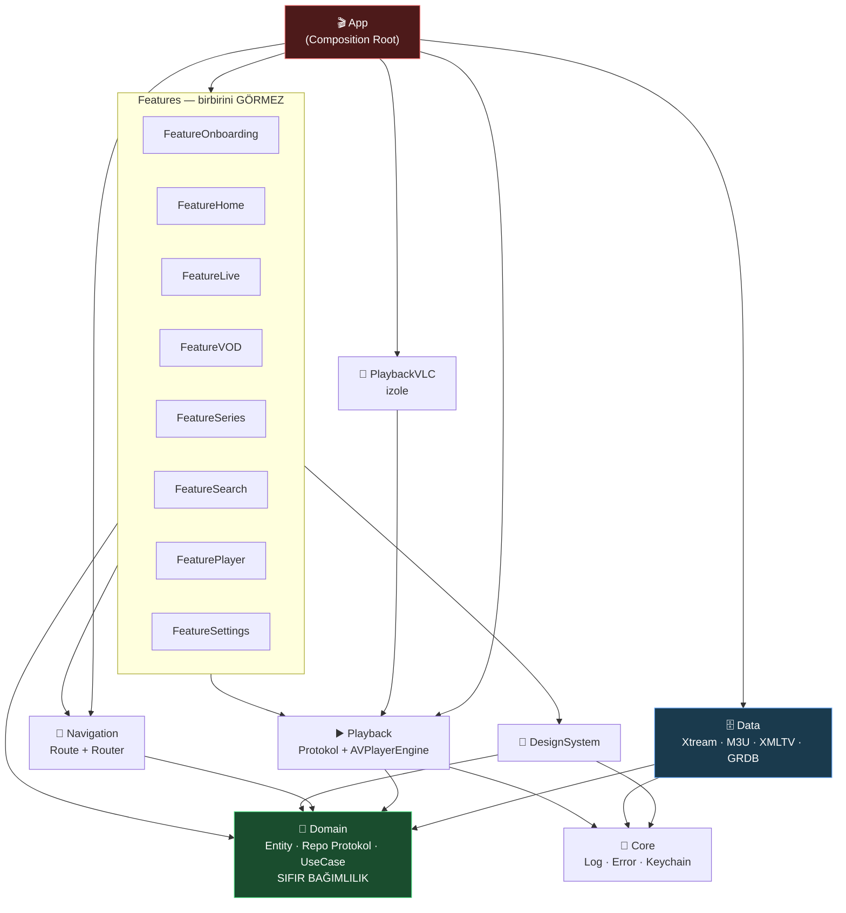

# 🧠 OCTOPUS — BEYİN HARİTASI

> Bu dosya projenin **anayasasıdır**. Kod ile doküman çelişirse, önce burayı güncelle, sonra kodu yaz.
> Her yeni özellik "bu haritada nereye oturuyor?" sorusuna cevap veremiyorsa **yazılmaz**.

---

## 1. NE İNŞA EDİYORUZ

iOS için IPTV istemcisi. Kullanıcı bir **kaynak** ekler (Xtream Codes hesabı veya M3U linki),
uygulama o kaynaktan **Canlı TV / Film / Dizi** içeriğini çeker, yerel veritabanına yazar,
offline-first gösterir ve uygun motorla oynatır.

---

## 2. KİLİTLENMİŞ KARARLAR

| Konu | Karar | Neden |
|---|---|---|
| İçerik kaynağı | Xtream Codes **+** M3U/M3U8 | Tek `ContentProvider` protokolü arkasında. Yeni kaynak = yeni dosya, sıfır refactor |
| Oynatma | AVPlayer **+** VLCKit | HLS → AVPlayer (PiP/AirPlay/arka plan). MPEG-TS/RTSP → VLCKit fallback |
| Min. platform | **iOS 16.0**, iPhone + iPad | Kapsam geniş |
| Proje üretimi | **XcodeGen** (`project.yml`) | `.xcodeproj` git'e girmez → merge conflict yok, Windows'ta düzenlenebilir |
| UI | SwiftUI, `NavigationStack` | iOS 16'da mevcut |
| State | `ObservableObject` + `@Published` | `@Observable` iOS 17+, bize kapalı |
| Veritabanı | **GRDB.swift** (SQLite) | SwiftData iOS 17+. 50.000 kanal bulk-insert + FTS5 arama gerekiyor |
| Görsel cache | **Nuke** | `AsyncImage`'ın cache'i poster grid'lerinde çöküyor |
| Eşzamanlılık | `async/await` + Actor | Combine sadece player state stream'i için |
| DI | Elle yazılan Composition Root | Runtime DI (Swinject vb.) derleme-zamanı güvenliği öldürür |

> ⚠️ **iOS 16 tuzakları:** `@Observable` ❌ · `SwiftData` ❌ · `@Bindable` ❌ ·
> `NavigationStack` ✅ · `.searchable` ✅ · `Charts` ✅ · async/await ✅

---

## 3. MODÜL GRAFİĞİ



---

## 4. DEMİR KURALLAR (ihlal = derleme hatası)

1. **Domain hiçbir şeyi import etmez.** Sadece `Foundation`. UIKit/SwiftUI/GRDB **yasak**.
2. **Feature → Data import edemez.** Feature sadece Domain protokolünü bilir.
   Somut `XtreamContentProvider`'ı sadece App tanır.
3. **Feature → Feature import edemez.** Geçiş `Navigation.Route` üzerinden olur.
4. **Data → SwiftUI import edemez.** Data, ekranın var olduğunu bilmez.
5. **Bağımlılıklar yukarı akmaz.** Ok yönü tek taraflıdır; döngü olursa mimari bozulmuştur.
6. **3rd-party bağımlılık tek modülde hapsedilir.** GRDB sadece Data'da, VLCKit sadece PlaybackVLC'de.
7. **Singleton yasak.** Her şey `init` ile enjekte edilir. (`Log` istisna.)

---

## 5. MODÜL SORUMLULUKLARI

### 💎 OctopusDomain — *merkez*
**Yapar:** Entity (`Channel`, `Movie`, `Series`, `EPGProgram`, `Playlist`), Repository **protokolleri**, UseCase'ler, iş kuralları.
**ASLA yapmaz:** Ağ isteği, disk yazma, UI, tarih formatlama.
> Bu modül 10 yıl sonra da aynen durabilmeli. Buraya `import` eklemek istiyorsan dur ve düşün.

### 🗄️ OctopusData
**Yapar:** `XtreamContentProvider`, `M3UContentProvider`, XMLTV parser, GRDB şeması/migration, Repository **implementasyonları**, senkronizasyon.
**ASLA yapmaz:** Ekran bilmez, `Color`/`View` döndürmez.

### ▶️ OctopusPlayback / 📼 OctopusPlaybackVLC
**Yapar:** `PlaybackEngine` protokolü, `AVPlayerEngine`, `EngineResolver` (URL/format → motor seçimi), Now Playing + PiP + uzaktan kumanda.
VLC ayrı target: VLCKit patlarsa çekirdek etkilenmez.
**ASLA yapmaz:** Player **UI**'ı çizmez — o `FeaturePlayer`'ın işi.

### 🧭 OctopusNavigation
`AppRoute` enum + `Router`. Route'lar **sadece ID taşır**, entity taşımaz (deeplink/state-restore için).

### 🎨 OctopusDesignSystem
Renk, tipografi, spacing, `PosterCard`, `ChannelRow`, `LoadingView`, `ErrorStateView`.
**ASLA yapmaz:** İş mantığı, ağ, ViewModel bilmez.

### 🔧 OctopusCore
`Log`, `AppError`, `KeychainStore`, `Reachability`, `Debouncer`. İş mantığı **yok**.

### 🎬 App — *ince olmak zorunda*
Sadece: container kurulumu + kök view + lifecycle. **Hedef: `OctopusApp.swift` ≤ 40 satır.**

---

## 6. VERİ AKIŞI — "Kanal listesi ekrana nasıl gelir?"

```
FeatureLive/LiveChannelsView
   └─ @StateObject LiveChannelsViewModel
        └─ ChannelRepository   ← PROTOKOL (Domain)
              ▲
              │ App tarafından bağlanır
              │
        ChannelRepositoryImpl (Data)
              ├─ ChannelDAO (GRDB)      → önce yereli döndür  ⚡ anında UI
              └─ ContentProvider        → arka planda tazele
                    ├─ XtreamContentProvider  (player_api.php)
                    └─ M3UContentProvider     (#EXTINF parser)
```

**Offline-first:** Repository **her zaman** önce SQLite'ı döndürür, ağ sonucu geldikçe günceller.
Kullanıcı boş ekran görmez.

---

## 7. OYNATMA AKIŞI — motor nasıl seçilir?

```
PlaybackItem(url, format)
        │
   EngineResolver
        ├─ .hls (.m3u8)          → AVPlayerEngine   ✅ PiP, AirPlay, arka plan
        ├─ .mp4 / .mov           → AVPlayerEngine
        ├─ .mpegTS (.ts) / rtsp  → VLCPlaybackEngine
        └─ bilinmiyor            → AVPlayer dene → hata → VLC'ye düş 🔁
```

`FeaturePlayer` **hangi motorun** çalıştığını bilmez; sadece `PlaybackEngine` protokolüne bakar.

---

## 8. DOSYA HARİTASI

```
ios-octopus/
├── project.yml                      # XcodeGen — TEK proje tanımı
├── CLAUDE.md                        # kod kuralları
├── Docs/
│   ├── BRAIN.md                     # ← buradasın
│   └── ROADMAP.md
├── App/                             # İNCE kabuk
│   ├── Sources/
│   │   ├── OctopusApp.swift         # @main  (≤40 satır)
│   │   └── Composition/
│   │       ├── AppContainer.swift   # tüm bağlantılar burada
│   │       └── RootView.swift
│   └── Info.plist                   # sources DIŞINDA — çift üretim hatası olmasın
└── Packages/
    ├── OctopusCore/
    ├── OctopusDomain/               # ⭐ saf Swift
    ├── OctopusData/
    ├── OctopusNavigation/
    ├── OctopusDesignSystem/
    ├── OctopusPlayback/
    ├── OctopusPlaybackVLC/
    └── OctopusFeatures/             # her feature ayrı target
```

---

## 9. KOD KURALLARI

- Dosya adı = içindeki ana tipin adı. `LiveChannelsViewModel.swift` → `LiveChannelsViewModel`.
- View dosyası **200 satırı** geçerse alt bileşene böl.
- ViewModel `@MainActor`, `final class`, `ObservableObject`.
- Her ViewModel bağımlılığını **protokol** olarak alır → test'te sahte (mock) verilir.
- `try!` · `as!` · `force unwrap` **yasak** (test kodu hariç).
- Public API'ye `public` yazmayı unutma — modüller arası varsayılan `internal`.
- Kullanıcıya gösterilen metin doğrudan yazılmaz → `Localizable.strings`.

---

## 10. YOL HARİTASI

| Faz | İçerik | Durum |
|---|---|---|
| **0** | Beyin haritası + modül iskeleti + protokoller | 🔨 şimdi |
| **1** | Domain entity'leri + GRDB şema/migration | ⏳ |
| **2** | Xtream + M3U provider, Repository impl | ⏳ |
| **3** | Onboarding: kaynak ekle → senkronize et | ⏳ |
| **4** | Canlı TV listesi + kategori + arama | ⏳ |
| **5** | Player (AVPlayer → VLC fallback) | ⏳ |
| **6** | EPG (XMLTV + Xtream short_epg) | ⏳ |
| **7** | VOD + Dizi (sezon/bölüm) | ⏳ |
| **8** | Favoriler, izleme geçmişi, kaldığın yerden devam | ⏳ |
| **9** | PiP, AirPlay, arka plan sesi, Now Playing | ⏳ |
| **10** | Çoklu profil, ebeveyn kilidi, tema | ⏳ |

---

## 11. "MAIN NEDEN ŞİŞMEZ?"

Klasik IPTV projelerinde `ContentView.swift` 3000 satır olur çünkü **her şey oraya bağlanır**.
Burada üç mekanizma bunu fiziksel olarak imkânsız kılar:

1. **Fiziksel ayrım** — Her feature ayrı Swift paketi. App'e kod yazmak için önce paket eklemen gerekir; bu bir sürtünmedir ve doğru yere yazmaya iter.
2. **Tek bağlanma noktası** — Somut sınıflar sadece `AppContainer` içinde birleşir. App büyüse bile **tek bir dosya** büyür, o da sadece `let x = XImpl(y:)` satırlarıdır.
3. **Derleyici zorlaması** — `FeatureLive`, `OctopusData`'yı import **edemez**. "Şuraya hızlıca şunu yazayım" kestirmesi derlenmez.

**Sonuç:** Proje 50.000 satıra çıkar, `OctopusApp.swift` yine 40 satır kalır.
