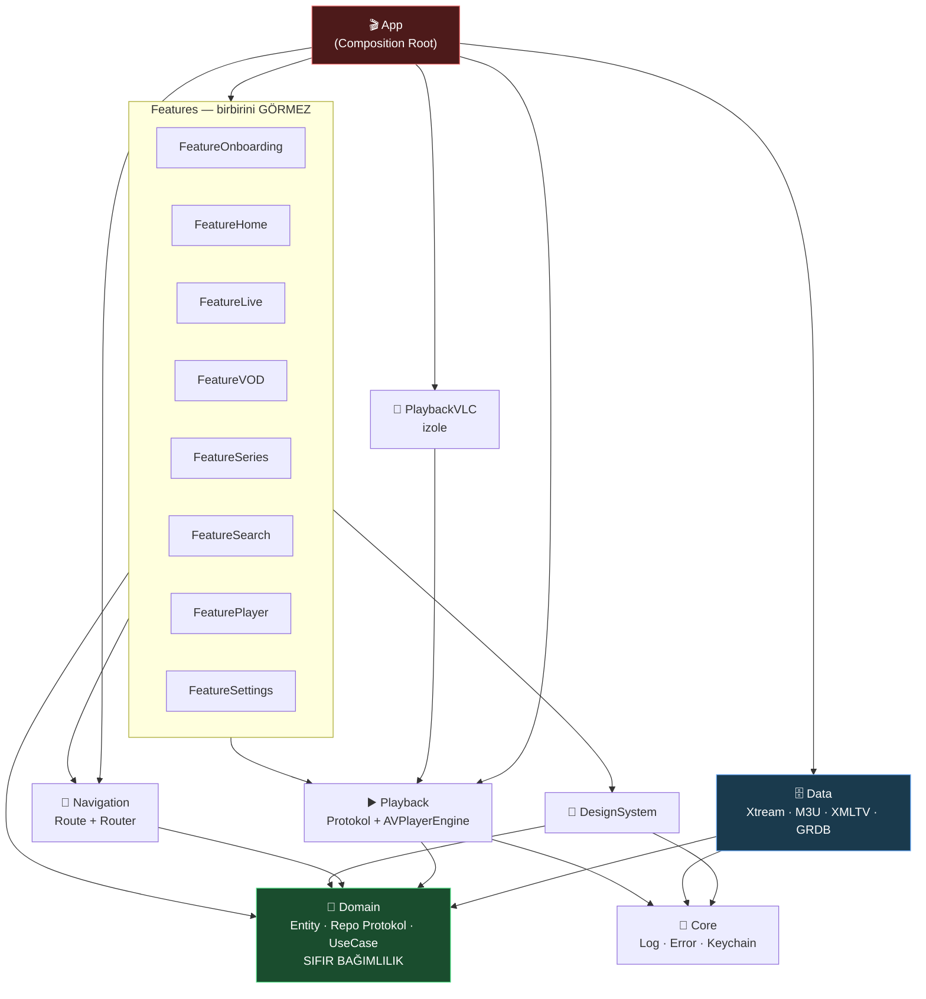

# 🧠 OCTOPUS — BEYİN HARİTASI

> Bu dosya projenin **anayasasıdır**. Kod ile doküman çelişirse, önce burayı güncelle, sonra kodu yaz.
> Her yeni özellik "bu haritada nereye oturuyor?" sorusuna cevap veremiyorsa **yazılmaz**.

---

## 1. NE İNŞA EDİYORUZ

iOS için IPTV istemcisi. Kullanıcı bir **kaynak** ekler (Xtream hesabı, M3U linki
veya aktivasyon kodu), uygulama o kaynaktan **Canlı TV / Film / Dizi** içeriğini
çeker, yerel veritabanına yazar, offline-first gösterir ve uygun motorla oynatır.

Ayrıca bir **bayi (reseller) altyapısına** bağlanır: marka rengi, duyurular,
yedek sunucu listesi ve bakım/güncelleme kapısı panelden gelir.

> 📐 Tasarım ve özellik hedefi Android sürümünden alınıyor —
> ayrıntı ve sahada öğrenilmiş dersler: [`REFERANS-ANALIZI.md`](REFERANS-ANALIZI.md)

---

## 2. KİLİTLENMİŞ KARARLAR

| Konu | Karar | Neden |
|---|---|---|
| İçerik kaynağı | Xtream **+** M3U/M3U8 **+** aktivasyon kodu | Üçü de tek `ContentProvider` protokolü arkasında. Yeni kaynak = yeni dosya, sıfır refactor |
| Bayi altyapısı | Panel API (`/api/app-config`, `/api/activation/redeem`, `/api/dns-list`) | Marka, duyuru, failover uzaktan yönetilir |
| Görsel dil | Android sürümüyle aynı kimlik, iOS'a özgü cila | Marka `#00B0FF`, koyu tema; SF Symbols + iOS tipografisi + haptik |
| Dil | Türkçe + İngilizce | Varsayılan cihaz dili; Ayarlar'da Sistem/Türkçe/English seçimi anında ve kalıcı uygulanır |
| Oynatma | AVPlayer **+** VLCKit | HLS → AVPlayer (canlı/film/bölümde yalnızca düğmeyle PiP, AirPlay, arka plan). MPEG-TS/RTSP → VLCKit fallback |
| Min. platform | **iOS 16.0**, iPhone + iPad | Kapsam geniş |
| Proje üretimi | **XcodeGen** (`project.yml`) | `.xcodeproj` git'e girmez → merge conflict yok, Windows'ta düzenlenebilir |
| UI | SwiftUI, `NavigationStack` | iOS 16'da mevcut |
| State | `ObservableObject` + `@Published` | `@Observable` iOS 17+, bize kapalı |
| Veritabanı | **GRDB.swift** (SQLite) | SwiftData iOS 17+. 50.000 kanal bulk-insert + FTS5 arama gerekiyor |
| Görsel cache | **Nuke** | `AsyncImage`'ın cache'i poster grid'lerinde çöküyor |
| Eşzamanlılık | `async/await` + Actor | Combine sadece player state stream'i için |
| DI | Elle yazılan Composition Root | Runtime DI (Swinject vb.) derleme-zamanı güvenliği öldürür |

> ⚠️ **iOS 16 tuzakları:** `@Observable` ❌ · `SwiftData` ❌ · `@Bindable` ❌ ·
> `NavigationStack` ✅ · `.searchable` ✅ · `Charts` ✅ · async/await ✅

---

## 3. MODÜL GRAFİĞİ



---

## 4. DEMİR KURALLAR (ihlal = derleme hatası)

1. **Domain hiçbir şeyi import etmez.** Sadece `Foundation`. UIKit/SwiftUI/GRDB **yasak**.
2. **Feature → Data import edemez.** Feature sadece Domain protokolünü bilir.
   Somut `XtreamContentProvider`'ı sadece App tanır.
3. **Feature → Feature import edemez.** Geçiş `Navigation.Route` üzerinden olur.
4. **Data → SwiftUI import edemez.** Data, ekranın var olduğunu bilmez.
5. **Bağımlılıklar yukarı akmaz.** Ok yönü tek taraflıdır; döngü olursa mimari bozulmuştur.
6. **3rd-party bağımlılık tek modülde hapsedilir.** GRDB sadece Data'da, VLCKit sadece PlaybackVLC'de.
7. **Singleton yasak.** Her şey `init` ile enjekte edilir. (`Log` istisna.)

---

## 5. MODÜL SORUMLULUKLARI

### 💎 OctopusDomain — *merkez*
**Yapar:** Entity (`Channel`, `Movie`, `Series`, `EPGProgram`, `Playlist`), Repository **protokolleri**, UseCase'ler, iş kuralları.
**ASLA yapmaz:** Ağ isteği, disk yazma, UI, tarih formatlama.
> Bu modül 10 yıl sonra da aynen durabilmeli. Buraya `import` eklemek istiyorsan dur ve düşün.

### 🗄️ OctopusData
**Yapar:** `XtreamContentProvider`, `M3UContentProvider`, XMLTV parser, GRDB şeması/migration, Repository **implementasyonları**, senkronizasyon.
**ASLA yapmaz:** Ekran bilmez, `Color`/`View` döndürmez.

### ▶️ OctopusPlayback / 📼 OctopusPlaybackVLC
**Yapar:** `PlaybackEngine` protokolü, `AVPlayerEngine`, `EngineResolver` (URL/format → motor seçimi), `PlayerController`, `NowPlayingCenter`, `AudioSessionController`.
VLC ayrı target: VLCKit patlarsa çekirdek etkilenmez.
**ASLA yapmaz:** Player **UI**'ı çizmez — o `FeaturePlayer`'ın işi.

> **Motor mu, koordinatör mü?** Motor tek bir işi bilir: verilen adresi
> açmak. Şu üçü onun işi **değil**, `PlayerController`'ın işidir:
> hangi motor (açamazsa yedeğe geçmek), nerede kalmıştı (devam konumu),
> SwiftUI'a nasıl anlatılır (`AsyncStream` → `@Published`).
> Bunlar motora konsaydı her yeni motor aynı mantığı baştan yazardı.

### 🧭 OctopusNavigation
`AppRoute` enum + `Router`. Route'lar **sadece ID taşır**, entity taşımaz (deeplink/state-restore için).

### 🎨 OctopusDesignSystem
Renk, tipografi, spacing, `PosterCard`, `ChannelRow`, `LoadingView`, `ErrorStateView`.
**ASLA yapmaz:** İş mantığı, ağ, ViewModel bilmez.

### 🔧 OctopusCore
`Log`, `AppError`, `KeychainStore`, `Reachability`, `Debouncer`. İş mantığı **yok**.

### 🎬 App — *ince olmak zorunda*
Sadece: container kurulumu + kök view + lifecycle. **Hedef: `OctopusApp.swift` ≤ 40 satır.**

---

## 6. VERİ AKIŞI — "Kanal listesi ekrana nasıl gelir?"

```
FeatureLive/LiveChannelsView
   └─ @StateObject LiveChannelsViewModel
        └─ ChannelRepository   ← PROTOKOL (Domain)
              ▲
              │ App tarafından bağlanır
              │
        ChannelRepositoryImpl (Data)
              ├─ ChannelDAO (GRDB)      → önce yereli döndür  ⚡ anında UI
              └─ ContentProvider        → arka planda tazele
                    ├─ XtreamContentProvider  (player_api.php)
                    └─ M3UContentProvider     (#EXTINF parser)
```

**Offline-first:** Repository **her zaman** önce SQLite'ı döndürür, ağ sonucu geldikçe günceller.
Kullanıcı boş ekran görmez.

---

## 7. OYNATMA AKIŞI — motor nasıl seçilir?

```
PlaybackItem(url, format)
        │
   EngineResolver
        ├─ .hls (.m3u8)          → AVPlayerEngine   ✅ AirPlay, arka plan ses
        ├─ .mp4 / .mov           → AVPlayerEngine
        ├─ .mpegTS (.ts) / rtsp  → VLCPlaybackEngine
        └─ bilinmiyor            → AVPlayer dene → hata → VLC'ye düş 🔁
```

`FeaturePlayer` **hangi motorun** çalıştığını bilmez; sadece `PlaybackEngine` protokolüne bakar.

Çalışma zamanı zinciri:

```
PlayerScreen ─── PlayerViewModel ──→ StreamResolving      "hangi adres?"
      │                                    ↓
      └───────── PlayerController ──→ PlaybackEngine      "aç ve çal"
                        ├──→ PlaybackProgressRepository   "nerede kalmıştı"
                        ├──→ WatchHistoryRepository       "izlendi"
                        └──→ NowPlayingCenter             "kilit ekranı"
```

⚠️ Yedeğe **yalnızca bir kez** düşülür (`didAttemptFallback`); ikisi de
açamazsa hata kullanıcıya gider. Aksi hâlde iki motor birbirini sonsuza
kadar tetikleyebilirdi.

⚠️ Video yüzeyine `.id(engineIdentifier)` verilir. Motor değişince SwiftUI
aynı `UIViewRepresentable`'ı yeniden kullanır; yeni motorun katmanı hiç
eklenmez ve **ekran siyah kalır**.

---

## 8. DOSYA HARİTASI

```
ios-octopus/
├── project.yml                      # XcodeGen — TEK proje tanımı
├── CLAUDE.md                        # kod kuralları
├── Docs/
│   ├── BRAIN.md                     # ← buradasın
│   └── ROADMAP.md
├── App/                             # İNCE kabuk
│   ├── Sources/
│   │   ├── OctopusApp.swift         # @main  (≤40 satır)
│   │   └── Composition/
│   │       ├── AppContainer.swift   # tüm bağlantılar burada
│   │       └── RootView.swift
│   └── Info.plist                   # `info:` DEĞİL, INFOPLIST_FILE ile bağlanır
└── Packages/
    ├── OctopusCore/
    ├── OctopusDomain/               # ⭐ saf Swift
    ├── OctopusData/
    ├── OctopusNavigation/
    ├── OctopusDesignSystem/
    ├── OctopusPlayback/
    ├── OctopusPlaybackVLC/
    └── OctopusFeatures/             # her feature ayrı target
        ├── FeatureOnboarding/       # kaynak ekleme, doğrulama
        ├── FeatureHome/             # raflar
        ├── FeatureLive/             # kanal listesi + EPG şeridi
        ├── FeatureVOD/              # film kataloğu + detay
        ├── FeatureSeries/           # dizi kataloğu + sezon/bölüm
        ├── FeatureSearch/           # birleşik arama
        ├── FeatureFavorites/        # favoriler
        ├── FeaturePlayer/           # oynatıcı (Faz 6)
        └── FeatureSettings/         # ayarlar, kaynak yönetimi
```

---

## 9. KOD KURALLARI

- Dosya adı = içindeki ana tipin adı. `LiveChannelsViewModel.swift` → `LiveChannelsViewModel`.
- View dosyası **200 satırı** geçerse alt bileşene böl.
- ViewModel `@MainActor`, `final class`, `ObservableObject`.
- Her ViewModel bağımlılığını **protokol** olarak alır → test'te sahte (mock) verilir.
- `try!` · `as!` · `force unwrap` **yasak** (test kodu hariç).
- Public API'ye `public` yazmayı unutma — modüller arası varsayılan `internal`.
- Kullanıcıya gösterilen metin doğrudan yazılmaz → `Localizable.strings`.

---

## 10. TEST STRATEJİSİ

Testin **nerede koştuğu** mimariden çıkar. Yanlış yere yazılan test ya hiç
çalışmaz ya da gereksiz yavaş çalışır.

| Test | Nerede koşar | Süre | Neden orada |
|---|---|---|---|
| `OctopusDomainTests` | Linux, `swift test` | saniyeler | Saf Swift — macOS/simülatör gerekmez |
| `OctopusDataTests` | Simülatör, `xcodebuild test` | ~1 dk | Core üzerinden `Security`/`os`'a bağlı |
| `OctopusPlaybackTests` | Simülatör, `xcodebuild test` | ~1 dk | `UIKit` bağımlı |
| `OctopusTests` (smoke) | Simülatör, `-scheme Octopus` | ~1 dk | Composition root'u kurar |

> ⚠️ **Paket test hedefleri ana şemaya dahil değildir.**
> `xcodebuild test -scheme Octopus` yalnızca `OctopusTests`'i koşar.
> Paket testleri CI'da her paketin kendi dizininde ayrıca çalıştırılır
> (bkz. `.github/workflows/ci.yml` → "Paket testleri").
> Yeni bir pakete test eklersen **o listeye de eklemeyi unutma** —
> yoksa test yazılmış ama hiç koşmamış olur ki bu, testsiz olmaktan
> daha tehlikelidir: koruman var sanırsın.

**Kural:** İş kuralını Domain'e yaz → testi ücretsiz ve anında koşar.
Test yazmak için simülatör gerekiyorsa, muhtemelen mantığı yanlış katmana koydun.

---

## 11. YOL HARİTASI

| Faz | İçerik | Durum |
|---|---|---|
| **0** | Beyin haritası + modül iskeleti + protokoller | ✅ |
| **1** | Domain entity'leri + GRDB şema/migration | ✅ |
| **2** | Xtream + M3U provider, Repository impl | ✅ |
| **3** | Onboarding: kaynak ekle → senkronize et | ✅ |
| **4** | Canlı TV listesi + kategori + arama | ✅ |
| **5** | Player (AVPlayer → VLC fallback) | ✅ AVPlayer · ✅ VLC · 🐞 VLC'de denetimler görünmüyor |
| **6** | EPG (XMLTV + Xtream short_epg) + rehber ekranı | ✅ |
| **7** | VOD + Dizi (sezon/bölüm) | ✅ |
| **8** | Favoriler, izleme geçmişi, kaldığın yerden devam | ✅ |
| **9** | Arka plan sesi ✅ · Now Playing ✅ · AirPlay ✅ · PiP ✅* | ✅ |
| **10** | Ebeveyn kilidi ✅ · tema ✅ · çoklu profil ⏳ | 🔨 |

> ✅ **Faz 5 neden artık beklemiyor:** "gerçek cihaz gerekiyor" varsayımı
> yanlıştı. AVFoundation bir **sistem çerçevesi**; CI'daki macOS runner
> onu derliyor, test ediyor ve simülatörde çalıştırıp kare alıyor. Cihaz
> gerçekten gereken tek parça VLCKit (~60 MB binary, SPM entegrasyonu
> kırılgan) — o hâlâ Mac'i bekliyor.
>
> Bu, projenin en pahalı yanlış varsayımıydı: fazlarca "cihaz yok" diye
> ertelendi. **Dersi:** "yapamayız" demeden önce hangi parçanın gerçekten
> engellendiğini ayrıştır.

> ✅ **VLC bağlandı (2026-08-09).** `vlckit-spm` 3.6.0 (`MobileVLCKit`) —
> resmî `videolan/VLCKit` deposunda `Package.swift` yok, SPM ile
> çözülemiyor. Tahmin doğru çıktı: resolver zinciri ve `PlayerController`
> yedek yolu **hiç değişmeden** çalıştı; yalnızca motor yazıldı.
>
> ⚠️ **Beklenmeyen boşluk — "sesli körlük":** `hls` formatı
> `isNativelySupported == true` olduğu için HEVC/UHD kanallar AVPlayer'da
> kalıyordu. AVPlayer çözemediği video izini **sessizce atlıyor**: durum
> `readyToPlay`, hata yok, ses akıyor, ekran siyah. Hata düşmediği için
> yedek motor hiç denenmiyordu. Çözüm: `AVPlayerEngine` içinde gözcü —
> oynatma başladıktan 5 sn sonra hâlâ `presentationSize == .zero` ise
> bu bir başarısızlıktır ve `unrecoverableFailure` yayınlanır.
> **Ders:** "açıldı" ile "görüntü var" aynı şey değil; motor sözleşmesi
> yalnızca hata sinyaline dayanırsa sessiz başarısızlıklar yakalanmaz.
>
> ⚡ **Zaplama maliyeti motor ömründedir (2026-08-09 incelemesi).**
> `start()` her çağrıldığında yeni motor üretiliyordu: eski motorun
> `teardown`'ı (VLC'de `stop()` ana iş parçacığını tıkar), yeni `AVPlayer`,
> ses oturumunun yeniden etkinleştirilmesi, PiP kontrolörünün yeniden
> kurulması ve `surfaceGeneration` arttığı için SwiftUI'ın video yüzeyini
> baştan yaratması — hepsi **her kanalda**. Artık resolver kararı
> değişmediyse motor korunuyor, yalnızca `load()` çağrılıyor.
> **Kural:** motor değiştirmek pahalıdır; yalnızca karar değişince yapılır.
>
> ⚠️ **Canlı yayın ≠ VOD, ayarlar da ayrı olmalı.** Canlıda
> `automaticallyWaitsToMinimizeStalling` kapalı (tampon beklemek her zapta
> gecikme demek), VOD'da açık. VLC'de `network-caching` canlıda 1500 ms —
> 3000 ms akıcıydı ama her zapta 3 saniye siyah ekrandı.
>
> ⚠️ **Sessiz başarısızlıklar iki motorda da yakalanmalı.** AVPlayer
> çözemediği videoyu sessizce atlar (bkz. "sesli körlük"); VLC ise ölü bir
> yayında `.opening`'de sonsuza kadar bekler, `.error` hiç gelmez.
> İkisinin de gözcüsü var: AVPlayer'da 3 sn (kare gelmedi), VLC'de 15 sn
> (hiç açılmadı). Motor sözleşmesi yalnızca hata sinyaline güvenemez.
>
> ⚠️ **Canlıda kopma kalıcı sayılmaz:** `PlayerController` aynı yayına
> artan gecikmeyle 3 kez sessizce yeniden bağlanır (kullanıcı spinner
> görür, hata ekranı değil). Sayaç oynatma başlayınca sıfırlanır — saatlik
> izlemede biriken kopmalar hakkı tüketmesin. VOD'da yeniden deneme **yok**:
> orada kopma genelde kalıcı bir sebeptendir ve gizlenmemeli.
>
> 🧪 **Üçüncü motor denendi: KSPlayer (2026-08-09).** `OctopusPlaybackKS`
> modülü kuruldu (KSPlayer 2.3.4 + FFmpegKit 6.1.4) ve **ilk denemede
> derlendi** — üçüncü motoru eklemek protokol + fabrika + `AppContainer`'da
> tek satırdan ibaret kaldı. Mimarinin asıl sınavı buydu ve geçti.
>
> ❌ **Ve kaldırıldı:** UHD/HEVC yayınlarında KSPlayer'ın kendi iz
> ayrıştırması çöküyordu — `FFmpegAssetTrack.init(stream:)` →
> `_assertionFailure` (EXC_BREAKPOINT), iki denemede birebir aynı yığın.
> Kütüphane içi, yamanamaz; 2.3.4 en güncel sürüm. Modül tamamen silindi
> (uygulama ~168 MB → VLC'siz hâline döndü, SPM önbelleğinden ~1 GB düştü).
> Yedek motor yine VLC.
> **Ders:** üçüncü taraf motoru "derleniyor" ile "güvenilir" aynı şey değil;
> kabul kriteri gerçek yayında çökmemektir. Eklemek de çıkarmak da tek
> modül + `AppContainer`'da tek fonksiyondan ibaret kaldı — izolasyon işe yaradı.
>
> 🐞 **Açık:** VLC motorundayken oynatıcı denetimleri ekranda görünmüyor
> (dokunma ulaşıyor, durum değişiyor, çizim olmuyor). `VLCOpenGLES2VideoView`
> SwiftUI içeriğinin önünde kompozit ediliyor. `zIndex`, `.overlay` ve
> `isUserInteractionEnabled` denendi, çözmedi. Bkz. `PlayerScreen.swift`.

> ✅* **PiP yazıldı, gerçek cihazda doğrulanmadı:** simülatörde
> `AVPictureInPictureController.isPictureInPictureSupported()` **false**
> döner; kontrolör hiç kurulmaz ve düğme çıkmaz. Kod bu durumu sessizce
> kabul ediyor — yani simülatörde "çalışmıyor" görünmesi normaldir.
> Mac'te iPhone'a kurup doğrulanması gerekiyor.
> PiP canlı yayın, film ve dizi bölümlerinde kullanıcı üst çubuktaki düğmeye
> bastığında başlar. Geri/Home hareketi otomatik PiP başlatmaz.
>
> ⚠️ İki ayrı kavram karıştırılmamalı: `supportsPictureInPicture`
> **motorun** yeteneği (VLC'de `false`), `isPictureInPicturePossible`
> ise **o an** başlatılabilirlik (video yüklenene kadar `false`).
> Düğmenin görünürlüğü ikincisine bakar; birincisine baksaydı
> simülatörde tıklanan ama hiçbir şey yapmayan bir düğme olurdu.

### Görsel dil

Android sürümüyle aynı kimlik, iOS'a özgü cila. Somut karşılıkları:

| Referanstaki | iOS karşılığı | Nerede |
|---|---|---|
| Tam ekran dönen tanıtım | Hero **kartı** (raflar kaydırılabilir kalsın) | `FeatureHome/HomeScreen` |
| Kart üstü puan | `RatingBadge` — puan yoksa hiç çizilmez | `DesignSystem` |
| Detay hero'su | `DetailHeaderView` — film **ve** dizi ortak kullanır | `DesignSystem` |
| Uzun künye satırı | Yatay kaydırılan çipler (`DetailChip`) | `DesignSystem` |
| Üstte gömülü video | `LiveMiniPlayerView` — **gerçek** oynatıcı; liste dokunuşu yayını burada başlatır, tam ekran karta dokununca | `FeatureLive` |
| — | Haptik: favori/kategori/PIN | `DesignSystem/Haptics` |

⚠️ Detay başlığı **tek** bileşen: ayrı yazılsalardı zamanla birbirinden
ayrı düşerlerdi — referans projede tam olarak bu olmuştu.

> ⚠️ **Sinematik başlık iki parçalı bir sözleşmedir.** `DetailHeaderView`
> tek başına yetmez: ekranın **`.toolbarBackground(.hidden, for: .navigationBar)`**
> demesi de gerekir. Opak çubuk zemini görselin üst ~110pt'sini ve afişin
> tepesini örtüyordu — görsel ekranın tepesinden başladığı hâlde koyu bir
> bant gibi duruyor, afiş oradan kesiliyordu. Yeni bir detay ekranı
> eklenirse bu satır unutulmamalı.
>
> ⚠️ **Oran boş kutuya uygulanır, görsele değil.** `RemoteImageView`'a
> doğrudan `.aspectRatio` verilince görsel kendi doğal genişliğini
> dayatıyor ve **tüm başlık bloğu ekrandan taşıyor** (afiş ve başlık
> soldan kesildi). Doğrusu: `Color.clear.aspectRatio(...).overlay { görsel }`.

> ✅ **Gömülü mini oynatıcı (2026-08-09).** Uzun süre "feature'lar
> birbirini import edemez, video gömülemez" diye statik bir kartla
> idare edilmişti. Yanlış teşhis: gereken şey `FeaturePlayer` **değil**,
> `OctopusPlayback`'ti. `FeatureLive` motor sözleşmesini oynatma
> modülünden görüyor, iki ekran hâlâ birbirini tanımıyor — demir kural 3
> bozulmadı. `VideoSurfaceView` bu yüzden `FeaturePlayer`'dan
> `OctopusPlayback`'e taşındı.
>
> ⚠️ **Yüzey kimliği motor adı olamaz:** her `attach` yeni bir motor
> **örneği** üretir ama kimlik dizgesi aynı kalabilir (kanal değiştirirken
> AVPlayer → AVPlayer). SwiftUI `.id` değişmeyince yüzeyi yeniden kurmaz
> ve ekranda bırakılmış eski motorun katmanı kalır: kanal değişir, ses
> gelir, görüntü donar. Çözüm `PlayerController.surfaceGeneration`
> sayacı. Aynı hata tam ekrandaki zaplamayı da vuruyordu.

#### Canlı TV yerleşimi

Referanstaki sıra birebir alındı: **video → kategoriler → arama → liste**.
Üç karar bunu mümkün kıldı:

1. **Gezinme çubuğu gizli** (`.toolbar(.hidden, for: .navigationBar)`) —
   önizleme kartı ekranın üst kenarına yapışsın, durum çubuğunun altına
   uzansın diye. Yan etkisi: bu sekmede arama/ayarlar ikonu görünmez;
   ayarlara diğer dört sekmenin üst barından erişilir.
2. **`.searchable` kullanılmıyor** — o değiştirici aramayı gezinme
   çubuğuna koyar, biz kategorilerin **altında** istiyoruz. Yerine
   `DesignSystem/SearchField`.
3. **Kart `ScrollView`'in dışında** — referansta video sabit, liste
   altında kayıyor.

⚠️ Video **gömülemez**: `FeaturePlayer` ayrı modül ve feature'lar
birbirini import edemez (demir kural 3). Kart aynı hissi mimariyi
bozmadan verir.

⚠️ İki tuzak: (a) kart yokken üst güvenli alan korunmalı
(`edges: showsPreview ? .top : []`), yoksa kategori şeridi durum
çubuğunun altında kalır; (b) buradan açılan ekranlara
`.toolbar(.visible)` verilmeli, yoksa geri düğmesi kaybolur.

### Bayi paneli entegrasyonu

Panel ayrı bir depoda: `qruze_player/admin-server` (Node + Express +
SQLite). Uygulama oraya **üç uçtan** bağlanır:

| Uç | Ne getirir | Ne zaman |
|---|---|---|
| `/api/app-config` | genel: sürüm, bakım, tema, duyuru | her açılış |
| `/api/public/reseller-config/<kod>` | bayiye özel: marka, duyuru, **sunucu listesi**, iOS bayrağı | kod kayıtlıysa |
| `/api/activation/redeem` | aktivasyon kodu → gerçek hesap | kullanıcı kod girince |

Sistemdeki üç **adres** karıştırılmamalı:

| Ne | Adres | Kim kullanır |
|---|---|---|
| API tabanı | `octopusdocumentary.com` | uygulama |
| Yönetim paneli | `octopusdocumentary.com/octo-control-7842` | admin, tarayıcıda |
| Hızlı kurulum | `octopusplayer.com/b/<kod>` | müşteri, tarayıcıda |

⚠️ Sonuncusu **API değil**. Uygulama oraya istek atmaz; kullanıcı o
bağlantıyı bayi kodu alanına yapıştırırsa koda çevrilir
(`ResellerConfig.normalizeCode`) — bayiler müşteriye kodu değil
bağlantıyı gönderiyor.

**Öncelik kuralı:** bayi > global. Bayi bir alanı doldurmuşsa o kazanır,
susmuşsa global değer korunur (`RemoteAppConfig.applying(_:)`).

⚠️ **Panel varsayılan kırmızısı** (`#E50914`): panel, bayi renk seçmemiş
olsa da bu değeri gönderiyor. Ham uygulanırsa her bayi kırmızı olur ve
uygulamanın kimliği kaybolur — `BrandConfiguration.effectiveColorHex`
yalnızca bu bilinen eski varsayılan değeri eler; seçilmiş diğer kırmızılar uygulanır.

⚠️ **iOS ayrı bir platform**: `platform_ios_enabled`, Android'in
`platform_mobile_enabled` bayrağından bağımsız. Bayilerin çoğu App Store
onayı çıkana kadar yalnızca Android dağıtıyor; tek bayrak paylaşsalardı
iOS'u kapatmak Android'i de kapatırdı. Kapalıyken
`ServiceGate.platformUnavailable` devreye girer — bakımdan **ayrı** bir
durum, çünkü beklemenin faydası yok, kullanıcı bayisine başvurmalı.

⚠️ **Eksik alan = açık**: sunucusu güncellenmemiş panelde
`platform_ios_enabled` hiç gelmez. `false` varsaymak o bayilerin
uygulamasını bir anda kilitlerdi.

Sözleşme `PanelResellerConfigTests` ile kilitli: içindeki JSON çalışan
panelden alınmış gerçek bir yanıt. Panel bir alan adını değiştirirse test
kırmızıya döner — aksi hâlde uygulama sessizce markasız açılır.

### Ebeveyn kilidi nerede uygulanır?

Kilit **tek bir yerde tutulur, yedi yerde uygulanır**. Bir ekranı atlamak
kilidi o ekrandan atlatılabilir kılar — bu yüzden liste burada:

| Ekran | Süzülen |
|---|---|
| Canlı TV | kanal listesi **ve** arama sonuçları |
| Filmler | katalog sayfaları **ve** arama sonuçları |
| Diziler | katalog sayfaları **ve** arama sonuçları |
| Ara (birleşik) | üç türün sonucu da |
| Ana Sayfa | "kaldığın yer", "son eklenenler", "son izlenenler" |
| Favoriler | üç tür de |
| **Oynatıcı** | **kanal değiştirme (zap) sırası** |

⚠️ Sonuncusu en kolay unutulanı: listeler süzülse bile oynatıcıda ileri
geri basan kullanıcı yetişkin kanala düşerdi. `PlayerZappingTests`
bunu ayrıca doğruluyor.

⚠️ Sayfalı listelerde ofset **çekilen ham satır** sayısını takip eder,
görünen öğe sayısını değil. Aksi halde gizlenen her öğe sonraki sayfayı
geri kaydırır ve aynı içerik tekrar tekrar gelir.

---

## 11.1 SAHADA ÖĞRENİLEN TUZAKLAR

Bu proje boyunca **derleme geçtiği hâlde** yanlış olan şeyler. Hepsi
gerçekten yaşandı; tekrar keşfetmeye gerek yok.

| Tuzak | Belirti | Doğrusu |
|---|---|---|
| XcodeGen `info:` bölümü | `Info.plist` sessizce **eziliyor**; ATS ve launch screen pakete girmiyor, uygulama 320×480 boyutta açılıyor | `info:` kullanma, `INFOPLIST_FILE` build ayarını ver |
| Eksik `ignoresSafeArea()` | Arka plan durum çubuğuna uzanmıyor, ekran "kutu içinde" duruyor | Kök görünümde `ZStack` + `ignoresSafeArea()` |
| Çok ürünlü SPM paketi | `xcodebuild -scheme OctopusFeatures` diye bir şema **yok**, testler koşmuyor | `<Ad>-Package` toplu şemasını kullan |
| `XCTUnwrap(try await …)` · `XCTAssertTrue(await …)` | `'async' call in an autoclosure that does not support concurrency` | Tüm `XCTAssert…` ailesi **autoclosure** alır; içinde `await` olamaz. Önce `let x = await …`, sonra assert |
| `@MainActor` tipin örneğini varsayılan parametre değeri yapmak | `call to main actor-isolated initializer in a synchronous nonisolated context` — varsayılan ifadeler izolasyonsuz bağlamda değerlendirilir | Parametreyi `Optional` yap, varsayılanı **gövdede** üret: `self.x = x ?? X()` |
| `@MainActor` fonksiyona non-escaping closure parametresi | `escaping local function captures non-escaping value` — aktöre atlarken parametre kaçmış sayılır | Closure'ı `@escaping` işaretle |
| Motor değişince video yüzeyini yeniden kurmamak | Yedeğe düşülüyor, ses geliyor ama **ekran siyah**: SwiftUI aynı `UIViewRepresentable`'ı yeniden kullanıyor, yeni motorun katmanı hiç eklenmiyor | Yüzeye `.id(engineIdentifier)` ver |
| İzleme geçmişini adres çözülünce yazmak | Açılmayan yayınlar da "izlendi" sayılıyor; "kaldığın kanal" kartı hiç izlenmemiş kanalı gösteriyor | Kaydı `.playing` durumuna **ilk geçişte** yaz |
| Ham dizgi `#"…"#` + renk kodu | `"#00E676` dizisi dizgiyi erken kapatıyor | İki diyezli sınırlayıcı `##"…"##` |
| Feature'da `as?` ile Data protokolü | Dönüşüm **asla tutmaz** (feature Data'yı göremez), özellik sessizce çalışmaz | Sözleşmeyi Domain'e taşı |
| Domain'in iç yardımcısına uzanmak | `inaccessible due to 'internal'` | Dönüşümü sunum katmanına koy, Domain'i açma |
| `try?` + optional dönen fonksiyon | `initializer for conditional binding must have Optional type, not 'String'` — `String??` sanıp iki kez açtım | `try?` iç içe optional'ı **düzleştirir** (SE-0230); `throws -> String?` tek `if let` ile açılır |
| Testte sabit `sleep` ile geciktirme beklemek | CI **rastgele** kırmızı: yerelde geçen test yüklü koşucuda 100 ms'e sığmıyor. Kod değişmemişti | Süreyi değil **koşulu** bekle (`waitUntil { … }`). Sabit bekleme yalnızca bir şeyin *olmadığını* doğrularken doğru |
| `AsyncStream`'e abone olunmadan yayın yapmak | Yayın **sessizce kaybolur** (continuation henüz yok), test zaman aşımına düşer | Önce aboneliği bekle (`waitUntil { stub.isObserving }`), sonra yayınla. Sabit uyku bunu şans eseri örtüyordu — uyku kaldırılınca ortaya çıktı |
| `@MainActor` sınıfın statik üyesini izolasyonsuz testten çağırmak | `call to main actor-isolated static method … in a synchronous nonisolated context` | Test sınıfını da `@MainActor` yap. `actor` tiplerde sorun yok — onların statikleri zaten izolasyonsuz |
| Uyarlanır ızgarada sabit genişlikli afiş | Hücreler ekrana göre genişliyor, afiş 104pt'de kalıyor; iPad'de her hücrede boşluk | `Color.clear` + `aspectRatio` ile hücre genişliğini ölç, görseli doldur |
| Nuke'u yapılandırmadan bırakmak | Afişler **tam boyutta** çözülüyor; 1000×1500 afiş 104pt'lik küçük resim için ~6 MB. Yüz afişte bellek baskısı | `ImageProcessors.Resize(width:)` ile çözme sırasında küçült |
| Sayfalamada beraberlik bozucusuz sıralama | Aynı adlı içerik (IPTV'de aynı film farklı kalitelerde) sayfa sınırında tekrar edip kaybolur | `ORDER BY title, id` — ve `id`'yi indekse de ekle |
| Varsayılan görünümün indeksi | `(playlistId, categoryId, sortOrder)` indeksi, kategori süzülmeyince sıralamayı karşılamıyor → tam sıralama | Süzgeçsiz hâl için ayrı indeks: `(playlistId, sortOrder, name)` |
| `.sensoryFeedback` kullanmak | iOS **17+** — bizde derlenmez | UIKit üreteçleri (`UISelectionFeedbackGenerator` vb.), `prepare()` ile sakla |
| Kaynaksız uygulamanın karesini almak | Tek görülebilen ekran karşılama; ana sayfa/ızgara/detay **kör** yazılıyor | `-seedDemoData` ile sahte katalog yaz, `-startup.tab <ad>` ile her sekmenin karesini al |
| Dokunma gerektiren ekranın karesini alamamak | Oynatıcıya girmek bir kanala dokunmayı gerektiriyor, `simctl` dokunma üretmiyor → oynatıcı kör yazılıyor | `-startup.player <storageKey>` ile açılışta doğrudan sun (`#if DEBUG`). Demo kaynağın ilk kanalı gerçek bir HLS akışına bakıyor, böylece kare video çizildiğini de kanıtlıyor |

> 💡 **iOS numarası:** `xcrun simctl launch … -anahtar değer` biçimindeki
> argümanları iOS otomatik olarak `NSUserDefaults`'a yazar. Açılış sekmesi
> tercihi zaten oradan okunduğu için sekme sekme kare almak **sıfır satır**
> ek uygulama kodu gerektirdi.
| Sağlayıcının `is_adult` alanına güvenmek | Ebeveyn kilidi kuruluyor ama hiçbir şey gizlenmiyor: M3U'da alan yok, panellerin çoğu doldurmuyor | Kategori adından çıkar (`AdultContentDetector`), damgalamayı senkronizasyonda yap |
| **Panel ucuna GET atmak** | Aktivasyon kodu **hiç** çalışmıyor: uç `405 method_not_allowed` dönüyor, kullanıcı "kod geçersiz" sanıyor | `POST` + JSON gövde. Kod sorgu dizesine **konmaz** — sunucu erişim kayıtlarına düşer, kod tek kullanımlık bir sırdır |
| 4xx gövdesini atmak | Panel asıl sebebi `{"error":"invalid_code_format"}` diye **400 gövdesinde** açıklıyor; kullanıcı "Beklenmeyen durum kodu: 400" görüyor | Gövdeyi durum kodundan **önce** oku (`HTTPResponse` döndür, fırlatma) |
| Panel cevabını düz varsaymak | Kod kabul ediliyor ama "Aktivasyon bilgileri eksik": alanlar `playlist` **nesnesinin içinde** geliyordu | Okuma sırası: iç içe nesne → düz alan → yedek ad. Alan adlarını (değerleri değil) logla |
| Kullanıcı girdisini "temizlemek" | Kod büyük harfe çevriliyor + karakter süzgecinden geçiyordu; panel büyük/küçük harfe duyarlıysa **doğru kod bozuluyor** | Yalnızca boşluk kırp. Geçerliliğe **panel** karar verir; yerel süzgeç test edilemeyen bir hata sınıfı üretir |
| `playlist_type` alanına güvenmek | Panel "m3u" diyor ama adres `get.php?username=…&password=…` — yani Xtream. M3U olarak işlenince **250 MB tek dosya** iniyor, 315 bin satırın hepsi "kanal" oluyor, film/dizi **sıfır** | Bağlantı kimlik taşıyorsa Xtream kur (`XtreamLink`). Tür alanı bağlantının **biçimini** anlatır, hesabın türünü değil |
| Marka bilgisini ayrıştırıp kullanmamak | Bayinin rengi (`#E50914`) çözülüyor ama hiçbir yere uygulanmıyordu; herkes varsayılan maviyi görüyordu | Aktivasyon sonucu tema denetleyicisine bağlanmalı. Ayrıca renk `theme.primary_color`'da — düz `reseller_primary_color` hiç gelmiyor |
| Panel alan adını belgeye göre yazmak | `maintenance_mode` bekleniyordu, panel `maintenance` gönderiyor → **bakım modu hiç tetiklenmiyor** | Canlı cevabın alan adlarını listele, ikisini de oku |
| Motor kimliğini yüzey kimliği sanmak | Kanal değişince ses geliyor, görüntü **donuyor**: her `attach` yeni motor **örneği** üretiyor ama kimlik dizgesi aynı (`avplayer` → `avplayer`), SwiftUI yüzeyi yenilemiyor | `surfaceGeneration` sayacı; `.id(engineIdentifier)` yetmez |
| Her kanal değişiminde motoru yeniden kurmak | Zaplama yavaş: teardown + yeni `AVPlayer` + ses oturumu + PiP + yüzey yeniden kurulumu, **her kanalda** | Resolver kararı değişmediyse motoru koru, yalnızca `load()` çağır |
| Motorun yalnızca hata sinyaline güvenmek | AVPlayer çözemediği videoyu **sessizce atlıyor**: `readyToPlay`, hata yok, ses akıyor, ekran siyah — yedek motor hiç denenmiyor | "Oynuyor ama kare yok" gözcüsü. VLC'de tersi: ölü yayında sonsuza kadar `.opening` — orada da zaman aşımı gerekir |
| `.menu` Picker'ın etiketine güvenmek | `Form`/`List` dışında etiket **hiç çizilmiyor**, ekranda yalnızca seçili değer duruyor ("Dengeli" yazıyor, neyin dengeli olduğu yazmıyor) | Etiketi elle çiz, Picker'a `.labelsHidden()` |
| Oranı görsele uygulamak | `RemoteImageView`'a `.aspectRatio` verilince görsel kendi doğal genişliğini dayatıyor, **tüm blok ekrandan taşıyor** | Oranı boş kutuya ver: `Color.clear.aspectRatio(…).overlay { görsel }` |
| Sinematik başlığı tek bileşen sanmak | Opak gezinme çubuğu görselin üst ~110pt'sini ve afişin tepesini örtüyor | Ekran ayrıca `.toolbarBackground(.hidden, for: .navigationBar)` demeli — bu bir **iki parçalı sözleşme** |

> 🔍 **Yöntem dersi:** Ekran boyutu hatası iki tur **tahminle** kovalandı,
> üçüncüde `plutil -p` ile derlenmiş plist okununca cevap tek satırda çıktı.
> Belirti tekrar ediyorsa tahmini bırak, ölç.

> 🔍 **Üçüncü yöntem dersi — en pahalısı:** Faz 5 fazlarca "gerçek cihaz
> gerekiyor" diye ertelendi. Varsayım hiç sınanmadı. Sınandığında ortaya
> çıktı ki AVFoundation bir **sistem çerçevesi**: CI'daki macOS runner onu
> derliyor, test ediyor, simülatörde çalıştırıp video karesi alıyor.
> Gerçekten engellenen tek parça VLCKit'ti (60 MB binary).
> **Dersi:** "yapamayız" demeden önce hangi parçanın gerçekten
> engellendiğini ayrıştır — engel çoğu zaman sanılandan küçüktür.

> 🔍 **İkinci yöntem dersi:** Favoriler testi "yavaş" sanılıp bekleme süresi
> uzatılabilirdi. Süre yerine **koşul** beklenince gerçek sebep ortaya çıktı:
> yayın, abone olunmadan yapılıyordu ve sessizce kayboluyordu. Sabit uyku
> hatayı düzeltmiyor, **saklıyordu**.

---

## 12. "MAIN NEDEN ŞİŞMEZ?"

Klasik IPTV projelerinde `ContentView.swift` 3000 satır olur çünkü **her şey oraya bağlanır**.
Burada üç mekanizma bunu fiziksel olarak imkânsız kılar:

1. **Fiziksel ayrım** — Her feature ayrı Swift paketi. App'e kod yazmak için önce paket eklemen gerekir; bu bir sürtünmedir ve doğru yere yazmaya iter.
2. **Tek bağlanma noktası** — Somut sınıflar sadece `AppContainer` içinde birleşir. App büyüse bile **tek bir dosya** büyür, o da sadece `let x = XImpl(y:)` satırlarıdır.
3. **Derleyici zorlaması** — `FeatureLive`, `OctopusData`'yı import **edemez**. "Şuraya hızlıca şunu yazayım" kestirmesi derlenmez.

**Sonuç:** Proje 50.000 satıra çıkar, `OctopusApp.swift` yine 40 satır kalır.

---

## 13. NEREDE KALDIK? (2026-08-11)

### Bu oturumda tamamlananlar

| Konu | Durum | Not |
|---|---|---|
| VLCKit entegrasyonu (Faz 5) | ✅ | `vlckit-spm` 3.6.0. UHD/HEVC kanallar artık görüntülü açılıyor |
| "Sesli körlük" gözcüsü | ✅ | AVPlayer sessizce video izini atlıyordu; 3 sn sonra yedeğe düşülür |
| Canlı TV gömülü mini oynatıcı | ✅ | Liste dokunuşu tam ekrana atlamıyor, yayın tepede başlıyor |
| Kanal geçiş hızı | ✅ | Motor yeniden kullanımı + tampon ayarları. Standart kanal ~1,3 sn |
| Canlıda otomatik yeniden bağlanma | ✅ | Artan gecikmeyle 3 deneme, sessiz |
| Sonraki bölüm | ✅ | 8 sn geri sayım, elle oynatma/iptal ve sezonlar arası otomatik sıra |
| Oynatıcı hareketleri + kilit | ✅ | Çift dokunma 10 sn; sol parlaklık, sağ ses; yanlış dokunmaya karşı kilit |
| Canlı oynatıcı paneli | ✅ | Oynatıcıdan çıkmadan aranabilir kanal listesi ve şimdi/sırada EPG |
| Yayın öncesi görsel kalite turu | ✅ | Kompakt oynatıcı kontrolleri/bildirim, güvenli alt boşluklar, yatay raf ipucu ve markalı logo-afiş yedekleri |
| Standart uygulama logosu | ✅ | Ahtapot oynat simgesi AppIcon oldu; bayi logosu yoksa onboarding ve ana sayfada aynı işaret kullanılıyor |
| Tam ekran VLC denetimleri | ✅ | Video ve SwiftUI katmanı aynı UIKit hiyerarşisinde; CI'da fallback karesi var |
| Ayarlar → Oynatıcı bölümü | ✅ | Tampon, yerleşim, yeniden bağlanma, yedek motor — hepsi gerçek etkili |
| Detay sayfası sinematik başlık | ✅ | Şeffaf çubuk + oranla ölçeklenen arka plan |
| Ana sayfa başlık kartı | ✅ | Dönen afiş kaldırıldı; marka, saat, abonelik, kullanıcı |
| Son eklenen diziler rafı | ✅ | `SeriesRepository.recentlyAdded` (sıralama `lastModified`) |
| Abonelik bitişi kalıcı | ✅ | `authenticate()` sonucu atılıyordu; artık `playlist.expiresAt` |
| Aktivasyon kodu | ✅ | GET→POST, iç içe cevap, normalleştirme — üç ayrı hata |
| M3U → Xtream dönüşümü | ✅ | `XtreamLink`. Kanıt: m3u'da 315k kanal/0 film · xtream'de 3k kanal/38k film/4k dizi |
| Bayi markası | ✅ | `theme.primary_color` okunuyor **ve** artık uygulanıyor |
| KSPlayer denemesi | ❌ | Entegre edildi, çalıştı, **çöktü** (kütüphane içi trap), kaldırıldı |

### Açık işler

| # | İş | Neden bekliyor |
|---|---|---|
| 1 | **Bayi kodu ucu bağlı değil** | `/api/public/reseller-config/{kod}` app_name, logo, iletişim, `minimum_version` ve **DNS yedek listesi** döndürüyor. Uygulama bu ucu hiç çağırmıyor çünkü **bayi kodunu bilmiyor** — aktivasyon cevabı kodu döndürmüyor. Seçenekler: (a) panel cevabına `reseller_code` eklesin, (b) bayi başına derleme, (c) kullanıcı girsin |
| 2 | **`DNSFailoverService` çağrılmıyor** | Yazılmış ama hiçbir yerden kullanılmıyor. (1) çözülünce sunucu düştüğünde otomatik yedeğe geçiş devreye girer |
| 3 | Mevcut M3U kaynakları dönüşmüyor | Dönüşüm yalnızca **yeni** eklemede. Eski kayıtlar silinip yeniden eklenmeli — ya da senkronizasyonda göç yazılmalı |
| 4 | `PanelEndpoint.defaultBaseURL` force unwrap | CLAUDE.md yasaklıyor, `check-architecture.sh` yakalamıyor |
| 5 | HEVC gerçek cihazda doğrulanmadı | Simülatörde HEVC çözülemiyor ve her UHD kanal yedeğe düşüyor. **Gerçek iPhone'da AVPlayer HEVC'yi donanımda çözer** — orada yedeğe hiç düşmemesi beklenir. Ölçülmeden optimize edilmemeli |

### Doğrulanmış gerçekler (tahmin değil)

- **API adresi:** `octopusdocumentary.com` ✅ · `octopusplayer.com/api/*` → CMS 404 ❌
- Bayi sayfası `octopusplayer.com/b/{kod}` 4 haneli, 10 dakikalık kod üretir
- Aktivasyon başarı cevabı: `{ success, playlist:{…}, theme:{…}, home_theme:{…} }`
- Panel `invalid_code_format` hatasını **boş gövdeye de** döndürür — "biçim yanlış" değil, "okuyamadım" demektir
- Açılış süreleri (simülatör): standart kanal 1,3–2,4 sn · UHD (yedeğe düşerek) ~7,5 sn

### Ölçüm araçları

- `Açılış: N ms · motor X` — her yayın açılışında (kalıcı log)
- `Aktivasyon cevabı: HTTP N · <hata> · alanlar=[…]` — alan adları, **değerler asla**
