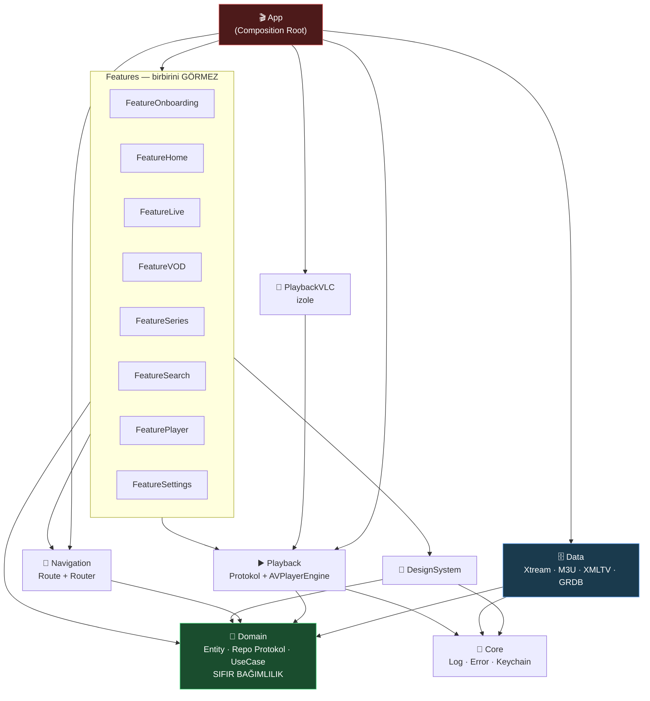

# 🧠 OCTOPUS — BEYİN HARİTASI

> Bu dosya projenin **anayasasıdır**. Kod ile doküman çelişirse, önce burayı güncelle, sonra kodu yaz.
> Her yeni özellik "bu haritada nereye oturuyor?" sorusuna cevap veremiyorsa **yazılmaz**.

---

## 1. NE İNŞA EDİYORUZ

iOS için IPTV istemcisi. Kullanıcı bir **kaynak** ekler (Xtream hesabı, M3U linki
veya aktivasyon kodu), uygulama o kaynaktan **Canlı TV / Film / Dizi** içeriğini
çeker, yerel veritabanına yazar, offline-first gösterir ve uygun motorla oynatır.

Ayrıca bir **bayi (reseller) altyapısına** bağlanır: marka rengi, duyurular,
yedek sunucu listesi ve bakım/güncelleme kapısı panelden gelir.

> 📐 Tasarım ve özellik hedefi Android sürümünden alınıyor —
> ayrıntı ve sahada öğrenilmiş dersler: [`REFERANS-ANALIZI.md`](REFERANS-ANALIZI.md)

---

## 2. KİLİTLENMİŞ KARARLAR

| Konu | Karar | Neden |
|---|---|---|
| İçerik kaynağı | Xtream **+** M3U/M3U8 **+** aktivasyon kodu | Üçü de tek `ContentProvider` protokolü arkasında. Yeni kaynak = yeni dosya, sıfır refactor |
| Bayi altyapısı | Panel API (`/api/app-config`, `/api/activation/redeem`, `/api/dns-list`) | Marka, duyuru, failover uzaktan yönetilir |
| Görsel dil | Android sürümüyle aynı kimlik, iOS'a özgü cila | Marka `#00B0FF`, koyu tema; SF Symbols + iOS tipografisi + haptik |
| Oynatma | AVPlayer **+** VLCKit | HLS → AVPlayer (PiP/AirPlay/arka plan). MPEG-TS/RTSP → VLCKit fallback |
| Min. platform | **iOS 16.0**, iPhone + iPad | Kapsam geniş |
| Proje üretimi | **XcodeGen** (`project.yml`) | `.xcodeproj` git'e girmez → merge conflict yok, Windows'ta düzenlenebilir |
| UI | SwiftUI, `NavigationStack` | iOS 16'da mevcut |
| State | `ObservableObject` + `@Published` | `@Observable` iOS 17+, bize kapalı |
| Veritabanı | **GRDB.swift** (SQLite) | SwiftData iOS 17+. 50.000 kanal bulk-insert + FTS5 arama gerekiyor |
| Görsel cache | **Nuke** | `AsyncImage`'ın cache'i poster grid'lerinde çöküyor |
| Eşzamanlılık | `async/await` + Actor | Combine sadece player state stream'i için |
| DI | Elle yazılan Composition Root | Runtime DI (Swinject vb.) derleme-zamanı güvenliği öldürür |

> ⚠️ **iOS 16 tuzakları:** `@Observable` ❌ · `SwiftData` ❌ · `@Bindable` ❌ ·
> `NavigationStack` ✅ · `.searchable` ✅ · `Charts` ✅ · async/await ✅

---

## 3. MODÜL GRAFİĞİ



---

## 4. DEMİR KURALLAR (ihlal = derleme hatası)

1. **Domain hiçbir şeyi import etmez.** Sadece `Foundation`. UIKit/SwiftUI/GRDB **yasak**.
2. **Feature → Data import edemez.** Feature sadece Domain protokolünü bilir.
   Somut `XtreamContentProvider`'ı sadece App tanır.
3. **Feature → Feature import edemez.** Geçiş `Navigation.Route` üzerinden olur.
4. **Data → SwiftUI import edemez.** Data, ekranın var olduğunu bilmez.
5. **Bağımlılıklar yukarı akmaz.** Ok yönü tek taraflıdır; döngü olursa mimari bozulmuştur.
6. **3rd-party bağımlılık tek modülde hapsedilir.** GRDB sadece Data'da, VLCKit sadece PlaybackVLC'de.
7. **Singleton yasak.** Her şey `init` ile enjekte edilir. (`Log` istisna.)

---

## 5. MODÜL SORUMLULUKLARI

### 💎 OctopusDomain — *merkez*
**Yapar:** Entity (`Channel`, `Movie`, `Series`, `EPGProgram`, `Playlist`), Repository **protokolleri**, UseCase'ler, iş kuralları.
**ASLA yapmaz:** Ağ isteği, disk yazma, UI, tarih formatlama.
> Bu modül 10 yıl sonra da aynen durabilmeli. Buraya `import` eklemek istiyorsan dur ve düşün.

### 🗄️ OctopusData
**Yapar:** `XtreamContentProvider`, `M3UContentProvider`, XMLTV parser, GRDB şeması/migration, Repository **implementasyonları**, senkronizasyon.
**ASLA yapmaz:** Ekran bilmez, `Color`/`View` döndürmez.

### ▶️ OctopusPlayback / 📼 OctopusPlaybackVLC
**Yapar:** `PlaybackEngine` protokolü, `AVPlayerEngine`, `EngineResolver` (URL/format → motor seçimi), Now Playing + PiP + uzaktan kumanda.
VLC ayrı target: VLCKit patlarsa çekirdek etkilenmez.
**ASLA yapmaz:** Player **UI**'ı çizmez — o `FeaturePlayer`'ın işi.

### 🧭 OctopusNavigation
`AppRoute` enum + `Router`. Route'lar **sadece ID taşır**, entity taşımaz (deeplink/state-restore için).

### 🎨 OctopusDesignSystem
Renk, tipografi, spacing, `PosterCard`, `ChannelRow`, `LoadingView`, `ErrorStateView`.
**ASLA yapmaz:** İş mantığı, ağ, ViewModel bilmez.

### 🔧 OctopusCore
`Log`, `AppError`, `KeychainStore`, `Reachability`, `Debouncer`. İş mantığı **yok**.

### 🎬 App — *ince olmak zorunda*
Sadece: container kurulumu + kök view + lifecycle. **Hedef: `OctopusApp.swift` ≤ 40 satır.**

---

## 6. VERİ AKIŞI — "Kanal listesi ekrana nasıl gelir?"

```
FeatureLive/LiveChannelsView
   └─ @StateObject LiveChannelsViewModel
        └─ ChannelRepository   ← PROTOKOL (Domain)
              ▲
              │ App tarafından bağlanır
              │
        ChannelRepositoryImpl (Data)
              ├─ ChannelDAO (GRDB)      → önce yereli döndür  ⚡ anında UI
              └─ ContentProvider        → arka planda tazele
                    ├─ XtreamContentProvider  (player_api.php)
                    └─ M3UContentProvider     (#EXTINF parser)
```

**Offline-first:** Repository **her zaman** önce SQLite'ı döndürür, ağ sonucu geldikçe günceller.
Kullanıcı boş ekran görmez.

---

## 7. OYNATMA AKIŞI — motor nasıl seçilir?

```
PlaybackItem(url, format)
        │
   EngineResolver
        ├─ .hls (.m3u8)          → AVPlayerEngine   ✅ PiP, AirPlay, arka plan
        ├─ .mp4 / .mov           → AVPlayerEngine
        ├─ .mpegTS (.ts) / rtsp  → VLCPlaybackEngine
        └─ bilinmiyor            → AVPlayer dene → hata → VLC'ye düş 🔁
```

`FeaturePlayer` **hangi motorun** çalıştığını bilmez; sadece `PlaybackEngine` protokolüne bakar.

---

## 8. DOSYA HARİTASI

```
ios-octopus/
├── project.yml                      # XcodeGen — TEK proje tanımı
├── CLAUDE.md                        # kod kuralları
├── Docs/
│   ├── BRAIN.md                     # ← buradasın
│   └── ROADMAP.md
├── App/                             # İNCE kabuk
│   ├── Sources/
│   │   ├── OctopusApp.swift         # @main  (≤40 satır)
│   │   └── Composition/
│   │       ├── AppContainer.swift   # tüm bağlantılar burada
│   │       └── RootView.swift
│   └── Info.plist                   # `info:` DEĞİL, INFOPLIST_FILE ile bağlanır
└── Packages/
    ├── OctopusCore/
    ├── OctopusDomain/               # ⭐ saf Swift
    ├── OctopusData/
    ├── OctopusNavigation/
    ├── OctopusDesignSystem/
    ├── OctopusPlayback/
    ├── OctopusPlaybackVLC/
    └── OctopusFeatures/             # her feature ayrı target
        ├── FeatureOnboarding/       # kaynak ekleme, doğrulama
        ├── FeatureHome/             # raflar
        ├── FeatureLive/             # kanal listesi + EPG şeridi
        ├── FeatureVOD/              # film kataloğu + detay
        ├── FeatureSeries/           # dizi kataloğu + sezon/bölüm
        ├── FeatureSearch/           # birleşik arama
        ├── FeatureFavorites/        # favoriler
        ├── FeaturePlayer/           # oynatıcı (Faz 6)
        └── FeatureSettings/         # ayarlar, kaynak yönetimi
```

---

## 9. KOD KURALLARI

- Dosya adı = içindeki ana tipin adı. `LiveChannelsViewModel.swift` → `LiveChannelsViewModel`.
- View dosyası **200 satırı** geçerse alt bileşene böl.
- ViewModel `@MainActor`, `final class`, `ObservableObject`.
- Her ViewModel bağımlılığını **protokol** olarak alır → test'te sahte (mock) verilir.
- `try!` · `as!` · `force unwrap` **yasak** (test kodu hariç).
- Public API'ye `public` yazmayı unutma — modüller arası varsayılan `internal`.
- Kullanıcıya gösterilen metin doğrudan yazılmaz → `Localizable.strings`.

---

## 10. TEST STRATEJİSİ

Testin **nerede koştuğu** mimariden çıkar. Yanlış yere yazılan test ya hiç
çalışmaz ya da gereksiz yavaş çalışır.

| Test | Nerede koşar | Süre | Neden orada |
|---|---|---|---|
| `OctopusDomainTests` | Linux, `swift test` | saniyeler | Saf Swift — macOS/simülatör gerekmez |
| `OctopusDataTests` | Simülatör, `xcodebuild test` | ~1 dk | Core üzerinden `Security`/`os`'a bağlı |
| `OctopusPlaybackTests` | Simülatör, `xcodebuild test` | ~1 dk | `UIKit` bağımlı |
| `OctopusTests` (smoke) | Simülatör, `-scheme Octopus` | ~1 dk | Composition root'u kurar |

> ⚠️ **Paket test hedefleri ana şemaya dahil değildir.**
> `xcodebuild test -scheme Octopus` yalnızca `OctopusTests`'i koşar.
> Paket testleri CI'da her paketin kendi dizininde ayrıca çalıştırılır
> (bkz. `.github/workflows/ci.yml` → "Paket testleri").
> Yeni bir pakete test eklersen **o listeye de eklemeyi unutma** —
> yoksa test yazılmış ama hiç koşmamış olur ki bu, testsiz olmaktan
> daha tehlikelidir: koruman var sanırsın.

**Kural:** İş kuralını Domain'e yaz → testi ücretsiz ve anında koşar.
Test yazmak için simülatör gerekiyorsa, muhtemelen mantığı yanlış katmana koydun.

---

## 11. YOL HARİTASI

| Faz | İçerik | Durum |
|---|---|---|
| **0** | Beyin haritası + modül iskeleti + protokoller | ✅ |
| **1** | Domain entity'leri + GRDB şema/migration | ✅ |
| **2** | Xtream + M3U provider, Repository impl | ✅ |
| **3** | Onboarding: kaynak ekle → senkronize et | ✅ |
| **4** | Canlı TV listesi + kategori + arama | ✅ |
| **5** | Player (AVPlayer → VLC fallback) | 🚧 **Mac/cihaz bekliyor** |
| **6** | EPG (XMLTV + Xtream short_epg) + rehber ekranı | ✅ |
| **7** | VOD + Dizi (sezon/bölüm) | ✅ |
| **8** | Favoriler, izleme geçmişi, kaldığın yerden devam | ✅ |
| **9** | PiP, AirPlay, arka plan sesi, Now Playing | ⏳ (Faz 5'e bağlı) |
| **10** | Ebeveyn kilidi ✅ · tema ✅ · çoklu profil ⏳ | 🔨 |

> 🚧 **Faz 5 neden bekliyor:** oynatıcı motoru gerçek cihazda
> doğrulanmadan yazılmamalı. `PlaybackEngineResolver` yerinde,
> `NullPlaybackEngine` ile derleniyor; AVPlayer/VLCKit implementasyonu
> Apple geliştirici hesabı ve TestFlight hazır olunca eklenecek.

### Görsel dil

Android sürümüyle aynı kimlik, iOS'a özgü cila. Somut karşılıkları:

| Referanstaki | iOS karşılığı | Nerede |
|---|---|---|
| Tam ekran dönen tanıtım | Hero **kartı** (raflar kaydırılabilir kalsın) | `FeatureHome/HomeScreen` |
| Kart üstü puan | `RatingBadge` — puan yoksa hiç çizilmez | `DesignSystem` |
| Detay hero'su | `DetailHeaderView` — film **ve** dizi ortak kullanır | `DesignSystem` |
| Uzun künye satırı | Yatay kaydırılan çipler (`DetailChip`) | `DesignSystem` |
| — | Haptik: favori/kategori/PIN | `DesignSystem/Haptics` |

⚠️ Detay başlığı **tek** bileşen: ayrı yazılsalardı zamanla birbirinden
ayrı düşerlerdi — referans projede tam olarak bu olmuştu.

### Ebeveyn kilidi nerede uygulanır?

Kilit **tek bir yerde tutulur, altı yerde uygulanır**. Bir ekranı atlamak
kilidi o ekrandan atlatılabilir kılar — bu yüzden liste burada:

| Ekran | Süzülen |
|---|---|
| Canlı TV | kanal listesi **ve** arama sonuçları |
| Filmler | katalog sayfaları **ve** arama sonuçları |
| Diziler | katalog sayfaları **ve** arama sonuçları |
| Ara (birleşik) | üç türün sonucu da |
| Ana Sayfa | "kaldığın yer", "son eklenenler", "son izlenenler" |
| Favoriler | üç tür de |

⚠️ Sayfalı listelerde ofset **çekilen ham satır** sayısını takip eder,
görünen öğe sayısını değil. Aksi halde gizlenen her öğe sonraki sayfayı
geri kaydırır ve aynı içerik tekrar tekrar gelir.

---

## 11.1 SAHADA ÖĞRENİLEN TUZAKLAR

Bu proje boyunca **derleme geçtiği hâlde** yanlış olan şeyler. Hepsi
gerçekten yaşandı; tekrar keşfetmeye gerek yok.

| Tuzak | Belirti | Doğrusu |
|---|---|---|
| XcodeGen `info:` bölümü | `Info.plist` sessizce **eziliyor**; ATS ve launch screen pakete girmiyor, uygulama 320×480 boyutta açılıyor | `info:` kullanma, `INFOPLIST_FILE` build ayarını ver |
| Eksik `ignoresSafeArea()` | Arka plan durum çubuğuna uzanmıyor, ekran "kutu içinde" duruyor | Kök görünümde `ZStack` + `ignoresSafeArea()` |
| Çok ürünlü SPM paketi | `xcodebuild -scheme OctopusFeatures` diye bir şema **yok**, testler koşmuyor | `<Ad>-Package` toplu şemasını kullan |
| `XCTUnwrap(try await …)` | `'async' call in an autoclosure` | Önce `await`, sonra unwrap |
| Ham dizgi `#"…"#` + renk kodu | `"#00E676` dizisi dizgiyi erken kapatıyor | İki diyezli sınırlayıcı `##"…"##` |
| Feature'da `as?` ile Data protokolü | Dönüşüm **asla tutmaz** (feature Data'yı göremez), özellik sessizce çalışmaz | Sözleşmeyi Domain'e taşı |
| Domain'in iç yardımcısına uzanmak | `inaccessible due to 'internal'` | Dönüşümü sunum katmanına koy, Domain'i açma |
| `try?` + optional dönen fonksiyon | `initializer for conditional binding must have Optional type, not 'String'` — `String??` sanıp iki kez açtım | `try?` iç içe optional'ı **düzleştirir** (SE-0230); `throws -> String?` tek `if let` ile açılır |
| Testte sabit `sleep` ile geciktirme beklemek | CI **rastgele** kırmızı: yerelde geçen test yüklü koşucuda 100 ms'e sığmıyor. Kod değişmemişti | Süreyi değil **koşulu** bekle (`waitUntil { … }`). Sabit bekleme yalnızca bir şeyin *olmadığını* doğrularken doğru |
| `AsyncStream`'e abone olunmadan yayın yapmak | Yayın **sessizce kaybolur** (continuation henüz yok), test zaman aşımına düşer | Önce aboneliği bekle (`waitUntil { stub.isObserving }`), sonra yayınla. Sabit uyku bunu şans eseri örtüyordu — uyku kaldırılınca ortaya çıktı |
| `@MainActor` sınıfın statik üyesini izolasyonsuz testten çağırmak | `call to main actor-isolated static method … in a synchronous nonisolated context` | Test sınıfını da `@MainActor` yap. `actor` tiplerde sorun yok — onların statikleri zaten izolasyonsuz |
| Uyarlanır ızgarada sabit genişlikli afiş | Hücreler ekrana göre genişliyor, afiş 104pt'de kalıyor; iPad'de her hücrede boşluk | `Color.clear` + `aspectRatio` ile hücre genişliğini ölç, görseli doldur |
| Nuke'u yapılandırmadan bırakmak | Afişler **tam boyutta** çözülüyor; 1000×1500 afiş 104pt'lik küçük resim için ~6 MB. Yüz afişte bellek baskısı | `ImageProcessors.Resize(width:)` ile çözme sırasında küçült |
| Sayfalamada beraberlik bozucusuz sıralama | Aynı adlı içerik (IPTV'de aynı film farklı kalitelerde) sayfa sınırında tekrar edip kaybolur | `ORDER BY title, id` — ve `id`'yi indekse de ekle |
| Varsayılan görünümün indeksi | `(playlistId, categoryId, sortOrder)` indeksi, kategori süzülmeyince sıralamayı karşılamıyor → tam sıralama | Süzgeçsiz hâl için ayrı indeks: `(playlistId, sortOrder, name)` |
| `.sensoryFeedback` kullanmak | iOS **17+** — bizde derlenmez | UIKit üreteçleri (`UISelectionFeedbackGenerator` vb.), `prepare()` ile sakla |
| Kaynaksız uygulamanın karesini almak | Tek görülebilen ekran karşılama; ana sayfa/ızgara/detay **kör** yazılıyor | `-seedDemoData` ile sahte katalog yaz, `-startup.tab <ad>` ile her sekmenin karesini al |

> 💡 **iOS numarası:** `xcrun simctl launch … -anahtar değer` biçimindeki
> argümanları iOS otomatik olarak `NSUserDefaults`'a yazar. Açılış sekmesi
> tercihi zaten oradan okunduğu için sekme sekme kare almak **sıfır satır**
> ek uygulama kodu gerektirdi.
| Sağlayıcının `is_adult` alanına güvenmek | Ebeveyn kilidi kuruluyor ama hiçbir şey gizlenmiyor: M3U'da alan yok, panellerin çoğu doldurmuyor | Kategori adından çıkar (`AdultContentDetector`), damgalamayı senkronizasyonda yap |

> 🔍 **Yöntem dersi:** Ekran boyutu hatası iki tur **tahminle** kovalandı,
> üçüncüde `plutil -p` ile derlenmiş plist okununca cevap tek satırda çıktı.
> Belirti tekrar ediyorsa tahmini bırak, ölç.

> 🔍 **İkinci yöntem dersi:** Favoriler testi "yavaş" sanılıp bekleme süresi
> uzatılabilirdi. Süre yerine **koşul** beklenince gerçek sebep ortaya çıktı:
> yayın, abone olunmadan yapılıyordu ve sessizce kayboluyordu. Sabit uyku
> hatayı düzeltmiyor, **saklıyordu**.

---

## 12. "MAIN NEDEN ŞİŞMEZ?"

Klasik IPTV projelerinde `ContentView.swift` 3000 satır olur çünkü **her şey oraya bağlanır**.
Burada üç mekanizma bunu fiziksel olarak imkânsız kılar:

1. **Fiziksel ayrım** — Her feature ayrı Swift paketi. App'e kod yazmak için önce paket eklemen gerekir; bu bir sürtünmedir ve doğru yere yazmaya iter.
2. **Tek bağlanma noktası** — Somut sınıflar sadece `AppContainer` içinde birleşir. App büyüse bile **tek bir dosya** büyür, o da sadece `let x = XImpl(y:)` satırlarıdır.
3. **Derleyici zorlaması** — `FeatureLive`, `OctopusData`'yı import **edemez**. "Şuraya hızlıca şunu yazayım" kestirmesi derlenmez.

**Sonuç:** Proje 50.000 satıra çıkar, `OctopusApp.swift` yine 40 satır kalır.
