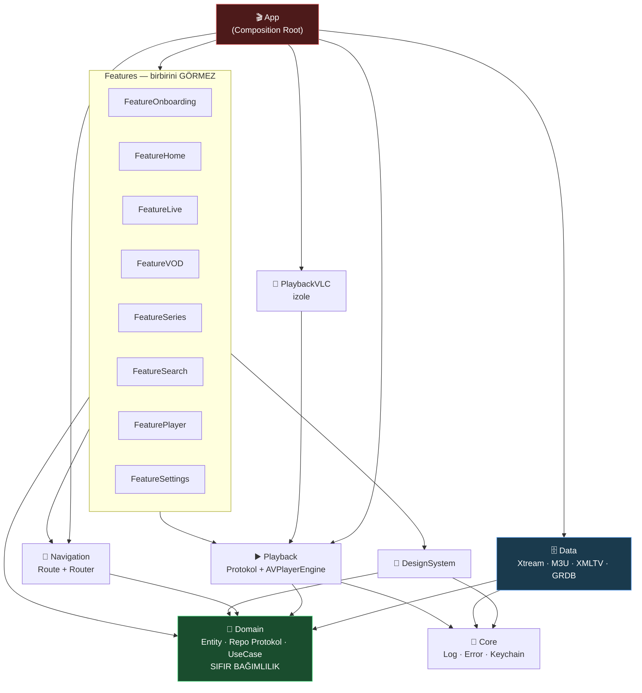

# 🧠 OCTOPUS — BEYİN HARİTASI

> Bu dosya projenin **anayasasıdır**. Kod ile doküman çelişirse, önce burayı güncelle, sonra kodu yaz.
> Her yeni özellik "bu haritada nereye oturuyor?" sorusuna cevap veremiyorsa **yazılmaz**.

---

## 1. NE İNŞA EDİYORUZ

iOS için IPTV istemcisi. Kullanıcı bir **kaynak** ekler (Xtream hesabı, M3U linki
veya aktivasyon kodu), uygulama o kaynaktan **Canlı TV / Film / Dizi** içeriğini
çeker, yerel veritabanına yazar, offline-first gösterir ve uygun motorla oynatır.

Ayrıca bir **bayi (reseller) altyapısına** bağlanır: marka rengi, duyurular,
yedek sunucu listesi ve bakım/güncelleme kapısı panelden gelir.

> 📐 Tasarım ve özellik hedefi Android sürümünden alınıyor —
> ayrıntı ve sahada öğrenilmiş dersler: [`REFERANS-ANALIZI.md`](REFERANS-ANALIZI.md)

---

## 2. KİLİTLENMİŞ KARARLAR

| Konu | Karar | Neden |
|---|---|---|
| İçerik kaynağı | Xtream **+** M3U/M3U8 **+** aktivasyon kodu | Üçü de tek `ContentProvider` protokolü arkasında. Yeni kaynak = yeni dosya, sıfır refactor |
| Bayi altyapısı | Panel API (`/api/app-config`, `/api/activation/redeem`, `/api/dns-list`) | Marka, duyuru, failover uzaktan yönetilir |
| Görsel dil | Android sürümüyle aynı kimlik, iOS'a özgü cila | Marka `#00B0FF`; PC/Android/iOS ortak lacivert palet (`#091525`, `#11263B`, `#19374F`); kullanıcının 03.10.2026 talebiyle şeffaf mavi/turkuaz ahtapot logosu, yalnızca mavi ailesinden vurgu seçenekleri. Panel renkleri ve logoları ürün kimliğini değiştirmez, okunaklı metin; SF Symbols + iOS tipografisi + haptik. Büyük yazılar sınırlandırılmaz; düzen dikeyleşir. |
| Dil | Türkçe + İngilizce | Varsayılan cihaz dili; Ayarlar'da Sistem/Türkçe/English seçimi anında ve kalıcı uygulanır |
| Oynatma | AVPlayer **+** VLCKit | HLS → AVPlayer (canlı/film/bölümde yalnızca düğmeyle PiP, AirPlay, arka plan). MPEG-TS/RTSP → VLCKit fallback |
| Tam ekran ve dönüş | Oynatıcı kendi window scene'inde yatay; kapatınca önceki yön ve gezinme yolu korunur | Gerçek tam ekran UIKit hosting denetleyicisi, iOS 16 public geometry API ve iOS 26+ public orientation lock; görünür Live alıcısı varsa aynı oturum mini yüzeye devredilir, alıcı yoksa ses gecikmeden durur. Kanal paneli cached yerel sol overlay; video üstünde Material blur yok. |
| Min. platform | **iOS 16.0**, iPhone + iPad | Kapsam geniş |
| Proje üretimi | **XcodeGen** (`project.yml`) | `.xcodeproj` git'e girmez → merge conflict yok, Windows'ta düzenlenebilir |
| UI | SwiftUI, `NavigationStack` | iOS 16'da mevcut |
| State | `ObservableObject` + `@Published` | `@Observable` iOS 17+, bize kapalı |
| Veritabanı | **GRDB.swift** (SQLite) | SwiftData iOS 17+. 50.000 kanal bulk-insert + FTS5 arama gerekiyor |
| Görsel cache | **Nuke** | `AsyncImage`'ın cache'i poster grid'lerinde çöküyor |
| Eşzamanlılık | `async/await` + Actor | Combine sadece player state stream'i için |
| DI | Elle yazılan Composition Root | Runtime DI (Swinject vb.) derleme-zamanı güvenliği öldürür |

> ⚠️ **iOS 16 tuzakları:** `@Observable` ❌ · `SwiftData` ❌ · `@Bindable` ❌ ·
> `NavigationStack` ✅ · `.searchable` ✅ · `Charts` ✅ · async/await ✅

---

## 3. MODÜL GRAFİĞİ


```mermaid
graph TD
    App["🎬 App<br/>(Composition Root)"]

    subgraph FEAT["Features — birbirini GÖRMEZ"]
        FO[FeatureOnboarding]
        FH[FeatureHome]
        FL[FeatureLive]
        FV[FeatureVOD]
        FS[FeatureSeries]
        FR[FeatureSearch]
        FP[FeaturePlayer]
        FSet[FeatureSettings]
    end

    NAV["🧭 Navigation<br/>Route + Router"]
    DS["🎨 DesignSystem"]
    DOM["💎 Domain<br/>Entity · Repo Protokol · UseCase<br/>SIFIR BAĞIMLILIK"]
    DATA["🗄️ Data<br/>Xtream · M3U · XMLTV · GRDB"]
    PB["▶️ Playback<br/>Protokol + AVPlayerEngine"]
    PBV["📼 PlaybackVLC<br/>izole"]
    CORE["🔧 Core<br/>Log · Error · Keychain"]

    App --> FEAT
    App --> DATA
    App --> PB
    App --> PBV
    App --> NAV

    FEAT --> DOM
    FEAT --> DS
    FEAT --> NAV
    FEAT --> PB

    DATA --> DOM
    PB --> DOM
    PBV --> PB
    NAV --> DOM
    DS --> DOM
    DS --> CORE
    DATA --> CORE
    PB --> CORE

    style DOM fill:#1a4d2e,stroke:#4ade80,color:#fff
    style App fill:#4d1a1a,stroke:#f87171,color:#fff
    style DATA fill:#1a3a4d,stroke:#60a5fa,color:#fff
```

---

## 4. DEMİR KURALLAR (ihlal = derleme hatası)

1. **Domain hiçbir şeyi import etmez.** Sadece `Foundation`. UIKit/SwiftUI/GRDB **yasak**.
2. **Feature → Data import edemez.** Feature sadece Domain protokolünü bilir.
   Somut `XtreamContentProvider`'ı sadece App tanır.
3. **Feature → Feature import edemez.** Geçiş `Navigation.Route` üzerinden olur.
4. **Data → SwiftUI import edemez.** Data, ekranın var olduğunu bilmez.
5. **Bağımlılıklar yukarı akmaz.** Ok yönü tek taraflıdır; döngü olursa mimari bozulmuştur.
6. **3rd-party bağımlılık tek modülde hapsedilir.** GRDB sadece Data'da, VLCKit sadece PlaybackVLC'de.
7. **Singleton yasak.** Her şey `init` ile enjekte edilir. (`Log` istisna.)

---

## 5. MODÜL SORUMLULUKLARI

### 💎 OctopusDomain — *merkez*
**Yapar:** Entity (`Channel`, `Movie`, `Series`, `EPGProgram`, `Playlist`), Repository **protokolleri**, UseCase'ler, iş kuralları.
**ASLA yapmaz:** Ağ isteği, disk yazma, UI, tarih formatlama.
> Bu modül 10 yıl sonra da aynen durabilmeli. Buraya `import` eklemek istiyorsan dur ve düşün.

### 🗄️ OctopusData
**Yapar:** `XtreamContentProvider`, `M3UContentProvider`, XMLTV parser, GRDB şeması/migration, Repository **implementasyonları**, senkronizasyon.
**ASLA yapmaz:** Ekran bilmez, `Color`/`View` döndürmez.

### ▶️ OctopusPlayback / 📼 OctopusPlaybackVLC
**Yapar:** `PlaybackEngine` protokolü, `AVPlayerEngine`, `EngineResolver` (URL/format → motor seçimi), `PlayerController`, `NowPlayingCenter`, `AudioSessionController`.
VLC ayrı target: VLCKit patlarsa çekirdek etkilenmez.
**ASLA yapmaz:** Player **UI**'ı çizmez — o `FeaturePlayer`'ın işi.

> **Motor mu, koordinatör mü?** Motor tek bir işi bilir: verilen adresi
> açmak. Şu üçü onun işi **değil**, `PlayerController`'ın işidir:
> hangi motor (açamazsa yedeğe geçmek), nerede kalmıştı (devam konumu),
> SwiftUI'a nasıl anlatılır (`AsyncStream` → `@Published`).
> Bunlar motora konsaydı her yeni motor aynı mantığı baştan yazardı.

### 🧭 OctopusNavigation
`AppRoute` enum + `Router`. Route'lar **sadece ID taşır**, entity taşımaz (deeplink/state-restore için).

### 🎨 OctopusDesignSystem
Renk, tipografi, spacing, `PosterCard`, `ChannelRow`, `LoadingView`, `ErrorStateView`.
**ASLA yapmaz:** İş mantığı, ağ, ViewModel bilmez.

### 🔧 OctopusCore
`Log`, `AppError`, `KeychainStore`, `Reachability`, `Debouncer`. İş mantığı **yok**.

### 🎬 App — *ince olmak zorunda*
Sadece: container kurulumu + kök view + lifecycle. **Hedef: `OctopusApp.swift` ≤ 40 satır.**

---

## 6. VERİ AKIŞI — "Kanal listesi ekrana nasıl gelir?"

```
FeatureLive/LiveChannelsView
   └─ @StateObject LiveChannelsViewModel
        └─ ChannelRepository   ← PROTOKOL (Domain)
              ▲
              │ App tarafından bağlanır
              │
        ChannelRepositoryImpl (Data)
              ├─ ChannelDAO (GRDB)      → önce yereli döndür  ⚡ anında UI
              └─ ContentProvider        → arka planda tazele
                    ├─ XtreamContentProvider  (player_api.php)
                    └─ M3UContentProvider     (#EXTINF parser)
```

**Offline-first:** Repository **her zaman** önce SQLite'ı döndürür, ağ sonucu geldikçe günceller.
Kullanıcı boş ekran görmez.

---

## 7. OYNATMA AKIŞI — motor nasıl seçilir?

```
PlaybackItem(url, format)
        │
   EngineResolver
        ├─ .hls (.m3u8)          → AVPlayerEngine   ✅ AirPlay, arka plan ses
        ├─ .mp4 / .mov           → AVPlayerEngine
        ├─ .mpegTS (.ts) / rtsp  → VLCPlaybackEngine
        └─ bilinmiyor            → AVPlayer dene → hata → VLC'ye düş 🔁
```

`FeaturePlayer` **hangi motorun** çalıştığını bilmez; sadece `PlaybackEngine` protokolüne bakar.

Çalışma zamanı zinciri:

```
PlayerScreen ─── PlayerViewModel ──→ StreamResolving      "hangi adres?"
      │                                    ↓
      └───────── PlayerController ──→ PlaybackEngine      "aç ve çal"
                        ├──→ PlaybackProgressRepository   "nerede kalmıştı"
                        ├──→ WatchHistoryRepository       "izlendi"
                        └──→ NowPlayingCenter             "kilit ekranı"
```

⚠️ Yedeğe **yalnızca bir kez** düşülür (`didAttemptFallback`); ikisi de
açamazsa hata kullanıcıya gider. Aksi hâlde iki motor birbirini sonsuza
kadar tetikleyebilirdi.

⚠️ Video yüzeyine `.id(engineIdentifier)` verilir. Motor değişince SwiftUI
aynı `UIViewRepresentable`'ı yeniden kullanır; yeni motorun katmanı hiç
eklenmez ve **ekran siyah kalır**.

---

## 8. DOSYA HARİTASI

```
ios-octopus/
├── project.yml                      # XcodeGen — TEK proje tanımı
├── CLAUDE.md                        # kod kuralları
├── Docs/
│   ├── BRAIN.md                     # ← buradasın
│   └── ROADMAP.md
├── App/                             # İNCE kabuk
│   ├── Sources/
│   │   ├── OctopusApp.swift         # @main  (≤40 satır)
│   │   └── Composition/
│   │       ├── AppContainer.swift   # tüm bağlantılar burada
│   │       └── RootView.swift
│   └── Info.plist                   # `info:` DEĞİL, INFOPLIST_FILE ile bağlanır
└── Packages/
    ├── OctopusCore/
    ├── OctopusDomain/               # ⭐ saf Swift
    ├── OctopusData/
    ├── OctopusNavigation/
    ├── OctopusDesignSystem/
    ├── OctopusPlayback/
    ├── OctopusPlaybackVLC/
    └── OctopusFeatures/             # her feature ayrı target
        ├── FeatureOnboarding/       # kaynak ekleme, doğrulama
        ├── FeatureHome/             # raflar
        ├── FeatureLive/             # kanal listesi + EPG şeridi
        ├── FeatureVOD/              # film kataloğu + detay
        ├── FeatureSeries/           # dizi kataloğu + sezon/bölüm
        ├── FeatureSearch/           # birleşik arama
        ├── FeatureFavorites/        # favoriler
        ├── FeaturePlayer/           # oynatıcı (Faz 6)
        └── FeatureSettings/         # ayarlar, kaynak yönetimi
```

---

## 9. KOD KURALLARI

- Dosya adı = içindeki ana tipin adı. `LiveChannelsViewModel.swift` → `LiveChannelsViewModel`.
- View dosyası **200 satırı** geçerse alt bileşene böl.
- ViewModel `@MainActor`, `final class`, `ObservableObject`.
- Her ViewModel bağımlılığını **protokol** olarak alır → test'te sahte (mock) verilir.
- `try!` · `as!` · `force unwrap` **yasak** (test kodu hariç).
- Public API'ye `public` yazmayı unutma — modüller arası varsayılan `internal`.
- Kullanıcıya gösterilen metin doğrudan yazılmaz → `Localizable.strings`.

---

## 10. TEST STRATEJİSİ

Testin **nerede koştuğu** mimariden çıkar. Yanlış yere yazılan test ya hiç
çalışmaz ya da gereksiz yavaş çalışır.

| Test | Nerede koşar | Süre | Neden orada |
|---|---|---|---|
| `OctopusDomainTests` | Linux, `swift test` | saniyeler | Saf Swift — macOS/simülatör gerekmez |
| `OctopusDataTests` | Simülatör, `xcodebuild test` | ~1 dk | Core üzerinden `Security`/`os`'a bağlı |
| `OctopusPlaybackTests` | Simülatör, `xcodebuild test` | ~1 dk | `UIKit` bağımlı |
| `OctopusTests` (smoke) | Simülatör, `-scheme Octopus` | ~1 dk | Composition root'u kurar |

> ⚠️ **Paket test hedefleri ana şemaya dahil değildir.**
> `xcodebuild test -scheme Octopus` yalnızca `OctopusTests`'i koşar.
> Paket testleri CI'da her paketin kendi dizininde ayrıca çalıştırılır
> (bkz. `.github/workflows/ci.yml` → "Paket testleri").
> Yeni bir pakete test eklersen **o listeye de eklemeyi unutma** —
> yoksa test yazılmış ama hiç koşmamış olur ki bu, testsiz olmaktan
> daha tehlikelidir: koruman var sanırsın.

**Kural:** İş kuralını Domain'e yaz → testi ücretsiz ve anında koşar.
Test yazmak için simülatör gerekiyorsa, muhtemelen mantığı yanlış katmana koydun.

---

## 11. YOL HARİTASI

| Faz | İçerik | Durum |
|---|---|---|
| **0** | Beyin haritası + modül iskeleti + protokoller | ✅ |
| **1** | Domain entity'leri + GRDB şema/migration | ✅ |
| **2** | Xtream + M3U provider, Repository impl | ✅ |
| **3** | Onboarding: kaynak ekle → senkronize et | ✅ |
| **4** | Canlı TV listesi + kategori + arama | ✅ |
| **5** | Player (AVPlayer → VLC fallback) | ✅ AVPlayer · ✅ VLC · 🐞 VLC'de denetimler görünmüyor |
| **6** | EPG (XMLTV + Xtream short_epg) + rehber ekranı | ✅ |
| **7** | VOD + Dizi (sezon/bölüm) | ✅ |
| **8** | Favoriler, izleme geçmişi, kaldığın yerden devam | ✅ |
| **9** | Arka plan sesi ✅ · Now Playing ✅ · AirPlay ✅ · PiP ✅* | ✅ |
| **10** | Ebeveyn kilidi ✅ · tema ✅ · çoklu profil ⏳ | 🔨 |

> ✅ **Faz 5 neden artık beklemiyor:** "gerçek cihaz gerekiyor" varsayımı
> yanlıştı. AVFoundation bir **sistem çerçevesi**; CI'daki macOS runner
> onu derliyor, test ediyor ve simülatörde çalıştırıp kare alıyor. Cihaz
> gerçekten gereken tek parça VLCKit (~60 MB binary, SPM entegrasyonu
> kırılgan) — o hâlâ Mac'i bekliyor.
>
> Bu, projenin en pahalı yanlış varsayımıydı: fazlarca "cihaz yok" diye
> ertelendi. **Dersi:** "yapamayız" demeden önce hangi parçanın gerçekten
> engellendiğini ayrıştır.

> ✅ **VLC bağlandı (2026-08-09).** `vlckit-spm` 3.6.0 (`MobileVLCKit`) —
> resmî `videolan/VLCKit` deposunda `Package.swift` yok, SPM ile
> çözülemiyor. Tahmin doğru çıktı: resolver zinciri ve `PlayerController`
> yedek yolu **hiç değişmeden** çalıştı; yalnızca motor yazıldı.
>
> ⚠️ **Beklenmeyen boşluk — "sesli körlük":** `hls` formatı
> `isNativelySupported == true` olduğu için HEVC/UHD kanallar AVPlayer'da
> kalıyordu. AVPlayer çözemediği video izini **sessizce atlıyor**: durum
> `readyToPlay`, hata yok, ses akıyor, ekran siyah. Hata düşmediği için
> yedek motor hiç denenmiyordu. Çözüm: `AVPlayerEngine` içinde gözcü —
> görünür yüzeyde 8 sn kesintisiz oynatmaya rağmen
> `AVPlayerLayer.isReadyForDisplay == false` ise başarısızlık olayı
> yayınlanır. `presentationSize` yalnızca boyut metadata'sıdır; ilk
> karenin çözüldüğünü kanıtlamaz. AirPlay'de yerel kare beklenmez.
> **Ders:** "açıldı" ile "görüntü var" aynı şey değil; motor sözleşmesi
> yalnızca hata sinyaline dayanırsa sessiz başarısızlıklar yakalanmaz.
>
> ⚡ **Zaplama maliyeti motor ömründedir (2026-08-09 incelemesi).**
> `start()` her çağrıldığında yeni motor üretiliyordu: eski motorun
> `teardown`'ı (VLC'de `stop()` ana iş parçacığını tıkar), yeni `AVPlayer`,
> ses oturumunun yeniden etkinleştirilmesi, PiP kontrolörünün yeniden
> kurulması ve `surfaceGeneration` arttığı için SwiftUI'ın video yüzeyini
> baştan yaratması — hepsi **her kanalda**. Artık resolver kararı
> değişmediyse motor korunuyor, yalnızca `load()` çağrılıyor.
> **Kural:** motor değiştirmek pahalıdır; yalnızca karar değişince yapılır.
>
> ⚠️ **Canlı yayın ≠ VOD, ayarlar da ayrı olmalı.** Canlıda
> `automaticallyWaitsToMinimizeStalling` kapalı (tampon beklemek her zapta
> gecikme demek), VOD'da açık. VLC'de `network-caching` canlıda 1500 ms —
> 3000 ms akıcıydı ama her zapta 3 saniye siyah ekrandı.
>
> ⚠️ **Sessiz başarısızlıklar iki motorda da yakalanmalı.** AVPlayer
> çözemediği videoyu sessizce atlar (bkz. "sesli körlük"); VLC ise ölü bir
> yayında `.opening`'de sonsuza kadar bekler, `.error` hiç gelmez.
> İkisinin de gözcüsü var: AVPlayer'da 3 sn (kare gelmedi), VLC'de 15 sn
> (hiç açılmadı). Motor sözleşmesi yalnızca hata sinyaline güvenemez.
>
> ⚠️ **Canlıda kopma kalıcı sayılmaz:** `PlayerController` aynı yayına
> artan gecikmeyle 3 kez sessizce yeniden bağlanır (kullanıcı spinner
> görür, hata ekranı değil). Sayaç oynatma başlayınca sıfırlanır — saatlik
> izlemede biriken kopmalar hakkı tüketmesin. VOD'da yeniden deneme **yok**:
> orada kopma genelde kalıcı bir sebeptendir ve gizlenmemeli.
>
> 🧪 **Üçüncü motor denendi: KSPlayer (2026-08-09).** `OctopusPlaybackKS`
> modülü kuruldu (KSPlayer 2.3.4 + FFmpegKit 6.1.4) ve **ilk denemede
> derlendi** — üçüncü motoru eklemek protokol + fabrika + `AppContainer`'da
> tek satırdan ibaret kaldı. Mimarinin asıl sınavı buydu ve geçti.
>
> ❌ **Ve kaldırıldı:** UHD/HEVC yayınlarında KSPlayer'ın kendi iz
> ayrıştırması çöküyordu — `FFmpegAssetTrack.init(stream:)` →
> `_assertionFailure` (EXC_BREAKPOINT), iki denemede birebir aynı yığın.
> Kütüphane içi, yamanamaz; 2.3.4 en güncel sürüm. Modül tamamen silindi
> (uygulama ~168 MB → VLC'siz hâline döndü, SPM önbelleğinden ~1 GB düştü).
> Yedek motor yine VLC.
> **Ders:** üçüncü taraf motoru "derleniyor" ile "güvenilir" aynı şey değil;
> kabul kriteri gerçek yayında çökmemektir. Eklemek de çıkarmak da tek
> modül + `AppContainer`'da tek fonksiyondan ibaret kaldı — izolasyon işe yaradı.
>
> 🐞 **Açık:** VLC motorundayken oynatıcı denetimleri ekranda görünmüyor
> (dokunma ulaşıyor, durum değişiyor, çizim olmuyor). `VLCOpenGLES2VideoView`
> SwiftUI içeriğinin önünde kompozit ediliyor. `zIndex`, `.overlay` ve
> `isUserInteractionEnabled` denendi, çözmedi. Bkz. `PlayerScreen.swift`.

> ✅* **PiP yazıldı, gerçek cihazda doğrulanmadı:** simülatörde
> `AVPictureInPictureController.isPictureInPictureSupported()` **false**
> döner; kontrolör hiç kurulmaz ve düğme çıkmaz. Kod bu durumu sessizce
> kabul ediyor — yani simülatörde "çalışmıyor" görünmesi normaldir.
> Mac'te iPhone'a kurup doğrulanması gerekiyor.
> PiP canlı yayın, film ve dizi bölümlerinde kullanıcı üst çubuktaki düğmeye
> bastığında başlar. Geri/Home hareketi otomatik PiP başlatmaz.
>
> ⚠️ İki ayrı kavram karıştırılmamalı: `supportsPictureInPicture`
> **motorun** yeteneği (VLC'de `false`), `isPictureInPicturePossible`
> ise **o an** başlatılabilirlik (video yüklenene kadar `false`).
> Düğmenin görünürlüğü ikincisine bakar; birincisine baksaydı
> simülatörde tıklanan ama hiçbir şey yapmayan bir düğme olurdu.

### Görsel dil

Android sürümüyle aynı kimlik, iOS'a özgü cila. Somut karşılıkları:

| Referanstaki | iOS karşılığı | Nerede |
|---|---|---|
| Tam ekran dönen tanıtım | Hero **kartı** (raflar kaydırılabilir kalsın) | `FeatureHome/HomeScreen` |
| Kart üstü puan | `RatingBadge` — puan yoksa hiç çizilmez | `DesignSystem` |
| Detay hero'su | `DetailHeaderView` — film **ve** dizi ortak kullanır | `DesignSystem` |
| Uzun künye satırı | Yatay kaydırılan çipler (`DetailChip`) | `DesignSystem` |
| Üstte gömülü video | `LiveMiniPlayerView` — **gerçek** oynatıcı; liste dokunuşu yayını burada başlatır, tam ekran karta dokununca | `FeatureLive` |
| — | Haptik: favori/kategori/PIN | `DesignSystem/Haptics` |

⚠️ Detay başlığı **tek** bileşen: ayrı yazılsalardı zamanla birbirinden
ayrı düşerlerdi — referans projede tam olarak bu olmuştu.

> ⚠️ **Sinematik başlık iki parçalı bir sözleşmedir.** `DetailHeaderView`
> tek başına yetmez: ekranın **`.toolbarBackground(.hidden, for: .navigationBar)`**
> demesi de gerekir. Opak çubuk zemini görselin üst ~110pt'sini ve afişin
> tepesini örtüyordu — görsel ekranın tepesinden başladığı hâlde koyu bir
> bant gibi duruyor, afiş oradan kesiliyordu. Yeni bir detay ekranı
> eklenirse bu satır unutulmamalı.
>
> ⚠️ **Oran boş kutuya uygulanır, görsele değil.** `RemoteImageView`'a
> doğrudan `.aspectRatio` verilince görsel kendi doğal genişliğini
> dayatıyor ve **tüm başlık bloğu ekrandan taşıyor** (afiş ve başlık
> soldan kesildi). Doğrusu: `Color.clear.aspectRatio(...).overlay { görsel }`.

> ✅ **Gömülü mini oynatıcı (2026-08-09).** Uzun süre "feature'lar
> birbirini import edemez, video gömülemez" diye statik bir kartla
> idare edilmişti. Yanlış teşhis: gereken şey `FeaturePlayer` **değil**,
> `OctopusPlayback`'ti. `FeatureLive` motor sözleşmesini oynatma
> modülünden görüyor, iki ekran hâlâ birbirini tanımıyor — demir kural 3
> bozulmadı. `VideoSurfaceView` bu yüzden `FeaturePlayer`'dan
> `OctopusPlayback`'e taşındı.
>
> ⚠️ **Yüzey kimliği motor adı olamaz:** her `attach` yeni bir motor
> **örneği** üretir ama kimlik dizgesi aynı kalabilir (kanal değiştirirken
> AVPlayer → AVPlayer). SwiftUI `.id` değişmeyince yüzeyi yeniden kurmaz
> ve ekranda bırakılmış eski motorun katmanı kalır: kanal değişir, ses
> gelir, görüntü donar. Çözüm `PlayerController.surfaceGeneration`
> sayacı. Aynı hata tam ekrandaki zaplamayı da vuruyordu.

#### Canlı TV yerleşimi

Referanstaki sıra birebir alındı: **video → kategoriler → arama → liste**.
Üç karar bunu mümkün kıldı:

1. **Gezinme çubuğu gizli** (`.toolbar(.hidden, for: .navigationBar)`) —
   önizleme kartı ekranın üst kenarına yapışsın, durum çubuğunun altına
   uzansın diye. Üst bardaki ayarlar ikonu da gizlendiğinden aynı erişim
   `LiveScreen` üzerinde sağ üstteki ayrı düğmeyle korunur.
2. **`.searchable` kullanılmıyor** — o değiştirici aramayı gezinme
   çubuğuna koyar, biz kategorilerin **altında** istiyoruz. Yerine
   `DesignSystem/SearchField`.
3. **Kart `ScrollView`'in dışında** — referansta video sabit, liste
   altında kayıyor.

⚠️ Video **gömülemez**: `FeaturePlayer` ayrı modül ve feature'lar
birbirini import edemez (demir kural 3). Kart aynı hissi mimariyi
bozmadan verir.

⚠️ İki tuzak: (a) kart yokken üst güvenli alan korunmalı
(`edges: showsPreview ? .top : []`), yoksa kategori şeridi durum
çubuğunun altında kalır; (b) buradan açılan ekranlara
`.toolbar(.visible)` verilmeli, yoksa geri düğmesi kaybolur.

### Bayi paneli entegrasyonu

Panel ayrı bir depoda: `qruze_player/admin-server` (Node + Express +
SQLite). Uygulama oraya **üç uçtan** bağlanır:

| Uç | Ne getirir | Ne zaman |
|---|---|---|
| `/api/app-config` | genel: sürüm, bakım, tema, duyuru | her açılış |
| `/api/public/reseller-config/<kod>` | bayiye özel: marka, duyuru, **sunucu listesi**, iOS bayrağı | kod kayıtlıysa |
| `/api/activation/redeem` | aktivasyon kodu → gerçek hesap | kullanıcı kod girince |

Sistemdeki üç **adres** karıştırılmamalı:

| Ne | Adres | Kim kullanır |
|---|---|---|
| API tabanı | `octopusdocumentary.com` | uygulama |
| Yönetim paneli | `octopusdocumentary.com/octo-control-7842` | admin, tarayıcıda |
| Hızlı kurulum | `octopusplayer.com/b/<kod>` | müşteri, tarayıcıda |

⚠️ Sonuncusu **API değil**. Uygulama oraya istek atmaz; kullanıcı o
bağlantıyı bayi kodu alanına yapıştırırsa koda çevrilir
(`ResellerConfig.normalizeCode`) — bayiler müşteriye kodu değil
bağlantıyı gönderiyor.

**Öncelik kuralı:** bayi > global. Bayi bir alanı doldurmuşsa o kazanır,
susmuşsa global değer korunur (`RemoteAppConfig.applying(_:)`).

⚠️ **Panel varsayılan kırmızısı** (`#E50914`): panel, bayi renk seçmemiş
olsa da bu değeri gönderiyor. Ham uygulanırsa her bayi kırmızı olur ve
uygulamanın kimliği kaybolur — `BrandConfiguration.effectiveColorHex`
yalnızca bu bilinen eski varsayılan değeri eler; seçilmiş diğer kırmızılar uygulanır.

⚠️ **iOS ayrı bir platform**: `platform_ios_enabled`, Android'in
`platform_mobile_enabled` bayrağından bağımsız. Bayilerin çoğu App Store
onayı çıkana kadar yalnızca Android dağıtıyor; tek bayrak paylaşsalardı
iOS'u kapatmak Android'i de kapatırdı. Kapalıyken
`ServiceGate.platformUnavailable` devreye girer — bakımdan **ayrı** bir
durum, çünkü beklemenin faydası yok, kullanıcı bayisine başvurmalı.

⚠️ **Eksik alan = açık**: sunucusu güncellenmemiş panelde
`platform_ios_enabled` hiç gelmez. `false` varsaymak o bayilerin
uygulamasını bir anda kilitlerdi.

Sözleşme `PanelResellerConfigTests` ile kilitli: içindeki JSON çalışan
panelden alınmış gerçek bir yanıt. Panel bir alan adını değiştirirse test
kırmızıya döner — aksi hâlde uygulama sessizce markasız açılır.

### İçerik kilidi nerede uygulanır?

Kilit ilk kurulumdan itibaren otomatik kapalı başlar ve **tek bir yerde
tutulup yedi yerde uygulanır**. Bir ekranı atlamak
kilidi o ekrandan atlatılabilir kılar — bu yüzden liste burada:

| Ekran | Süzülen |
|---|---|
| Canlı TV | kanal listesi **ve** arama sonuçları |
| Filmler | katalog sayfaları **ve** arama sonuçları |
| Diziler | katalog sayfaları **ve** arama sonuçları |
| Ara (birleşik) | üç türün sonucu da |
| Ana Sayfa | "kaldığın yer", "son eklenenler", "son izlenenler" |
| Favoriler | üç tür de |
| **Oynatıcı** | doğrudan açılış, kanal değiştirme sırası ve arka plan geçişi |

⚠️ Sonuncusu en kolay unutulanı: listeler süzülse bile oynatıcıda ileri
geri basan kullanıcı korumalı kanala düşebilirdi. `PlayerZappingTests`
doğrudan kimlikle açmayı ve arka plan kilidini de ayrıca doğruluyor.

⚠️ Sayfalı listelerde ofset **çekilen ham satır** sayısını takip eder,
görünen öğe sayısını değil. Aksi halde gizlenen her öğe sonraki sayfayı
geri kaydırır ve aynı içerik tekrar tekrar gelir.

---

## 11.1 SAHADA ÖĞRENİLEN TUZAKLAR

Bu proje boyunca **derleme geçtiği hâlde** yanlış olan şeyler. Hepsi
gerçekten yaşandı; tekrar keşfetmeye gerek yok.

| Tuzak | Belirti | Doğrusu |
|---|---|---|
| XcodeGen `info:` bölümü | `Info.plist` sessizce **eziliyor**; ATS ve launch screen pakete girmiyor, uygulama 320×480 boyutta açılıyor | `info:` kullanma, `INFOPLIST_FILE` build ayarını ver |
| Eksik `ignoresSafeArea()` | Arka plan durum çubuğuna uzanmıyor, ekran "kutu içinde" duruyor | Kök görünümde `ZStack` + `ignoresSafeArea()` |
| Çok ürünlü SPM paketi | `xcodebuild -scheme OctopusFeatures` diye bir şema **yok**, testler koşmuyor | `<Ad>-Package` toplu şemasını kullan |
| `XCTUnwrap(try await …)` · `XCTAssertTrue(await …)` | `'async' call in an autoclosure that does not support concurrency` | Tüm `XCTAssert…` ailesi **autoclosure** alır; içinde `await` olamaz. Önce `let x = await …`, sonra assert |
| `@MainActor` tipin örneğini varsayılan parametre değeri yapmak | `call to main actor-isolated initializer in a synchronous nonisolated context` — varsayılan ifadeler izolasyonsuz bağlamda değerlendirilir | Parametreyi `Optional` yap, varsayılanı **gövdede** üret: `self.x = x ?? X()` |
| `@MainActor` fonksiyona non-escaping closure parametresi | `escaping local function captures non-escaping value` — aktöre atlarken parametre kaçmış sayılır | Closure'ı `@escaping` işaretle |
| Motor değişince video yüzeyini yeniden kurmamak | Yedeğe düşülüyor, ses geliyor ama **ekran siyah**: SwiftUI aynı `UIViewRepresentable`'ı yeniden kullanıyor, yeni motorun katmanı hiç eklenmiyor | Yüzeye `.id(engineIdentifier)` ver |
| İzleme geçmişini adres çözülünce yazmak | Açılmayan yayınlar da "izlendi" sayılıyor; "kaldığın kanal" kartı hiç izlenmemiş kanalı gösteriyor | Kaydı `.playing` durumuna **ilk geçişte** yaz |
| Ham dizgi `#"…"#` + renk kodu | `"#00E676` dizisi dizgiyi erken kapatıyor | İki diyezli sınırlayıcı `##"…"##` |
| Feature'da `as?` ile Data protokolü | Dönüşüm **asla tutmaz** (feature Data'yı göremez), özellik sessizce çalışmaz | Sözleşmeyi Domain'e taşı |
| Domain'in iç yardımcısına uzanmak | `inaccessible due to 'internal'` | Dönüşümü sunum katmanına koy, Domain'i açma |
| `try?` + optional dönen fonksiyon | `initializer for conditional binding must have Optional type, not 'String'` — `String??` sanıp iki kez açtım | `try?` iç içe optional'ı **düzleştirir** (SE-0230); `throws -> String?` tek `if let` ile açılır |
| Testte sabit `sleep` ile geciktirme beklemek | CI **rastgele** kırmızı: yerelde geçen test yüklü koşucuda 100 ms'e sığmıyor. Kod değişmemişti | Süreyi değil **koşulu** bekle (`waitUntil { … }`). Sabit bekleme yalnızca bir şeyin *olmadığını* doğrularken doğru |
| `AsyncStream`'e abone olunmadan yayın yapmak | Yayın **sessizce kaybolur** (continuation henüz yok), test zaman aşımına düşer | Önce aboneliği bekle (`waitUntil { stub.isObserving }`), sonra yayınla. Sabit uyku bunu şans eseri örtüyordu — uyku kaldırılınca ortaya çıktı |
| `@MainActor` sınıfın statik üyesini izolasyonsuz testten çağırmak | `call to main actor-isolated static method … in a synchronous nonisolated context` | Test sınıfını da `@MainActor` yap. `actor` tiplerde sorun yok — onların statikleri zaten izolasyonsuz |
| Uyarlanır ızgarada sabit genişlikli afiş | Hücreler ekrana göre genişliyor, afiş 104pt'de kalıyor; iPad'de her hücrede boşluk | `Color.clear` + `aspectRatio` ile hücre genişliğini ölç, görseli doldur |
| Nuke'u yapılandırmadan bırakmak | Afişler **tam boyutta** çözülüyor; 1000×1500 afiş 104pt'lik küçük resim için ~6 MB. Yüz afişte bellek baskısı | `ImageProcessors.Resize(width:)` ile çözme sırasında küçült |
| Sayfalamada beraberlik bozucusuz sıralama | Aynı adlı içerik (IPTV'de aynı film farklı kalitelerde) sayfa sınırında tekrar edip kaybolur | `ORDER BY title, id` — ve `id`'yi indekse de ekle |
| Varsayılan görünümün indeksi | `(playlistId, categoryId, sortOrder)` indeksi, kategori süzülmeyince sıralamayı karşılamıyor → tam sıralama | Süzgeçsiz hâl için ayrı indeks: `(playlistId, sortOrder, name)` |
| `.sensoryFeedback` kullanmak | iOS **17+** — bizde derlenmez | UIKit üreteçleri (`UISelectionFeedbackGenerator` vb.), `prepare()` ile sakla |
| Kaynaksız uygulamanın karesini almak | Tek görülebilen ekran karşılama; ana sayfa/ızgara/detay **kör** yazılıyor | `-seedDemoData` ile sahte katalog yaz, `-startup.tab <ad>` ile her sekmenin karesini al |
| Dokunma gerektiren ekranın karesini alamamak | Oynatıcıya girmek bir kanala dokunmayı gerektiriyor, `simctl` dokunma üretmiyor → oynatıcı kör yazılıyor | `-startup.player <storageKey>` ile açılışta doğrudan sun (`#if DEBUG`). Demo kaynağın ilk kanalı gerçek bir HLS akışına bakıyor, böylece kare video çizildiğini de kanıtlıyor |

> 💡 **iOS numarası:** `xcrun simctl launch … -anahtar değer` biçimindeki
> argümanları iOS otomatik olarak `NSUserDefaults`'a yazar. Açılış sekmesi
> tercihi zaten oradan okunduğu için sekme sekme kare almak **sıfır satır**
> ek uygulama kodu gerektirdi.
| Sağlayıcının `is_adult` alanına güvenmek | Ebeveyn kilidi kuruluyor ama hiçbir şey gizlenmiyor: M3U'da alan yok, panellerin çoğu doldurmuyor | Kategori adından çıkar (`AdultContentDetector`), damgalamayı senkronizasyonda yap |
| **Panel ucuna GET atmak** | Aktivasyon kodu **hiç** çalışmıyor: uç `405 method_not_allowed` dönüyor, kullanıcı "kod geçersiz" sanıyor | `POST` + JSON gövde. Kod sorgu dizesine **konmaz** — sunucu erişim kayıtlarına düşer, kod tek kullanımlık bir sırdır |
| 4xx gövdesini atmak | Panel asıl sebebi `{"error":"invalid_code_format"}` diye **400 gövdesinde** açıklıyor; kullanıcı "Beklenmeyen durum kodu: 400" görüyor | Gövdeyi durum kodundan **önce** oku (`HTTPResponse` döndür, fırlatma) |
| Panel cevabını düz varsaymak | Kod kabul ediliyor ama "Aktivasyon bilgileri eksik": alanlar `playlist` **nesnesinin içinde** geliyordu | Okuma sırası: iç içe nesne → düz alan → yedek ad. Alan adlarını (değerleri değil) logla |
| Kullanıcı girdisini "temizlemek" | Kod büyük harfe çevriliyor + karakter süzgecinden geçiyordu; panel büyük/küçük harfe duyarlıysa **doğru kod bozuluyor** | Yalnızca boşluk kırp. Geçerliliğe **panel** karar verir; yerel süzgeç test edilemeyen bir hata sınıfı üretir |
| `playlist_type` alanına güvenmek | Panel "m3u" diyor ama adres `get.php?username=…&password=…` — yani Xtream. M3U olarak işlenince **250 MB tek dosya** iniyor, 315 bin satırın hepsi "kanal" oluyor, film/dizi **sıfır** | Bağlantı kimlik taşıyorsa Xtream kur (`XtreamLink`). Tür alanı bağlantının **biçimini** anlatır, hesabın türünü değil |
| Marka bilgisini ayrıştırıp kullanmamak | Bayinin rengi (`#E50914`) çözülüyor ama hiçbir yere uygulanmıyordu; herkes varsayılan maviyi görüyordu | Aktivasyon sonucu tema denetleyicisine bağlanmalı. Ayrıca renk `theme.primary_color`'da — düz `reseller_primary_color` hiç gelmiyor |
| Panel alan adını belgeye göre yazmak | `maintenance_mode` bekleniyordu, panel `maintenance` gönderiyor → **bakım modu hiç tetiklenmiyor** | Canlı cevabın alan adlarını listele, ikisini de oku |
| Motor kimliğini yüzey kimliği sanmak | Kanal değişince ses geliyor, görüntü **donuyor**: her `attach` yeni motor **örneği** üretiyor ama kimlik dizgesi aynı (`avplayer` → `avplayer`), SwiftUI yüzeyi yenilemiyor | `surfaceGeneration` sayacı; `.id(engineIdentifier)` yetmez |
| Her kanal değişiminde motoru yeniden kurmak | Zaplama yavaş: teardown + yeni `AVPlayer` + ses oturumu + PiP + yüzey yeniden kurulumu, **her kanalda** | Resolver kararı değişmediyse motoru koru, yalnızca `load()` çağır |
| Motorun yalnızca hata sinyaline güvenmek | AVPlayer çözemediği videoyu **sessizce atlıyor**: `readyToPlay`, hata yok, ses akıyor, ekran siyah — yedek motor hiç denenmiyor | "Oynuyor ama kare yok" gözcüsü. VLC'de tersi: ölü yayında sonsuza kadar `.opening` — orada da zaman aşımı gerekir |
| `.menu` Picker'ın etiketine güvenmek | `Form`/`List` dışında etiket **hiç çizilmiyor**, ekranda yalnızca seçili değer duruyor ("Dengeli" yazıyor, neyin dengeli olduğu yazmıyor) | Etiketi elle çiz, Picker'a `.labelsHidden()` |
| Oranı görsele uygulamak | `RemoteImageView`'a `.aspectRatio` verilince görsel kendi doğal genişliğini dayatıyor, **tüm blok ekrandan taşıyor** | Oranı boş kutuya ver: `Color.clear.aspectRatio(…).overlay { görsel }` |
| Sinematik başlığı tek bileşen sanmak | Opak gezinme çubuğu görselin üst ~110pt'sini ve afişin tepesini örtüyor | Ekran ayrıca `.toolbarBackground(.hidden, for: .navigationBar)` demeli — bu bir **iki parçalı sözleşme** |
| **Başarısızlığı önbelleğe almak** | Yedek sunucu listesi bir kez alınamayınca `cachedHosts = []` yazılıyor ve `if let cachedHosts` artık hep doğru: panele bir daha **hiç** sorulmuyor, failover oturum boyunca sessizce ölüyor. Üstelik bu kod yalnızca kayıtlı sunucu ölüyken çalışıyor — yani ağın zaten sorunlu olduğu an | Yalnızca **başarılı** sonucu önbelleğe al. Negatif önbellek gerekiyorsa süreli olsun |
| Güvenlik kontrolünde `try?` | `try? secrets.read(…)` "kayıt yok" ile "okunamadı"yı SE-0230 ile tek `nil`e düzleştiriyor; Keychain hatası kilidi **varsayılan PIN'e açıyor**. Kullanıcı kendi PIN'ini kurmuş sanarken 0000 kabul ediliyor | Hatayı `do/catch` ile ayır, şüphede **kapalı** kal. Yarım kayıt (özet var, tuz yok) da varsayılana düşmemeli |
| Çok anahtarlı Keychain yazımını atomik sanmak | Özet yazılıp tuz yazılamazsa depo kalıcı olarak tutarsız kalıyor | Hata yolunda ikisini de sil (`KeychainPlaylistAccessControl.configure` bunu baştan doğru yapıyordu) |
| **Testi olan ama çağrılmayan kod** | `DNSFailoverService.reset()` ve `DefaultContentProviderFactory.invalidate` için test **var**, üretimde call-site **yok**. Yeşil test "bu özellik çalışıyor" sanısı veriyor | Testin varlığı bağlanmışlığı kanıtlamaz. Yeni bir genel API yazınca call-site'ı da aynı commit'te bağla — **ya da** call-site'a hiç ihtiyaç bırakma: sağlayıcı önbelleğinde çözüm, `invalidate` çağrısı eklemek değil, anahtara `kind`'ı koymak oldu. Unutulabilecek adım en iyi ihtimalle **olmayan** adımdır |
| **`%ld` ile `%lld` ayrımı** | Aynı metin iki yoldan çevriliyor ve **farklı anahtar** üretiyorlar: `language.localized("%ld dk", n)` → `%ld`, SwiftUI `Text("\(n) dk")` → `%lld`. `.strings` dosyasında yalnızca biri varsa diğer yol sessizce **Türkçe kalıyor** — derleme ve test geçiyor. Dizi bölüm süreleri böyle İngilizcede "42 dk" kaldı | Sayı içeren her anahtarın **iki ikizini de** yaz. Tuzağa üç kez düşüldü: `%lld gün kaldı`, `%lld kaynak kayıtlı`, `%lld dk` |
| Denetim betiğinin adına güvenmek | Kural 7 "force unwrap yok" diyordu ama regex yalnızca `try!`/`as!` arıyordu; `URL(string:)!` yıllarca **yeşil** raporlandı ve açık iş #4 tam da bu yüzden kimsenin gözüne çarpmadı | Denetim kuralını yazarken **kırmızıya döndüğünü de** gör. Yakalamadığı bir örnek uydurup dene |

> 🔍 **Yöntem dersi:** Ekran boyutu hatası iki tur **tahminle** kovalandı,
> üçüncüde `plutil -p` ile derlenmiş plist okununca cevap tek satırda çıktı.
> Belirti tekrar ediyorsa tahmini bırak, ölç.

> 🔍 **Üçüncü yöntem dersi — en pahalısı:** Faz 5 fazlarca "gerçek cihaz
> gerekiyor" diye ertelendi. Varsayım hiç sınanmadı. Sınandığında ortaya
> çıktı ki AVFoundation bir **sistem çerçevesi**: CI'daki macOS runner onu
> derliyor, test ediyor, simülatörde çalıştırıp video karesi alıyor.
> Gerçekten engellenen tek parça VLCKit'ti (60 MB binary).
> **Dersi:** "yapamayız" demeden önce hangi parçanın gerçekten
> engellendiğini ayrıştır — engel çoğu zaman sanılandan küçüktür.

> 🔍 **İkinci yöntem dersi:** Favoriler testi "yavaş" sanılıp bekleme süresi
> uzatılabilirdi. Süre yerine **koşul** beklenince gerçek sebep ortaya çıktı:
> yayın, abone olunmadan yapılıyordu ve sessizce kayboluyordu. Sabit uyku
> hatayı düzeltmiyor, **saklıyordu**.

---

## 12. "MAIN NEDEN ŞİŞMEZ?"

Klasik IPTV projelerinde `ContentView.swift` 3000 satır olur çünkü **her şey oraya bağlanır**.
Burada üç mekanizma bunu fiziksel olarak imkânsız kılar:

1. **Fiziksel ayrım** — Her feature ayrı Swift paketi. App'e kod yazmak için önce paket eklemen gerekir; bu bir sürtünmedir ve doğru yere yazmaya iter.
2. **Tek bağlanma noktası** — Somut sınıflar sadece `AppContainer` içinde birleşir. App büyüse bile **tek bir dosya** büyür, o da sadece `let x = XImpl(y:)` satırlarıdır.
3. **Derleyici zorlaması** — `FeatureLive`, `OctopusData`'yı import **edemez**. "Şuraya hızlıca şunu yazayım" kestirmesi derlenmez.

**Sonuç:** Proje 50.000 satıra çıkar, `OctopusApp.swift` yine 40 satır kalır.

---

## 13. NEREDE KALDIK? (2026-08-11)

### Bu oturumda tamamlananlar

| Konu | Durum | Not |
|---|---|---|
| VLCKit entegrasyonu (Faz 5) | ✅ | `vlckit-spm` 3.6.0. UHD/HEVC kanallar artık görüntülü açılıyor |
| "Sesli körlük" gözcüsü | ✅ | AVPlayer sessizce video izini atlıyordu; 3 sn sonra yedeğe düşülür |
| Canlı TV gömülü mini oynatıcı | ✅ | Liste dokunuşu tam ekrana atlamıyor, yayın tepede başlıyor |
| Kanal geçiş hızı | ✅ | Motor yeniden kullanımı + tampon ayarları. Standart kanal ~1,3 sn |
| Canlıda otomatik yeniden bağlanma | ✅ | Artan gecikmeyle 3 deneme, sessiz |
| Sonraki bölüm | ✅ | 8 sn geri sayım, elle oynatma/iptal ve sezonlar arası otomatik sıra |
| Oynatıcı hareketleri + kilit | ✅ | Çift dokunma 10 sn; sol parlaklık, sağ ses; yanlış dokunmaya karşı kilit |
| Canlı oynatıcı paneli | ✅ | Oynatıcıdan çıkmadan aranabilir kanal listesi ve şimdi/sırada EPG |
| Yayın öncesi görsel kalite turu | ✅ | Kompakt oynatıcı kontrolleri/bildirim, güvenli alt boşluklar, yatay raf ipucu ve markalı logo-afiş yedekleri |
| Standart uygulama logosu | ✅ | Ahtapot oynat simgesi AppIcon oldu; bayi logosu yoksa onboarding ve ana sayfada çerçevesiz, şeffaf işaret kullanılıyor |
| Tam ekran VLC denetimleri | ✅ | Video ve SwiftUI katmanı aynı UIKit hiyerarşisinde; CI'da fallback karesi var |
| Ayarlar → Oynatıcı bölümü | ✅ | Tampon, yerleşim, yeniden bağlanma, yedek motor — hepsi gerçek etkili |
| Detay sayfası sinematik başlık | ✅ | Şeffaf çubuk + oranla ölçeklenen arka plan |
| Ana sayfa başlık kartı | ✅ | Dönen afiş kaldırıldı; marka, saat, abonelik, kullanıcı |
| Ana sayfa liste işlemleri | ✅ | Hero altında yeni liste ve aktif listeyi yenileme; Ayarlar'daki sağlayıcı bağlantısı gizlendi |
| Son eklenen diziler rafı | ✅ | `SeriesRepository.recentlyAdded` (sıralama `lastModified`) |
| Abonelik bitişi kalıcı | ✅ | `authenticate()` sonucu atılıyordu; artık `playlist.expiresAt` |
| Aktivasyon kodu | ✅ | GET→POST, iç içe cevap, normalleştirme — üç ayrı hata |
| Giriş sonrası katalog özeti | ✅ | Kanal, film ve dizi adetleri gerçek senkronizasyon sonucundan gelir; temalı kartlarda sayarak görünür ve başarı anı kısa süre korunur |
| M3U → Xtream dönüşümü | ✅ | `XtreamLink`. Kanıt: m3u'da 315k kanal/0 film · xtream'de 3k kanal/38k film/4k dizi |
| Bayi markası | ✅ | `theme.primary_color` okunuyor **ve** artık uygulanıyor |
| KSPlayer denemesi | ❌ | Entegre edildi, çalıştı, **çöktü** (kütüphane içi trap), kaldırıldı |

### Açık işler

| # | İş | Neden bekliyor |
|---|---|---|
| 1 | **Bayi kodu ucu bağlı değil** | `/api/public/reseller-config/{kod}` app_name, logo, iletişim, `minimum_version` ve **DNS yedek listesi** döndürüyor. Uygulama bu ucu hiç çağırmıyor çünkü **bayi kodunu bilmiyor** — aktivasyon cevabı kodu döndürmüyor. Seçenekler: (a) panel cevabına `reseller_code` eklesin, (b) bayi başına derleme, (c) kullanıcı girsin |
| 2 | **`DNSFailoverService.reset()` çağrılmıyor** | Üretimde call-site yok (yalnızca testi var). Sonucu küçük: ölü sunucu için bulunan yedek, asıl sunucu geri gelse de oturum boyunca kullanılmaya devam eder. Sağlayıcı önbelleğinin bayatlaması **çözüldü** — anahtar artık `id + kind`, kaynak tanımı değişince önbellek kendiliğinden ıskalıyor (bkz. `DefaultContentProviderFactory.CacheKey`) |
| 3 | Mevcut M3U kaynakları dönüşmüyor | Dönüşüm yalnızca **yeni** eklemede. Eski kayıtlar silinip yeniden eklenmeli — ya da senkronizasyonda göç yazılmalı |
| 4 | `PanelEndpoint.defaultBaseURL` force unwrap | CLAUDE.md yasaklıyor, `check-architecture.sh` yakalamıyor |
| 5 | UHD yayının native uyumluluğu doğrulanmalı | Kullanıcı UHD kanalların AVPlayer'da çalışmadığını ve otomatik VLC'nin bilinçli tercih olduğunu bildirdi. HEVC donanım desteği tek başına yeterli değil: HLS'te fMP4 paketleme gerekir. Gerçek yayın manifesti/segmenti, iPhone modeli ve iOS sürümüyle ölçülmeli; doğrulanana kadar otomatik VLC korunur |

### Doğrulanmış gerçekler (tahmin değil)

- **API adresi:** `octopusdocumentary.com` ✅ · `octopusplayer.com/api/*` → CMS 404 ❌
- Bayi sayfası `octopusplayer.com/b/{kod}` 4 haneli, 10 dakikalık kod üretir
- Aktivasyon başarı cevabı: `{ success, playlist:{…}, theme:{…}, home_theme:{…} }`
- Panel `invalid_code_format` hatasını **boş gövdeye de** döndürür — "biçim yanlış" değil, "okuyamadım" demektir
- Açılış süreleri (simülatör): standart kanal 1,3–2,4 sn · UHD (yedeğe düşerek) ~7,5 sn

### Ölçüm araçları

- `Açılış: N ms · motor X` — her yayın açılışında (kalıcı log)
- `Aktivasyon cevabı: HTTP N · <hata> · alanlar=[…]` — alan adları, **değerler asla**

### 03.10.2026 — gelecek güncelleme için oynatıcı ve istek incelemesi

- Motor kurulumu artık biçimi yeniden değerlendirip kararı kaybetmez:
  UHD ipucu ve hatırlanan fallback tercihi gerçek motor fabrikasına iletilir.
- Kapanış önce ilerleme anlık görüntüsünü alır, motoru ve ekran durumunu
  bırakır, sonra depoya yazar. Bekleyen eski kapanış yeni oturumu durduramaz.
- AVPlayer gözlem ve bitiş olayları içerik nesliyle doğrulanır; eski iz
  keşfi durdurmada da iptal edilir ve her asenkron aşamada güncel asset kontrol edilir.
- Kanal/bölüm adres çözümünde yalnızca son seçim uygulanır; geç gelen
  sonuç veya hata güncel yayını ve rehberini ezmez.
- Canlı yayın zaman olayları ve kayıt aralığı dolmamış VOD olayları için
  ilerleme yazma görevi oluşturulmaz. Yazılacak konum olay anında yakalanır.
- Film/dizi detay çağrıları kimlik başına devam eden tek isteği paylaşır.
  Film künyesi güncel katalog kimliğini, sırasını, kategorisini ve yetişkin
  işaretini koruyarak birleştirilir; eksik künye alanları liste verisini silmez.
- `ContentProvider.invalidateCache()` senkronizasyon öncesinde çağrılır.
  M3U yenilemesi taze listeyi bir kez indirir; geçersiz kılınan eski indirme
  yeni önbelleği dolduramaz.

Bu davranışlar için 19 regresyon testi eklendi. Windows'ta mimari denetimi
ve değişen Swift dosyalarının sözdizimi ayrıştırması geçti; Swift/Xcode
bulunmadığı için XCTest ve iOS derlemesi bu ortamda **çalıştırılmadı**.
Yayın doğrulaması mevcut CI'daki `OctopusData`, `OctopusPlayback` ve
`OctopusFeatures` paket testlerini, ardından gerçek iPhone'da hızlı zaplama,
mini/tam ekran geçişi, UHD yayın, arka plan, PiP ve AirPlay denemesini gerektirir.

### 03.10.2026 — UHD / AVPlayer incelemesi

- UHD için otomatik VLC bilinçli ürün kararıdır; kaldırılmadı. Kanal adı
  yalnızca koruyucu ipucudur, codec veya container kanıtı değildir.
- Apple'ın [HLS authoring specification](https://developer.apple.com/documentation/http-live-streaming/hls-authoring-specification-for-apple-devices/)
  §1.5'i HEVC için fMP4 ister. `.m3u8` adresi tek başına uyumluluk
  göstermez; HEVC'nin MPEG-TS parçalarında gönderilmesi olası açıklamadır.
  Kullanıcının gerçek yayını alınmadığı için kök neden henüz doğrulanmadı.
- Boyut metadata'sının ilk kare sayılması düzeltildi: görüntü gözcüsünü
  artık `AVPlayerLayer.isReadyForDisplay` kapatır. Ses akışı ayrı işaretlenir.
  Katmanın gözlemi içerik nesline bağlıdır; eski kanalın sinyali yeniye taşınmaz.
- Gözcü yalnızca görünür yüzey/PiP ve kesintisiz oynatma sırasında çalışır;
  duraklama/tamponlamada iptal edilir ve AirPlay'e yanlış fallback üretmez.
  Mevcut zaman gözlemi, sonradan ekrana takılan yüzeyi de kontrol eder.
- Aynı native arıza bir kez bildirilir. Teşhis kaydı video izi sayısı,
  boyut, ilk kare, AirPlay durumu ve sistem hata domain/kodunu içerir;
  yayın URL'si, sunucu hata metni veya kimlik bilgisi eklenmez.
- İki ilk kare regresyon testi ve ağ gerektirmeyen 3.9 KB yerel H.264 örneği
  eklendi. Windows'ta mimari/sözdizimi denetlenebilir; Xcode testleri ve
  gerçek cihaz oynatma denemesi burada çalıştırılamadı.

### 08.10.2026 — App Store 4.3(a), kaynak kontrolü ve cihaz teşhisi

Apple 07.10.2026 tarihinde 1.0 (7) sürümünü iPad Air 11-inch (M3) üzerinde
4.3(a) benzer/yeniden paketlenmiş uygulama gerekçesiyle reddetti. Önceki
5.6 konusu 03.09 mesajında giderilmiş olarak bildirilmiş; son ret özgünlük
üzerine. Performans düzeltmeleri tek başına bu gerekçenin giderildiğini
kanıtlamaz. Yeniden gönderimden önce gerçek işlevler, doğru mağaza metni
ve aynı Release sürümünden alınan iPhone/iPad kanıtları gerekir.

Kaynak kontrolü Ayarlar'dan herkes için erişilebilir olacak. Domain'deki
`SourceHealthReading` sözleşmesi üzerinden yerel katalog özetini alır;
GRDB sorguları Data'da, görünüm ve destek raporu FeatureSettings'tedir.
Kanal listesi bütünüyle belleğe alınmaz; hiçbir yayın topluca yoklanmaz.
Sayılar, tekrar eden yayın anahtarları ve eksik EPG/görsel bilgisi gösterilir.
Bu kontrol canlı bağlantı testi veya codec doğrulaması olarak sunulmaz.

Paylaşılabilir rapor yalnızca açıkça seçilmiş özet alanları ve oynatıcı
durumunu içerir: kaynak adı/adresi, kullanıcı adı, parola, içerik adı,
PIN, cihaz kimliği veya ham hata metni eklenmez. Paylaşımı kullanıcı
sistem paylaşım ekranında başlatır. SQL bağlama değerlerini açık loglayan
DEBUG trace kaldırılır. Cihazdan log toplama ayrıca yerel Windows aracıyla
yapılır; bağlanmamış cihaz veya çalıştırılmamış test başarı sayılmaz.

8 Ekim yerel doğrulaması: mimari denetimi ve `git diff --check` temiz;
42 değişen/yeni Swift dosyası sözdizimi ayrıştırmasını geçti. Kaynak
okuyucusunun SQL'i kaynak ayrımı, boş katalog ve 50 bin sentetik kanalda
doğrulandı. Log aracının 9 Python testi geçti; USB cihaz sayısı 0.
Data/Playback/Settings için 7 yeni XCTest eklendi, Windows'ta **koşulmadı**.
İmzalı yükleme işi mevcut CI'a bağlandı; CI/release YAML doğrulandı,
GitHub derleme/yükleme tetiklenmedi. Ayarlar bölümleri ve bağımlılıkları
200 satır altında ayrı dosyalara ayrıldı. Ayrıntılı bulgular, gönderilmemiş
Apple yanıtı ve metadata taslağı `APP-STORE-INCELEME-2026-10-08.md` içinde;
Windows cihaz komutları `IOS-CIHAZ-LOG.md` içinde.

8 Ekim cihaz bağlantısı sonrası: `usbmux --simple` çıktısının JSON dizi
olduğu görüldü; satır ayrıştırması bağlı cihazı yanlışlıkla 0 sayıyordu.
Keşif düzeltildi, araç testleri 12 oldu. Tek iPhone'a USB/lockdown,
os_trace ve DVT erişimi doğrulandı. Kurulu Octopus **1.0.0 (2)**;
yerel değişiklikleri veya Apple'ın build 7'sini cihazda doğrulamış değiliz.
Octopus açıldıktan sonra 180 saniyede 93 süreç logu alındı; UHD/oynatıcı
teşhis olayı yok. App adına uyan crash sayısı 0 (Jetsam hariç). Tek
CPU/bellek örneği alındı; oynatma yükü veya sızıntı sonucu değildir.
Gerçek cihaz ayrıntıları `IOS-CIHAZ-LOG.md` içinde; bütün ham kayıtlar
git dışındaki `.artifacts/device-logs/` altında tutulur.

8 Ekim UHD denemesi (cihazdaki build 2): kullanıcı görüntü olmadığını
bildirdi. Native motor dört kez yüklendi, her seferinde video izi yok
uyarısı geldi; üç yeniden bağlantı sonrası başarısız oldu. Bu kayıtta
VLC yükleme olayı yok. Sonraki normal kanal native ile 2868 ms'de açıldı.
Codec/container bu logla belirlenemedi; HEVC/TS teşhisi kesinleşmedi.
17 bine yakın SQL debug kaydı, `AVAudioSession Hang Risk` ve SwiftUI
`Publishing changes from within view updates` uyarıları görüldü.
Yerel kaynakta SQL trace zaten kaldırılmıştır. Ses oturumunun bloklayan
işlemleri ortak bir seri iş kuyruğuna alınacak; motor yüklemeleri bu
aktivasyonu beklerken nesil/iptal kontrolüyle korunacak. Hosted overlay
güncellemesi çizim turundan sonraya taşınıp son değerle birleştirilecek.

8 Ekim UHD son kullanıcı doğrulaması: UHD'de ses var, görüntü yok;
normal kanalda görüntü var. Ayrı 180 saniyelik kayıt 31.152 olay içeriyor:
16.989 SQL logu, 12 AVAudioSession ve 10 SwiftUI uyarısı. UHD sonrasında
app adına crash sayısı tekrar 0 (Jetsam hariç). Codec/container hâlâ
bilinmiyor; eski build'de VLC yükleme olayı görülmediği, yedeğin neden
devreye girmediğini tek başına açıklamaz.

Yerel ses/overlay düzeltmeleri tamamlandı: iki motor AppContainer'da
ortak AudioSessionWorker kullanır. Aktivasyon kuyruğa MainActor yaşam
döngüsü sırasıyla eklenir; bloklayan AVAudioSession işlemleri seri arka
plan kuyruğundadır. Aynı kategori tekrar kurulmaz. Her iki motor await
sonrası iptal/nesil kontrolü yapar. Overlay yayını çizim turundan sonraya
taşınır, son güncelleme birleştirilir, dismantle bekleyen işi iptal eder.
Motor seçim logu ve güvenli rapor `fallbackAvailable` alanı eklendi.

Ses için 3, overlay için 2 regresyon XCTest'i eklendi; Windows'ta
**çalıştırılmadı**. Son yerel kontrol: 50 Swift dosyasında sözdizimi hatası
yok, mimari temiz, kaynak SQL'i 50 bin sentetik kanalda doğru, 42 yeni
ekran metni/dil dosyası anahtarları kontrol edildi. Telefondaki build 2
değişmedi; bu düzeltmelerin gerçek cihaz başarısı macOS derlemesi sonrası
aynı UHD/normal kanal ve geçiş denemeleriyle doğrulanmalı. Ham loglar git
dışında, ayrıntılı sonuç `IOS-CIHAZ-LOG.md` içindedir.

8 Ekim güncel uygulamayı kurma talebi: kullanıcı yeni kodu içeren binary'nin
telefona kurulup aynı UHD kanalda denenmesini istedi. Bu test için yapı
numarası 8'e yükseltildi. Mevcut GitHub/Apple imzalama yoluyla gerçek
macOS derlemesi ve XCTest çalıştırılacak; başarılı derleme ve cihazdaki
build numarası doğrulanmadan düzeltmeler çalışmış sayılmayacak.

USB kurulum için App Store Release iş akışına ayrı `device` paket hedefi
eklenir. Seçilen cihaz kimliği GitHub environment secret üzerinden Apple
cihaz kaydı/profiline iletilir, açık workflow input veya loga yazılmaz.
Release arşivi imzasız hazırlanır, `release-testing` dışa aktarımı hedef
cihazı içeren profil ile imzalar. Cihaz profili bulunan IPA, yerel alıcının
açık anahtarıyla şifrelenmeden artifact olarak yüklenmez; özel anahtar
Windows'ta `.artifacts` içinde kalır. Bu hedef TestFlight/App Store'a yükleme
yapmaz. Aynı bundle ID ile güncelleme kurulur; eski uygulama/veri silinmez.

Mac CI ilk doğrulaması (37774933006): Domain/mimari/DesignSystem geçti;
Playback log interpolasyonunda açık `self` gerektiği için derleme durdu.
Bu hata düzeltildi. Data'da 264 testten yalnızca M3U somut nesne üzerinde
`invalidateCache` testi başarısızdı: async protokolün extension varsayılanı
sync aktör metodu yerine seçilebiliyordu. M3U metodu açıkça async yapıldı.
Device export araçlarının 8 testi ve mevcut log aracının 12 testi yerelde
geçti. Güncel kaynak için yeniden macOS CI/imzalama gerekiyor.

Reusable CI'da elle başlatılan turlar aynı concurrency kilidine takıldı:
yeni tur, eski turda tamamlanmış mimari işi için bekliyor görünüyordu.
Elle başlatılan turların grup adına run ID eklendi; otomatik push/PR
turlarında önceki işi iptal etme davranışı korundu.

8 Ekim build 8 doğrulaması: kaynak commit'i `88fc529`, GitHub Actions
`37776653115` tamamlandı ve başarılı. Mimari/Domain/DesignSystem/Data/
Features/Playback/iOS uygulama işleri geçti. Mac XCTest sayıları Playback
57, Data 264, Features 194; ses/overlay ve M3U regresyonları geçti.
Hedef cihaz Apple'da zaten ENABLED idi. `release-testing` imzalı IPA
şifreli artifact olarak üretildi; TestFlight/App Store'a yükleme yapılmadı.
Yerelde SHA-256/commit/bundle/build kontrolü sonrası USB kurulumu yapıldı.
İlk installer timeout'u ve streaming coordinator çakışması sonrası aynı
bundle ID'ye güncelleme tekrar denendi, çalışan Octopus kapatıldı.
İlerleme callback'i hata verse de bağımsız USB sorgusu **1.0.0 (8)**
kurulumunu doğruladı; uygulama/veriler silinmedi. Yeni binary açıldı,
16:01 İstanbul'da 240 saniyelik app log kaydı başlatıldı; UHD/normal
görüntü-ses sonucu ayrıca kullanıcı denemesiyle doğrulanacak.

Build 8 açılış kaydı tamamlandı: 2.915 olay, 0 oynatma olayı; AppContainer
logu VLC yedeğinin bağlı olduğunu doğruladı. SQL trace/ses hang/SwiftUI
yayın uyarısı bu örnekte yok, ancak kanal açılmadığı için UHD düzeltmesi
başarı sayılmaz. Octopus adına crash kontrolü tekrar 0 (Jetsam hariç).
Aktif kayıt yok; kullanıcının UHD/normal kanal denemesinden önce yeniden
kayıt başlatılmalı. Binary kaynak commit'i `88fc529`; sonraki belge
commit'leri bu kurulu binary'nin parçası değildir.

### 08.10.2026 — Android referansından iOS build 9 ve yeniden inceleme

Kullanıcı Android referansındaki cihaz/stabilite çalışmalarının iOS'a
uyarlanmasını ve düzeltmelerden sonra Apple'a tekrar gönderilmesini istedi.
`octopus--player (2)` salt okunur karşılaştırıldı. Android TV odak, tunneling,
Realtek ve SurfaceView kuralları iOS'a taşınmaz; ortak ürün davranışları
iOS yaşam döngüsü ve bellek sınırları üzerinden uygulanır.

- Native HTTP yetki/kaldırılmış içerik hatası VLC tercihini değiştirmez;
  geçici ağ/5xx için sınırlı aynı-motor toparlanması, decoder/ilk-kare
  hataları için uyumluluk motoru vardır. Referer gerektiren kaynak doğrudan
  VLC'ye gider. Belgelenmemiş AVURLAsset header anahtarı kaldırıldı.
- Sonraki bölüm yalnızca gerçek `.ended` olayından sonra kullanıcı seçimiyle
  ilerler. Oturumluk otomatik seçim kalıcı tercih değildir; jenerik %95
  zaman eşiğinde kesilmez. `.playing` ilk-kare ölçümü değildir.
- Katalog türlerinden biri başarısızsa diğerleri senkronize edilir;
  başarısız türün mevcut verisi korunur. Tüm türler veya yerel yazım
  başarısızsa hata gizlenmez. Hesap tarihi atomik güncellenir.
- Tamamen bozuk ama boş olmayan provider cevabı boş katalog sayılmaz;
  önceki içerik korunur. Bölüm `direct_source` adresi doğrulanıp nullable
  v6 migration ile saklanır; eksik uzantı için MP4 varsayımı üretilmez.
- Rehber satırları, okumaları, kapsamı ve indirme throttle'ı kaynağa
  ayrılır. v5 migration eski kaynağı bilinmeyen rehberi başka kaynağa
  atamaz. Rehber adresi hash ile takip edilir; yarım XML başarı sayılmaz.
- Kaynak değişimi eski oynatıcı/ekranları kapatır; eski arama sonuçları
  yeni bağlama taşınmaz. Provider kuruluşu ve senkronizasyon ortaklanır.
  Yeni kaynağın PIN durumu çözülene kadar kök ekran yükleme kapısındadır.
- Nuke thumbnail decoder tam bitmap oluşmadan boyutu sınırlar; ayrı
  bellek/disk bütçesi ve indirme eşzamanlılığı kullanılır. Nuke'nin kendi
  bellek uyarısı temizliğine ikinci gözlemci eklenmez.
- App Store'da M3U/Xtream girişini panel bayrağı gizleyemez. Gizlilik,
  destek ve mevcut Standard Apple EULA bağlantıları kurulum ve Ayarlar'dadır.

Kullanıcı Xtream inceleme hesabı sağlayamadı. Yalnız eski M3U'nun bütün
ekranları kapsadığı iddia edilmez. Herkes için isteğe bağlı `.sampleLibrary`
kaynağı iki CC BY 3.0 Blender filmi, açıkça örnek olarak açıklanan kayıtlı
kanal, bölüm seçkisi ve yerel rehber sunar. Kaynak ayrı kaydedilir; kişisel
listeler silinmez. Atıf/lisans/film ekibi bağlantıları gösterilir; film
baytları değiştirilmez. Medya oynatma kullanıcı eylemiyle başlar. Archive
MP4 aynaları kullanılır; resmî Blender MP4 adresleri artık ZIP olduğundan
doğrudan oynatma için kullanılmaz. Bu örnek gerçek Xtream/EPG/UHD servisi
uyumluluğunu kanıtlamaz. Örnekler yaş anketinde değerlendirilmelidir.

Hedef build **9**. Yeni ayrı `OctopusReview` şeması Release'i DEBUG tohumu
kullanmadan herkese açık örnek kurulumundan yürütür; gerçek native kare,
film/bölüm/ayar/kaynak kontrolü ekranlarını iPhone ve iPad'de kaydeder.
İmzalı yayın işi tüm CI kapıları sonrası aynı arşivden App Store ve
yapılandırılmış USB paketi üretir; cihaz IPA'sı şifreli saklanır.

Yerel mimari ve 89 Swift sözdizimi kontrolü temiz; 50 bin sentetik kanal
SQL kontrolü ve iki dilde tekrar eden anahtar kontrolü geçti. Log aracı
12, cihaz paketi aracı 8 Python testi doğru bağımlılık ortamında geçti.
Yeni XCTest'ler ve gerçek Release akışı henüz macOS'ta çalıştırılmadı;
TestFlight yükleme veya App Review gönderimi henüz tamamlanmadı. Sonuçlar
CI ve canlı App Store Connect durumuyla ayrıca kaydedilecek. Araştırma ve
karşılaştırma `APPLE-INCELEME-HAZIRLIK-2026-10-08.md` ve
`ANDROID-IOS-UYARLAMA-2026-10-08.md` dosyalarında.

### Build 9 — gerçek Mac doğrulamasında bulunanlar (8 Ekim)

`dd3eae2` turunda Domain 84, Playback 71, Features 211, DesignSystem 11
ve uygulama kabuğu 14 XCTest geçti. Data 294 testten birinde eski HTTP
testinin ortak yanıt kuyruğu/sayacı geç kalan iptal isteğinden etkilenebildi;
oturum başına URL ve durum ayrıldı, tam iki tekrar isteği beklentisi korunur.
Üretim HTTP istemcisi bu test düzeltmesi için değiştirilmedi.

Release akışı gerçek örnek kitaplığı kurup film listesine ulaştı. Kartların
2:3 kutusu görsel olarak doğru olsa da dolgu görüntüsünün erişilebilir ve
dokunma alanı yanındaki hücreye taşıyordu. GridPoster'ın dekoratif görüntüsü
bu alanlara katılmaz; film/dizi kartlarının dokunma şekli kendi kutusudur.
Release UI testi ekran dışına taşan veya birbirine binen film kartlarını
da denetler. Üst kapsayıcı erişilebilirlik kimlikleri düğme kimliklerini
ezdiği için kaldırıldı. CI Release simülatörü gerçek Keychain davranışını
korumak için yerel ad-hoc imzalıdır; üretimdeki hata halinde kilitleme
politikası gevşetilmedi.

App Store İngilizce alt başlığı ve açıklama/tanıtım/anahtar kelimeleri
kaydedildi. Örnek filmlere göre kaydedilen yaş cevapları genel 13+, eski
sistemlerde 12+ sonucunu verdi; bölgesel sonuçlar inceleme belgesindedir.
Build 9 yüklemesi, iPad Release akışı ve fiziksel cihaz UHD görüntüsü hâlâ
doğrulanmadı; başarısız test kapısı Apple'a paket yüklemesini durdurdu.

`3f633b3` turunda Data 294/294, Domain 84, Playback 71, Features 211
ve DesignSystem 11 test geçti. iPhone Release kullanıcı akışı 95 saniyede
tamamlandı: örnek kitaplığı, film seçimi, gerçek AVPlayerLayer video karesi,
örnek bölüm listesi, Ayarlar ve kaynak kontrolü; 10 ekran görüntüsü alındı.
Ardından CI zaten Shutdown durumundaki telefon simülatörünü yeniden
kapatmaya çalıştığı için iPad adımına geçemedi. Simülatör durumu artık
okunur; yalnız Booted ise kapatılır, beklenmeyen durum hâlâ hata verir.
iPad ve yayın yüklemesi yeni turda doğrulanacak. Mağaza metnindeki ayrı
liste PIN'i iddiası yalnız Code/Quick Setup kaynaklarıyla sınırlandırıldı;
normal M3U/örnek kitaplık için kategori ebeveyn PIN'i anlatılır.

`9111266` turunda tüm 685 Swift birim testi ile iPhone ve iPad'in iki
Release kullanıcı akışı geçti; her iki cihazda gerçek AVPlayerLayer karesi
doğrulandı. Yayın yüklemesi aşağıdaki ek üretim onarımını da kapsamak için
bu tur bitince durduruldu; eski paketin gönderilmesi hedeflenmedi.

Release ekran incelemesi Home'daki gerçek bir ilk kullanım hatasını buldu:
dolu M3U kataloğu izleme geçmişi yokken, tarihsiz film/dizi katalogları ise
"son eklenenler" sorgusundan dışlandığı için içerik yok mesajı alıyordu.
Home şimdi mevcut raflar boşken izinli katalogdan Film/Dizi veya Canlı TV
rafı sunar; tarihi olmayan öğeler son eklenen diye etiketlenmez. Okumalar
kaynak bazlı ve sınırlı sayfalıdır, ek HTTP isteği oluşturmaz; ebeveyn
filtresi ile geç kalan kaynak yüklemeleri korunur. GRDB kanal okumalarına
SQL LIMIT/OFFSET ve kararlı kimlik bağlayıcısı eklendi. Sekiz Home ve bir
kanal sayfalama regresyon testi eklendi. Release testi ana sayfadaki gerçek
örnek film kartını ekran görüntüsünden önce bekler. Bu son değişiklikler
için yeni Mac test sonucu, paket yükleme ve cihaz kurulum kanıtı beklenir.

### 08.10.2026 — build 9 son kaynak, USB UHD sonucu ve Apple'da kalan adımlar

Sonraki kullanıcı talebi son gönderimi yeni oynatıcı düzeltmelerine bağladı:
tam ekranda yatay yön, Android'deki kanal paneli, kontrol blur'unun temizliği,
tam ekrandan geri dönüşte görünür yüzey/ses ömrü. Build 9 henüz App Review'a
gönderilmedi; mevcut metadata korunup yeni binary ve gerçek cihaz akışı test edilir.

Doğrulanan binary kaynağı `9c0e98a2b9f09140a062c90eaf7bd7c3010ae299`;
[37808603564 numaralı yayın çalışması](https://github.com/mycrs/ios-octopus/actions/runs/37808603564)
başarılı. Mimari/iOS derleme kapıları ile **694 Swift testi** geçti:
Domain 84, Features 219, Data 295, Playback 71, DesignSystem 11, App 14.
Hem iPhone hem iPad Release inceleme akışı gerçek örnek kitaplık kurulumu,
ana sayfa, film, gerçek `AVPlayerLayer` video karesi, bölüm, Ayarlar ve
kaynak kontrolüyle tamamlandı. Önceki `b861665` turundaki iPad tam ekran
kapatma/test dokunuşu yarışı bu kaynakta giderildi. Native örnek video
kanıtı gerçek kullanıcı UHD kanalının native uyumluluğu anlamına gelmez.

İmzalı Apple yükleme işi geçti. Aynı kaynak/build numaralı USB güncellemesi
%100'e ulaştı; bağımsız InstallationProxy `get_apps` sorgusu telefonda
**1.0.0 (9)** olduğunu doğruladı. `.artifacts/device-builds/build9/installed-context.json`
bu sürüm/build/kaynak commit'ini kaydeder; doğrulama scripti build 9
koşulunu geçmeden kayıt yazmaz. Kişisel uygulama verileri silinmedi.

Kullanıcı build 9'da önceki sorunlu UHD kanalda **görüntü ve sesin geldiğini**,
ardından **normal kanalın çalıştığını** doğruladı. Çalışan UHD motoru **VLC**;
native UHD düzeldi veya bütün UHD formatları çalışıyor diye yazılmaz.
300 saniyelik log yakalama isteği için
`.artifacts/device-logs/20261008T165908300786Z` altında **41.897 olay** var;
ilk/son zaman damgalarının aralığı yaklaşık 259 saniye. Yerel saatle
20:01:14.896'da VLC yükleme nesli 1 / 8 saniyelik tanı: 2 video izi,
seçili iz 0, videoOut true, 3840×2160, drawable ve pencere bağlı.
20:02:02.712'de nesil 2 / 8 saniyelik tanı 1920×1080 ve aynı geçerli
iz/çıktı/yüzey durumunu verdi. Bunlar sayısal metaveridir; VLC'de
görünür ilk kare olayı üretilmez. Görüntü/ses sonucu kullanıcı gözlemidir;
codec/container kök nedeni ve genel native HEVC uyumluluğu bilinmiyor.

App Store İngilizce mağaza alanları, yaş cevapları ve **3.492 karakterlik
Review Notes** kaydedildi. Not alanını kaydetmek App Review mesajı veya
başvuru gönderimi değildir. Gerçek CI PNG'lerinden iPhone 6 + iPad 6
olarak **12 ekran görüntüsü** seçildi. İlk image asset aktarıldı;
`UPLOAD_COMPLETE` processing için ilk 120 saniyelik bekleme sınırı doldu;
sonraki kontrolde hatasız `PREPARE_FOR_SUBMISSION` ve doğru 1206×2622
spec doğrulandı. Diğer 11 görsel/yerleşim henüz tamamlanmadı.
Bu aşamada **eski 21 placement ilişkisi korunuyor**. Tüm yeni image
asset'ler hazır olup güncel sürüm/yüzey/restore kayıtları doğrulanmadan
ilişki kaldırılmaz; image asset silinmez.

Gizlilik denetimi yalnız iOS gövdesine bakarak «Data Not Collected»
sonucuna varmaz. iOS aktivasyonu yalnız `code` gönderiyor, config/DNS'te
kalıcı cihaz kimliği yok; bayi kodu kullanıcı girdisi olarak yolda gidiyor.
Android referansının işaret ettiği yerel owned-backend, rate-limit IP/sayacını
SQLite'a ve yavaş config/DNS/bayi isteklerini IP/teşhis bilgileriyle diske
yazıyor. Rate-limit 60 saniye pencere reset'i silme süresi değildir;
temizleme/rotasyon bulunmadı. Yerel backend'in canlı sürümle eşitliği ve
altyapı saklama süresi doğrulanmadı; public cache başlıkları bunu ispatlamaz.
Bilinen dört PHP dosyasının canlı hash karşılaştırması için güvenilir
FTP/SSH erişimi ve doğrulanmış uzak document root eşlemesi bulunamadı;
uzaktan bağlantı veya DB/log okuması yapılmadı.
Kullanıcı yanıtı/dağıtım kanıtı bekleniyor. Canlı kod eşitse mevcut boş
collected-data manifest'i ve ASC `Data Not Collected` cevabı gerçek
tür/amaç/bağlantı durumuna göre düzeltilmelidir. IP kendiliğinden konum
veya Device ID sayılmaz; ham IP'nin kullanıcıyla bağlantısızlığı da yalnız
IDFV yokluğundan çıkarılmaz. [Apple — App Privacy Details](https://developer.apple.com/app-store/app-privacy-details/)

Build 9 mevcut App Store sürümüne seçilip UI'da Save ile kaydedildi;
sonrasında **Prepare for Submission** görüldü. Save öncesindeki API
Rejected sonucu bu yeni durumu doğrulamaz; güncel API ilişkisi ayrıca okunur.
Kalan dış adımlar: build ilişkisinin son kontrolü, 12 yeni görselin işlenip yerleştirilmesi,
gizlilik eşleştirmesi ve **gerçek Submit for Review / Waiting for Review**
kanıtı. Mevcut ASC **onay sonrası otomatik yayın** tercihi korunur;
manuel yayına çevrilmez. İmzalı yükleme/TestFlight processing, App Review
başvurusu veya Apple onayı değildir. Kabul garantisi verilmez.

Son iletişim kaydı: **8 Ekim 20:15 (GMT+3)** 1.187 karakterlik App Review
yanıtı gönderildi; ana ajan 8 mesajlı konuşmayı doğruladı. Yerel kanıt
`.artifacts/apple-review-reply-sent.jpg`. Bu mesaj, 3.492 karakterlik
Review Notes alanı ve gerçek Submit for Review ayrı adımlardır; yanıtın
gönderilmesi Waiting for Review veya Apple onayı anlamına gelmez.

Build 10 yedinci aday `a621e2e9846f94d970ac51afe0c29b1a20650507` /
37838710378: **721 Swift testi ve mimari geçti**. iPhone film/Canlı TV
yatay kilidi, sol kanal paneli ve aramayla kanal değişimi, aynı film
detayına veya seçilen kanalın mini oynatıcısına dönüşü doğruladı.
Gerçek iPhone UIKit logunda altı güvenli olay ve iki etkileşime açık
dikey dönüş var. Son tekrar kapanışında test görünür close'u zorunlu
gizleme varsayımında durdu; close'a hiç basmadı. Denetim zaten
görünürse normal merkez dokunuşu ve işlem sonucunu sınırlı yeniden
denemede kontrol et; görünürlük için zorunlu gizle/aç precondition'ı
kullanma. Ürün süresi veya sonraki akış doğrulamaları değiştirilmez.
Bu aday iPad'e veya imzalı yüke geçmedi; build 10 henüz telefonda değil.

Build 10 sekizinci aday `4983c0b08aee0b5f08e857785ba018b760749244` /
[37842943490](https://github.com/mycrs/ios-octopus/actions/runs/37842943490):
**721 Swift testi / 0 hata ve mimari geçti**. iPhone Release kullanıcı
akışının tamamı **281,438 saniyede geçti**; gerçek native film karesi,
aynı detay sayfasına dönüş, Canlı TV mini/tam ekran geçişleri, yerel sol
kanal paneli, mevcut kanala dokunma, Sintel araması/kanal değişimi,
doğru mini oynatıcıya dönüş, bölüm ve kaynak kontrolü doğrulandı.
iPad Pro 13-inch (M5), iPadOS 26.4.1 simülatörü ilk filmde native kareyi üretir
ama tam ekran portrede kalır; yatay pencere kontrolü başarısızdır.
Özgün 2064×2752 kayıt ilerleyen filmi portrede gösterir. Gerçek filtreli
UIKit kaydı `Player orientation request failed; code=101` içerir;
isteğin reddi kanıtlanmıştır, erken portrait kilidinin buna neden olduğu
yorumu ise henüz sonraki Mac testiyle doğrulanmamış bir çıkarımdır.

Sekizinci turdan sonraki onarım adayı `PlayerFullscreenOrientationLockState` ile
bekleyen → kilitli → kapanan durumlarını ayırır. Yatay geometry isteği
kilit tercihi etkinleşmeden yapılır. Public lock yalnız kendi scene yönü ile view ve
window geometrisi gerçekten yatay gözlendiğinde açılır; kapanış durumu
mühürlenir ve geç callback yeniden kilitleyemez. Sonraki Mac sonucu
aşağıdaki dokuzuncu turdadır. Sekizinci turda imzalı iş **skipped**; imzalı build 10
üretilmedi, Apple'a yüklenmedi veya telefona kurulmadı. Bu başarısız turdan
eksik görsel takımı gönderilmez. Son doğrulanmış imzalı/kurulu kaynak
build 9'dur; mağaza kayıtları, kaynak pinleri, M3U/Xtream inceleme kapsamı
ve bekleyen canlı backend gizlilik eşleştirmesi korunur. Son tur kanıtı
`.artifacts/build10-attempt8-small/extraction-report.json`, filtreli
`ipad-player-ui.log` ve `video-inspection/frame-report.json` altında
aynı kaynak/run, özgün SHA/CRC ve native video zamanlarıyla tutulur.

Build 10 dokuzuncu kaynak adayı `4dcba17d74baa6094eda6e0faceb4997a187eaa3` /
[37847499591](https://github.com/mycrs/ios-octopus/actions/runs/37847499591):
**726 Swift testi / 0 hata ve mimari geçti**. iPhone Release akışının
tamamı **228,167 saniyede geçti**. iPad ilk filmde native video üretir
ama portrede kalır; ilk yatay pencere kontrolü başarısızdır. 17 özgün
tanı eki SHA/CRC ile doğrulandı. İstek sırasında `requested=24`,
`orientation=1`, `locked=0`, `appMask=30`, `rootMask=30`, `presentedMask=24`,
pencere 1032×1376; hemen ardından code **101** gelir. Etkin kilit kapalıyken
de istek reddedilmiştir; erken portrait kilidi tek başına açıklama değildir.
`appMask` UIApplication'ın varsayılan Info.plist getter'ıdır; özel
AppDelegate/policy lease sonucunu ölçmez ve lease arızasını kanıtlamaz.

Dokuzuncu turdan sonra hazırlanan aday ilk geometry isteğini gerçek UIKit sunum completion'ına
taşır; current host/desired ID eşleşmesi ve invalidation/kapanış guard'ı
korunur. Bekleyen → kilitli → kapanan durumları ile beş regresyon testi
kalır; geç callback kapanışı yeniden kilitleyemez. Timer/retry eklenmez,
UI assertion zayıflatılmaz. Onuncu turun gerçek sonucu aşağıdadır.
Bu dokuzuncu/onuncu kaynaklarda `UIRequiresFullScreen` eklenmemişti; deprecated public uyumluluk optout'u
araştırılmış fallback'tir, iPad çoklu görevini kısıtlar ve SDK 27+ için
migration gerektirir. Çözüm garantisi değildir. [Apple TN3192](https://developer.apple.com/documentation/technotes/tn3192-migrating-your-app-from-the-deprecated-uirequiresfullscreen-key)
Dokuzuncu turun imzalı işi skipped; imzalı build 10/Apple yüklemesi/USB
kurulumu ve başarılı yeni görsel takımı yok. Build 9 mağaza kayıtları,
kaynak pinleri, M3U/Xtream kapsamı ve bekleyen gizlilik eşleştirmesi korunur.
Kanıt `.artifacts/release10-attempt9-failure-qa.json` ve `build10-attempt9-small`
altında tutulur; başarısız kaynak görselleri mağazaya gönderilmez.

Build 10 onuncu kaynak adayı `b96b195744cbb1331e519a94b9ae56488be40da0`,
[onuncu tur 37851820087](https://github.com/mycrs/ios-octopus/actions/runs/37851820087):
**728 Swift testi / 1 hata**; mimari ve iOS uygulama derlemesi geçti.
Tek birim hatası, tuzlu SHA-256 özetinde PIN rakamlarının tesadüfen
geçmesini yasaklayan `ParentalControlTests` kontrolüdür. Üretim PIN
saklaması değiştirilmeden testin tam özet/tuz sözleşmesi doğrulandı;
bu düzeltme sonraki on birinci Mac turunda geçti.

iPhone Release akışının tamamı **260,500 saniyede geçti**. Özgün 06-player
PNG'si SHA/CRC doğrulandı; eXIf 6, etkili 2622×1206, gerçek video karesi
ve okunur kontroller görüldü. iPad native kare aşamasını geçse de ilk
filmde portrede kaldı; `ReviewJourneyTests.swift:140` yatay kontrolü
başarısız, akış **140,261 saniyede başarısız**. İstek UIKit sunum completion'ında:
`requested=24`, `orientation=1`, `locked=0`, `defaultAppMask=30`,
`policyMask=24`, `rootMask=30`, `presentedMask=24`, `beingPresented=0`,
`coordinator=1`, 1032×1376; ardından **101**, `reportedSupported=-1`.
Coordinator'ın varlığı tek başına aktif animasyon kanıtı değildir;
desteklenen ret maskesi ayrıştırılamadı. Zamanlamayı completion'a taşımak
bu iPad arızasını çözmedi; varsayılan getter policy lease arızasını kanıtlamaz.
26 özgün ek SHA/CRC ile doğrulandı. iPad native kaydı 2064×2752,
133,972 saniye, dönüş metadatası yok; 126,017 saniyedeki BBB karesi
gerçek 0:09 ilerlemeye rağmen dikey letterbox gösterir. Video SHA-256
`20eb691342bc60e05e44ac590a542377639ae8a923df71cb5fb7fd5a7b2209d7`.
Filtreli özgün UI logu SHA-256 `86c2593448349063795d78132616ceb8f33acb3bb13b03c8d707baed263ba55c`.

On birinci aday `App/Info.plist` içinde public `UIRequiresFullScreen=YES`
uyumluluk ayarını denedi; sonucu aşağıdadır. Dört iPad yönü, uyarlanır yerleşim, mevcut dinamik
lease/kapanış korumaları ve aynı UI assertion'ları korunur. Bu ayar uygulama
genelinde iPad pencere davranışını etkiler; Windowed Apps/Stage Manager'da
yalnız mantıksal scene yönü seçimi fiziksel görüntü dönüşünü kanıtlamaz.
Apple deprecated uyumluluk davranışını SDK 27+ için değiştirmiştir;
yeni native görüntülerle doğrulanmadan çözüm veya gelecek SDK uyumluluğu
iddia edilmez. [Apple TN3192](https://developer.apple.com/documentation/technotes/tn3192-migrating-your-app-from-the-deprecated-uirequiresfullscreen-key)
Onuncu turun imzalı işi skipped; build 10 Apple'a yüklenmedi veya telefona
kurulmadı. Mağazadaki build 9 ve eski görsel yerleşimleri korunur.
Kanıt `.artifacts/release10-attempt10-unit-evidence` ve
`.artifacts/build10-attempt10-small/ipad-player-ui.log` altında tutulur.
Bekleyen canlı backend gizlilik eşleştirmesi ve gerçek başvuru ayrı adımlardır.

İnceleme hazırlığı API aracı ayrı workflow üzerinden yalnız Build 10
ilişkisini ve mevcut Review Notes sonuna 337 karakter oynatıcı adımını
güncelleyebilir. API yanıtındaki not/iletişim/demo metni rapora veya
işlem günlüğüne yazılmaz; yalnız ID, durum, uzunluk ve SHA raporlanır. Mevcut not
fingerprintı, sekiz CI kapısı, imzalı TestFlight adımı, geçerli build ve
taze sürüm/inceleme ilişkileri zorunludur. Belirsiz PATCH otomatik
tekrarlanmaz; GET kanıtı kaydedilip durulur. Review item çözme veya
gönderim endpointi yoktur. 18 yerel API testi ve 70 workflow mod senaryosu
geçti; canlı Apple metadata yetkisi/şeması henüz denenmedi. Mağaza sürümü
1.0 ile gerçek IPA marketing/prerelease 1.0.0 ayrı doğrulanır. Bu API
aracı değişikliği, on birinci turdaki binary kaynak
`a0d6bbb737e9443186a3a052c366bfb2e993944c` /
[37854715123](https://github.com/mycrs/ios-octopus/actions/runs/37854715123)
pinini değiştirmez; yeni binary/görsel/telefon ve gizlilik doğrulanmadan
hazırlık veya inceleme gönderimi tamamlandı denmez.

Son Mac'te denenen build 10 kaynağı `a0d6bbb737e9443186a3a052c366bfb2e993944c`,
[on birinci tur 37854715123](https://github.com/mycrs/ios-octopus/actions/runs/37854715123):
**728 Swift testi / 0 hata**; mimari ve iOS uygulama derlemesi geçti.
PIN testinin tam tuz/özet sözleşmesi de gerçek Mac testinde geçti.
iPhone Release akışının tamamı **190,574 saniyede geçti**.

iPad ilk filmdeki yatay pencere kontrolünde **103,520 saniyede başarısız**.
Bu turun kanıtı önceki portrait/101 arızasından farklıdır: filtreli
tanıda 101 yok; host 1376×1032 ile yataydır. AX snapshot yalnız Application
gösterir, Window öğesi bulunmadığından assertion fiziksel tam ekranı
doğrulayamadı. Özgün kayıt gerçek BBB görüntüsünü yatay uygulama penceresinde,
dikey masaüstü/Dock ve sistem pencere düğmeleriyle gösterir. Mantıksal
scene dönüşü gerçekleşmiştir; cihaz ekranının tamamını kaplama kanıtı yoktur.
17 özgün ek SHA/CRC doğrulandı. Kayıt 2064×2752, 99,983 saniye; video SHA-256
`727c25853405552099abefa9a88c45ebde6973dc90cecd065b11798fa2d13578`.
Filtreli log SHA-256 `cecb57f606ff5576cca0953eb56d6d4f52774bf377ab84ff188715736ed6ae5b`.

`UIRequiresFullScreen=YES` bu iPad ortamında fiziksel tam ekranı zorlamadı.
Apple TN3192'nin Windowed Apps uyumluluk davranışı mantıksal yönü fiziksel
ekranı döndürmeden değiştirebilir. Sıradaki kontrollü test simülatörde
Apple'ın public Ayarlar → Multitasking & Gestures → Full Screen Apps
arayüzünü kullanır; cihaz dikken yatay pencere, videonun pencereyi doldurması
ve kapanışta doğru ekrana dönüş assertion'ları aynen korunur. Public
Ayarlar seçimi doğrulanamazsa preflight başarısız olur; özel defaults/API,
zamanlayıcı veya assertion zayıflatması kullanılmaz. Bu preflight henüz
Mac'te denenmedi. [Apple'ın ayar adımları](https://support.apple.com/en-us/123635),
[TN3192](https://developer.apple.com/documentation/technotes/tn3192-migrating-your-app-from-the-deprecated-uirequiresfullscreen-key).

On birinci turun imzalı işi **skipped**; build 10 üretilmedi, Apple'a
yüklenmedi veya telefona kurulmadı. Eski build 9/görseller korunur.
Kanıt `.artifacts/release10-attempt11-failure-qa.json` ve
`.artifacts/release10-attempt11-unit-evidence` içindedir. Canlı backend
gizlilik eşleştirmesi ve gerçek App Review gönderimi hâlâ bekliyor.

Son Mac'te denenen build 10 kaynağı `53eb01efda3807d82095f1eb094a1dd60ce6c7be`,
[on ikinci tur 37858059958](https://github.com/mycrs/ios-octopus/actions/runs/37858059958):
**728 Swift testi / 0 hata**, mimari, işlem modu ve uygulama derlemesi geçti.
iPhone Release akışı **161,416 saniyede başarısız**; ilk film kapanışı,
Canlı TV kanal paneli/Sintel seçimi, ilk canlı kapanışta dikey Sintel
mini oynatıcı ve native kare doğrulandı. İkinci genişletmede yatay/native
kare geçti; ikinci canlı kapanış `ReviewJourneyTests.swift:236` içinde
başarısız oldu. Kapat AX alanı (78,16,44,44), dokunulan merkez (100,38)
ile eşleşir. Reveal 148,22s, synth 151,07s; ikinci dismissal kaydı yok.
Kapatma olayının gönderilmemesi ile yanlış navigasyon sonucu ayrı tutulur.
20 özgün ek SHA/ZIP CRC ile doğrulandı; 255.507.047 baytlık native kayıt
ve gerçek dokunma eki incelendi. Kapat simgesi 149,8–152,165 video
saniyelerinde basılma tepkisi göstermedi; bütün denetimler 152,213'te
solup 152,353'te kayboldu ve 153,002'de tekrar belirdi. Gerçek event
merkezi yatay kapat düğmesiyle eşleşir; ekin zamanı 152,397'ye denk gelir.
Geç dokunuşun alttaki videoya ulaşması bu kanıtla tutarlıdır; gerçek down
anı veya down-sonrası gizleme kanıtlanmadı. Kapat handler'ının bozuk
olduğu sonucu çıkarılmaz. Özgün video SHA-256
`bf543653d40f83ab19999da1b34b76a6df7215e82d86cc20b098e9fd55e7b480`;
kesin pin, zamanlar ve sınırlar özel failure QA raporunda tutulur.

iPhone ilk çalıştığı ve başarısız olduğu için iPad testi **başlamadı**.
Public Settings preflight kaydı veya iPad sonucu yok; bu tur iPad
ayar yaklaşımını doğrulamaz veya çürütmez. İmzalı iş **skipped**;
build 10 paketi, Apple yüklemesi, telefon kurulumu ve yeni mağaza
görselleri yok. Mağazadaki build 9 ve eski görsel ilişkileri korunur.
728 test kanıtı `.artifacts/release10-attempt12-unit-evidence` içindedir.

Kodda ayrıca somut risk vardır: 3,5s gizleme görevi, kontrol basılıyken
veya scrub sürüklenirken görünümü kaldırabilir. Şimdiki yerel aday public
`ButtonStyleConfiguration.isPressed` ve ayrı kontrol kimlikleriyle
bu sırada gizlemeyi iptal eder; son gerçek release normal, hâlâ kendi
oynatıcı katmanında ise süreyi yeniden başlatır. Örtüşen/birden fazla
dokunuş, tekrarlı/geç release ve görünümden ayrılma korunur. Hız seçimi
açıkken de katman tutulur; yeni gesture veya artırılmış süre kullanılmaz.
Beş yeni mantık regresyon testi ve ikinci canlı kapanışta **4s gerçek
basılı tutma** UI kontrolü eklendi. Diğer yön/kare/liste/kapanış assertion'ları
aynıdır. Windows syntax/mimari geçti; bu aday henüz Mac'te denenmedi.
Basılı tutma testine ek olarak UI yardımcısı, hazır/görünür/hittable
kontrolü hemen kullanır; 2s waiter yalnız kontrol hazır değilse çalışır.
Pencere ölçüsü reveal öncesi okunur. Böylece ilk predicate'ın gecikmesi
atılır; gerçek süre, dokunuş, hedef sınırı ve sonuç assertion'ları korunur.
PlayerScreen yaşam döngüsü ayrı uzantıya taşındı; ana View 170 satırdır.
[Apple düğme durumu](https://developer.apple.com/documentation/swiftui/buttonstyleconfiguration),
[public XCTest basılı tutma](https://developer.apple.com/documentation/xcuiautomation/xcuicoordinate/press%28forduration%3A%29).
Canlı backend gizlilik eşleştirmesi ve gerçek App Review gönderimi bekliyor.


## 9 Ekim 2026 — on üçüncü aday ve basılma kaydı ömrü

Son Mac'te denenen build 10 kaynağı `359873a3077f4ea3deb90bfefad70e33affc6e3d`,
[on üçüncü tur 37861193556](https://github.com/mycrs/ios-octopus/actions/runs/37861193556):
**733 gerçek Swift testi / 0 hata**; beş yeni basılma regresyonu dahil
Features **237/0**, App **31/0** tamamlanmış loglardan doğrulandı. App
job'un iptali unit adımı sonrasındadır; bütün CI gate'leri geçti denmez. iPhone Release **173,867 saniyede başarısız**;
film duraklatma/kapanış/aynı detay ve Canlı TV mini→yatay tam ekran/native
kare geçti. İlk `player.channels.open` eylemi line 237'de tamamlanmadı.
23:54:20.714 dokunuş ve 20.772 synth sonrası 21.130 idle isteğinden ilk
sonuç sorgusuna **30,64s**, ardından AX snapshot'a **30s** bekleme vardır.
Son snapshot'lar yalnız Application içerir. Kanal merkezi (480,167;340)
ve fiziksel dönüşümü doğru; bu kanıt tek başına main-thread döngüsünü
kanıtlamaz. İkinci canlı 4s basılı kapatma ve iPad/Settings preflight
**çalıştırılmadı**. 19 küçük özgün ek ve tek 307.520.539 baytlık native MP4
CRC/SHA ile doğrulandı. Video SHA-256
`7c505bcd7878c55239862825e1a315c41cb6e07b96d473725c79cf1679135e56`.
Dokunma ekinin 108,405 video saniyesi çevresinde denetimler görünmez;
110–125s içinde denetimler tekrar görünürken video ilerler ama denetim
süresi 0:11'de kalır. Son 170,872s karesinde kanal paneli BBB seçili ve
Sintel satırıyla görünür. İlk panel geçişi 140,048–140,310s aralığında,
yani dokunma ekinden yaklaşık 31,6–31,9s sonradır; ilk AX retry/snapshot
23:54:53.017 zamanı bu sınırla eşleşir. Crash/SpringBoard/yükleniyor
kesintisi görünmez. Bu nedenle panelin hiç açılmadığı veya yalnız
kaçırılmış dokunma olduğu sonucu çıkarılmaz; belirgin UI/AX gecikmesi
vardır, kesin mekanizma doğrulanmadı. Başarılı 20 PNG paketi yok.

Release zaten başarısızken kalan DEBUG görsel adımı 9 Ekim 03:03 TR'de
iptal edildi; App unit adımı daha önce başarılıydı. Run/App görsel gate
ve imzalı iş **cancelled**, Release **failure**; tamamı geçti denmez.
Yeni IPA, TestFlight yüklemesi, telefon kurulumu veya App Review gönderimi yok.

Yeni yerel düzeltme, basılma kayıtlarını non-Observable bir referansta
korur. `@State` içindeki Set değerine her disappearance cleanup'ta
mutating writeback ile dış PlayerScreen'i yeniden çizdirme kaldırıldı;
UUID/süre/örtüşen basılma ve son release sözleşmesi aynıdır. Hosted overlay
snapshot'ıyla gereksiz yeniden çizim geri besleme riski kodda somuttur;
bunun son native takılmanın kesin nedeni olduğu henüz söylenemez.
Denetim basılması ile panel request/appear/scroll begin/end için yalnız
altı sabit, kullanıcı içeriği içermeyen log eklendi. Collector fullmatch
şeması ve **28 privacy testi** geçti; adres/başlık/token/ID suffix'leri
reddedilir. Bu referans düzeltmesi henüz Mac'te denenmedi.

## 9 Ekim 2026 — on dördüncü aday: iPhone geçişi ve test senkronizasyonu

Son Mac'te denenen build 10 kaynağı `803248d30f6df0b86ed1a4639a6cfe064cedb99f`,
[on dördüncü tur 37863231559](https://github.com/mycrs/ios-octopus/actions/runs/37863231559):
**733 gerçek Swift testi / 1 hata**; Domain 84/0, Playback 75/1, Design 11/0,
Data 295/0, Features 237/0, App 31/0. Beş basılma regresyonu, PIN ve
uygulama yön/sunum testleri geçti; App job da başarılı tamamlandı.
Playback'te `test_finish_duringLoad_doesNotRestartReleasedEngine` 0 yerine
1 play çağrısı gördü. Test motoru yüklemeyi 100ms sonra kendiliğinden
bitiriyordu; 15,451s süren test, play'in finish'ten sonra olduğunu kanıtlamaz.
Production attach/reload guard'ları kapanışta senkron geçersiz kılınır.
Yeni yerel test, gerçek yüklemeyi continuation ile finish sonrasına kadar
askıda tutar; giriş XCTest expectation ile sınırlıdır. Aynı 0-play/idle/
teardown assertion'ları ve ayrı kanal reload kapanışı korunur. Bu yeni
testler henüz Mac'te çalışmadı; production bu test hatası için değiştirilmedi.

iPhone **bütün Release akışını 172,895 saniyede geçti**: dik tutulan
cihazda yatay video/native kare, film duraklatma ve aynı detaya dönüş,
Canlı TV mini→tam ekran, sol panel/geçerli kanala tekrar dokunma/Sintel
arama ve seçim, aynı dikey Sintel mini oynatıcıya dönüş ve ikinci canlı
kapanışta **4s gerçek basılı tutma** başarılıdır. Önceki panel gecikmesinin
kesin mekanizması hâlâ çıkarım olarak ayrılır; yeni referans kaydıyla bu
somut kullanıcı akışı doğrulanmıştır.

iPad **Octopus açılmadan önce** public Settings preflight'ta 152,806s
sonunda `settings-navigation-not-ready` ile başarısız oldu. Hemen sonraki
tanı eki kategori, arama alanı ve tanınan sidebar'ın hazır/hittable olduğunu
gösterir; ilk geniş mode AX sorgusu yaklaşık 9,17s tüketmiştir. Sonraki
yerel hazırlık düzeltmesi kategori/arama/sidebar'ı önce kontrol eder ve
süre bitiminde koşulu bir kez taze okur; süreler ve gerçek Full Screen Apps
seçili doğrulaması korunur. iPad oynatıcı/yön assertion'ları çalışmadı.
Bu turdaki collector runtime kaydı bulmadı; sabit player logları başarılı
akışın kanıtı olarak gösterilmez. Whole run **failure**, imzalı job
**skipped**: yeni IPA, TestFlight yüklemesi, telefon kurulumu, yeni mağaza
görsel ilişkisi veya App Review gönderimi yok. Build 9 kanıtı ayrı kalır.

## 9 Ekim 2026 — on beşinci aday: 734 test ve gerçek iPad pencere seçimi

Son Mac'te denenen build 10 kaynağı `e784931116a1779d0ba2b4f49e26293ad04e6fc4`,
[on beşinci tur 37865437808](https://github.com/mycrs/ios-octopus/actions/runs/37865437808):
**734 gerçek Swift testi / 0 hata**; Domain 84/0, Playback 76/0, Design 11/0,
Data 295/0, Features 237/0, App 31/0. Finish sırasında askıda tutulan load
ve kanal reload testleri sırasıyla 0,003s ve 0,004s içinde geçti. Beş
basılma regresyonu, PIN ve uygulama yön/sunum testleri de başarılıdır.

iPhone **bütün Release akışını 302,468 saniyede geçti**. Dik cihazda
yatay tam ekran/native kare, aynı film detayına dönüş, sol kanal paneli,
geçerli kanala tekrar dokunma, Sintel arama/seçim, seçili canlı kanalın
aynı dikey mini oynatıcıya dönüşü ve 4s gerçek basılı tutarak ikinci
kapanış doğrulanmıştır. Bu sonuç fiziksel cihazda yeni VLC testi değildir.

iPad public Settings hazırlığını geçti: Full Screen Apps seçili ve
hittable; Windowed Apps ve Stage Manager seçili değil. Octopus açıldı ve
gerçek native-video ready yüzeyi ile Main penceresi **1376×1032** olarak
gözlendi. Bunun önündeki yardımcı AX Window **0×0** idi. Testin
`app.windows.firstMatch` seçimi ilk yatay pencere assertion'ında
`ReviewJourneyTests.swift:141` satırında 121,090s sonunda başarısız oldu.
İki sabit güvenli UI log olayı vardır; yatay istek boyutu 1376×1032'dir,
bu kayıtta yön isteği reddi yoktur. Bu gözlem iPad yolculuğunun kalanının
geçtiğini kanıtlamaz. Sonraki test düzeltmesi sıfır alanlı yardımcı
pencereleri dışlayarak gerçek pencereyi gözlemleyecek; gerçek yön,
native yüzey sınırı, dik tutma ve geri dönüş assertion'ları korunacak.

Whole run **failure**, imzalı job **skipped**. Build 10 IPA, TestFlight
yüklemesi, telefon kurulumu ve App Review gönderimi yok. Sınırlı
çıkarılan 31 özgün ekin CRC/SHA-256 doğrulaması korunur; büyük video
indirilmedi. Ayrı read-only Apple API kontrolünde sürüm
PREPARE_FOR_SUBMISSION ve eski 21 görsel yerleşimi doğrulandı; bu işlem
görsel, not, build seçimi veya inceleme gönderimini değiştirmedi.

## 9 Ekim 2026 — on altıncı aday: pencere geometrisi ve hit-point ayrımı

Son Mac'te denenen build 10 kaynağı `f5480055fee0bbe9863c28069692c4d02672b1fe`,
[on altıncı tur 37868108461](https://github.com/mycrs/ios-octopus/actions/runs/37868108461):
**734 gerçek Swift testi / 0 hata**; Domain 84/0, Playback 76/0, Design 11/0,
Data 295/0, Features 237/0, App 31/0. Altı job başarılıdır; askıdaki
load/reload, beş basılma regresyonu, PIN ve App yön/sunum suiteleri geçti.

iPhone kullanıcı testi **176,395s** sonunda test yardımcı fonksiyonunun
`ReviewJourneyTests.swift:323` satırındaki Window `isHittable` sorgusunda
başarısız oldu. Kayıt, ikinci canlı kapanışta 4s basılı tutmayı ve ardından
163,99s'te interface orientation'ın Portrait'e dönmesini gösterir. Son
pencere assertion'ı tamamlanmadı: pozitif frame okumasından sonraki
dokunulabilirlik sorgusu **{{inf, inf}, {0, 0}}** pencere için geçersiz
activation point XCTest hatası kaydetti. Bunun sonucu tam iPhone PASS
değildir; iPad bu turda çalışmadı. İki AX okuması arasında pencere/indeks
değişimi mekanizması çıkarımdır, gerçek hata pencere hit-point sorgusudur.

Sonraki dar test düzeltmesi `allElementsBoundByAccessibilityElement`
ile AX öğesine bağlanır ve geometry-only Window seçiminden `isHittable`
sorgusunu çıkarır. Apple belgeleri bu API'nin sonuç AX öğelerine,
`allElementsBoundByIndex` API'sinin ise sonuç indekslerine bağlandığını
açıklar. Bu seçim atomik pencere yaşam süresi garantisi değildir. Finite/
pozitif bağımsız pencere geometrisi, 1pt native yüzey sınırı, gerçek
button/mini hittability, seçili kanal, dik tutma ve geri dönüş assertion'ları
korunur; production oynatıcı bu test hatası için değiştirilmez.
[Apple query belgesi](https://developer.apple.com/documentation/xcuiautomation/xcuielementquery/allelementsboundbyaccessibilityelement)
ve [hittability belgesi](https://developer.apple.com/documentation/xcuiautomation/xcuielement/ishittable).

Whole run **failure**, imzalı job **skipped**. Build 10 IPA, TestFlight
yüklemesi, telefon kurulumu veya App Review gönderimi yok. Bir önceki
turun bütün iPhone PASS ve iPad native/Main yatay gözlemi ayrı kanıt olarak
korunur; yeni test kaynağı Mac doğrulaması bekler.

## 9 Ekim 2026 — on yedinci aday: mini oynatıcıda gerçek dokunuş kanıtı

Son Mac'te denenen build 10 kaynağı `a76e5e29256ba6b2a9c8f44e84d451bd6bf73244`,
[on yedinci tur 37870292518](https://github.com/mycrs/ios-octopus/actions/runs/37870292518):
**734 gerçek Swift testi / 0 hata**; Domain 84/0, Playback 76/0, Design 11/0,
Data 295/0, Features 237/0, App 31/0. Altı unit job başarılıdır.

iPhone kullanıcı testi **192,400s** sonunda `ReviewJourneyTests.swift:254`
satırında mini oynatıcının SwiftUI kapsayıcısının `isHittable` sorgusunda
başarısız oldu. XCTest geçerli activation point hesaplayamadı. AX öğesine
bağlanan pencere seçimi geçti; gerçek hata artık mini kapsayıcının hit-point
sorgusudur. Kayıt ikinci kapanışta **4,006s** gerçek basılı tutmayı gösterir.
Kapanıştan 2s sonraki UIKit kaydı portre **402×874**, normal kullanıcı
etkileşimi, açık Live TV sekmesi ve kaldırılmış tam ekran modalını gösterir.
Bu kayıt tek başına mini oynatıcının görüntüsünü veya yeniden açılabildiğini
kanıtlamaz. Son AX dökümü yalnızca uygulama kökünü içerir; son mini frame'i
bu dökümden çıkarılamaz. Tek özgün telefon MP4 kaydı (292.350.269 bayt)
CRC/SHA doğrulamasından sonra incelendi. Gerçek basılı kapanışın ardından
182s ve 185s karelerinde portre Live TV sekmesi, Sintel mini oynatıcısı ve
ilerleyen film görüntüsü doğrudan gözlendi. Bu iki kare boş AX dökümünün
görüntü kaybını kanıtlamadığını gösterir; tekrar dokunabilme yeni testte
ayrıca doğrulanmalıdır. Tam iPhone PASS değildir; iPad bu turda çalışmadı.

Sonraki dar test düzeltmesi kapsayıcının `isHittable` sorgusu yerine
finite/pozitif, portre pencere içinde kalan mini geometrisini kullanır.
Geri dönen mini içinde hazır native video yüzeyi ve 1pt sınır eşleşmesi
doğrulanır; ardından gerçek bir dokunuşla tekrar tam ekran açılması ve
aynı Sintel kanalına yeniden portre dönüşü sınanır. Kontrol görünürlüğü,
4s basılı tutma, dik cihazda yatay kilit ve 1pt tam ekran video sınırları
korunur; timeout veya üretim oynatıcı bu XCTest hatası için değiştirilmez.

Whole run **failure**, imzalı job **skipped**. Build 10 IPA, TestFlight
yüklemesi, telefon kurulumu veya App Review gönderimi yok. Yeni test
kaynağı Mac doğrulaması bekler; önceki tam iPhone PASS ayrı kanıttır.

## 9 Ekim 2026 — on sekizinci aday: Window yaşam süresi ve örnek yayın etiketi

Son Mac'te denenen build 10 kaynağı `a13057e227dab618c50a5d9bbbf234ece47bff2a`,
[on sekizinci tur 37872902093](https://github.com/mycrs/ios-octopus/actions/runs/37872902093):
**734 gerçek Swift testi / 0 hata**; Domain 84/0, Playback 76/0, Design 11/0,
Data 295/0, Features 237/0, App 31/0. Altı unit job başarılıdır.

iPhone kullanıcı testi **90,442s** sonunda `ReviewJourneyTests.swift:373`
satırında AX identity ile bağlı eski Window'un frame okumasında başarısız
oldu: `No matches found for Identity Binding`; mevcut snapshot'ta Main
Window vardı. Film kapatma dokunuşu 79,33s, interface Portrait gözlemi
86,11s idi. Pencerenin AX kimliği yön/sunum geçişinde kalıcı olmadı.
Bu tur canlı mini helper'ına veya 4s kapanışa ulaşmadı; iPad çalışmadı.
Sonuç uygulamada görüntü kaybı ya da ana sayfaya atma kanıtı değildir.

Sonraki dar test düzeltmesi Window öğelerini `allElementsBoundByIndex`
ile sorgular; Window `isHittable` geri eklenmez. Sıfır auxiliary pencereler
finite/pozitif bağımsız geometri ile elenir ve en büyük geçerli pencere
gözlenir. Beklenen yön veya video geometrisi pencere seçiminde kullanılmaz.
Mini içinde native-ready/1pt sınır, gerçek yeniden açma dokunuşu, aynı
kanala portre dönüşü ve 4s basılı tutma koşulları korunur. Timeout artmaz;
yeni sorgunun gerçek Mac/XCTest sonucu henüz doğrulanmamıştır.

Özgün video denetimi ayrıca kayıtlı örnek kanalda yanlış LIVE rozeti
buldu. Provider örnek kanalı `isLive=false` olarak verir; onboarding ve
rehber bunu kayıtlı film diye açıklar. Mini rozet artık controller'ın
gerçek `currentItem.isLive` değerini kullanır: kayıtlı örnekte LIVE gizlenir,
gerçek canlı kanalda ve son kanal placeholder'ında mevcut davranış korunur.

Release **failure**, imzalı job **skipped**. Build 10 IPA, TestFlight
yüklemesi, telefon kurulumu veya App Review gönderimi yok. Yeni test ve
rozet kaynağı Mac doğrulaması bekler; geçmiş gerçek PASS sonuçları korunur.

## 9 Ekim 2026 — on dokuzuncu aday: tüm iPhone PASS ve iPad transient Window

Son Mac'te denenen build 10 kaynağı `ea5d3affa18a8c74c11eb97c076f95b2505ab996`,
[on dokuzuncu tur 37874319632](https://github.com/mycrs/ios-octopus/actions/runs/37874319632):
**734 gerçek Swift testi / 0 hata**; Domain 84/0, Playback 76/0, Design 11/0,
Data 295/0, Features 237/0, App 31/0. Altı unit job başarılıdır.

**iPhone kullanıcı akışının tamamı PASS: 271,647s**. Dik cihazda yatay
kilit ve native 1pt tam ekran sınırı, blursuz gerçek kontrol ekranı,
film kapatılınca aynı detay, canlı kanal paneli/arama/Sintel seçimi,
mini oynatıcıya aynı kanalın devri, 4s basılı kapanış ve mini kapsamındaki
hazır native video/1pt sınır doğrulamaları geçti. Gerçek üçüncü mini
dokunuşu tekrar yatay tam ekran açtı; normal kapanış yeniden portre
Sintel mini görüntüsüne döndü. Dizi/bölüm ve kaynak sağlık akışı da geçti.
Kayıtlı örnekte yanlış LIVE rozetini kaldıran üretim kodu bu kaynaktadır.

iPad preflight ve uygulama akışı çalıştı. Gerçek yatay **1376×1032**
pencere, native tam ekran sınırı, film ve Live TV/kanal paneli/Sintel
native-ready kontrolleri geçti. İlk canlı kapanış dokunuşu 293,04s,
interface Portrait 297,01s idi. Pencere listesi dört öğeden üçe inerken
298,13s'te eski index3'ün frame okuması `No matches found for Element at
index3` ile `ReviewJourneyTests.swift:373` satırında hata verdi; iPad
testi **302,668s** sonunda FAIL. Bu native geometri veya mini video
assertion hatası değildir. Hangi yardımcı pencerenin kalktığı henüz doğrulanmadı;
kaybolan index sorgusu gerçek kanıttır. Son özgün AX dökümü Main
1032×1376 içinde seçili Live TV'yi, Sintel mini (3,96,1026,577.5) ve tam
aynı bounds içinde ready native video yüzeyini gösterir. UIKit +2s kaydı
modalın kapandığını gösterirken `ignoresEvents=true` gözlemi de vardır;
bunun kalıcı dokunma sorunu olduğu bu turda doğrulanmadı. iPad'de tekrar
gerçek dokunuş ve bütün kalan akış PASS sayılmaz; yeni test bunları korur.

Sonraki dar test düzeltmesi her Window için `exists` kontrolü yapar ve
public throwing `snapshot()` üzerinden tek snapshot.frame okur. Kaybolan
öğe elenir; finite/pozitif bağımsız en büyük pencere, bütün orientation/
native/mini/gerçek dokunuş/4s koşulları ve süreler korunur. Apple API'si
öğe ve alt hiyerarşinin snapshot'ını verir. Yakalanan hatanın XCTest issue
üretmemesi Mac'te doğrulanmadan garanti sayılmaz; üretim oynatıcı bu test
hatası için değiştirilmez.
[Apple snapshot belgesi](https://developer.apple.com/documentation/xcuiautomation/xcuielementsnapshotproviding).

Release **failure**; Build 10 IPA, TestFlight yüklemesi, telefon kurulumu
veya App Review gönderimi yok. Yeni test kaynağı Mac doğrulaması bekler;
gerçek tam iPhone PASS ve kısmi iPad kanıtı ayrı ayrı korunur.


## 9 Ekim 2026 — yirminci aday: gerçek pause görüntüsü ve bağımsız buffering yarışı

Son Mac'te denenen build 10 kaynağı `faf7793e9c410c74e100ff2e7ffcc4a8def1cda5`,
[yirminci tur 37877568288](https://github.com/mycrs/ios-octopus/actions/runs/37877568288):
**734 gerçek Swift testi / 0 hata**; Domain 84/0, Playback 76/0, Design 11/0,
Data 295/0, Features 237/0, App 31/0. Altı unit job başarılıdır; ham log
sayımı, tam kaynak/job kimlikleri ve hash indeksi bağımsız doğrulandı.

iPhone native-ready, dik cihazda yatay kilit ve native 1pt tam ekran
sınırlarını geçti. Test **78,787s** sonunda `ReviewJourneyTests.swift:283`
satırında `player.playPause` sonucunu okuyamadı. Gerçek düğme merkezine
dokunuldu ve UIKit logunda 63ms pressed=1→0 kaydı var. Son iki AX dump
yalnız boş Application içerir; görünür Play veya enabled bu AX'dan çıkmaz.
CRC/SHA doğrulanmış tek özgün MP4 (82.251.479 bayt) son görüntülerde
**Play üçgeni ve 0:17** gösterir. Görsel duraklama gerçekleşmiştir; bu,
başarısız XCTest assertion'ını PASS yapmaz. Kayıt 57,935s ile biter ve
son PTS kümesinde kısa geri gidiş vardır; seek hedefi kesin kare zamanı
sayılmaz. Sonraki +1/+3/+8/+12s görüntü, enabled değeri veya uzun süreli
pause bu kayıtta kanıtlanmadı. Film kapanışı, canlı mini ve iPad çalışmadı.
Window.snapshot API derlendi ve erişilen geometri kontrollerini geçti;
iPad'deki kaybolan Window yarışını çözdüğü bu turda henüz doğrulanmadı.

Yeni dar test düzenlemesi gerçek Pause dokunuşundan sonra çağıranın
mevcut 10s `Play + enabled` assertion'ını çalıştırır. Kanal/kapanış,
4s gerçek basılı tutma, mini native-ready/1pt, üçüncü gerçek mini dokunuşu
ve bütün orientation koşulları korunur; gerçek yeni Mac sonucu beklenir.

Bağımsız kod denetimi, aktif loading/buffering sırasında toggle'ın yeniden
play çağırabildiğini buldu. Üretim düzeltmesi bu durumda bekleyen oynatma
isteğini pause ile iptal eder; paused resume ve ended VOD yeniden başlatma
korunur. Üç deterministik regresyon eklendi: buffering pause/resume,
askıdaki load bitince otomatik play'in önlenmesi ve paused resume.
Bu yeni testlerin Mac sonucu henüz yoktur; beklenen sayı Playback 79 ve
toplam 737'dir. Bu ayrı yarış, 20. turdaki görsel olarak gerçekleşmiş
pause'un kök nedeni olarak sunulmaz.

Whole run ve Release **failure**, imzalı job **skipped**. Build 10 IPA,
TestFlight yüklemesi, telefon kurulumu veya App Review gönderimi yok.
19. turun tam iPhone PASS ve kısmi iPad kanıtı aşağıda korunur.


## 9 Ekim 2026 — yirmi birinci aday: iki cihaz tam PASS ve resume watchdog

Son Mac'te denenen build 10 kaynağı `7065ff3ea4af8f38cb5eeea0eed3ffacbc9ef3cc`,
[yirmi birinci tur 37880087650](https://github.com/mycrs/ios-octopus/actions/runs/37880087650):
**737 gerçek Swift testi / 0 hata**; Domain 84/0, Playback 79/0, Design 11/0,
Data 295/0, Features 237/0, App 31/0. Altı unit job ve bağımsız ham log/hash
incelemesi başarılıdır. Üç loading/buffering/pause regresyonu gerçekten geçti.

Release işi başarılıdır. iPhone tüm akışı **194,384s**, iPad **292,393s** ile
geçti: native-ready, dik ve ters cihazda yatay tam ekran, 1pt video sınırları,
Pause/Play, filmden aynı detaya dönüş, kanal paneli ve aynı kanala yeniden
dokunmada restart olmaması, Sintel seçimi, aynı portrait miniye kapanış,
4s gerçek basılı kapanış ve üçüncü gerçek mini dokunuşuyla yeniden tam ekran.
iPad ayarları preflight da geçti. Özgün görseller ayrı teşhis kanıtıdır;
bu simülatör sonucu fiziksel cihazdaki VLC/UHD için kanıt sayılmaz.

Son bağımsız kod denetimi resume sırasında iptal edilmiş stall watchdog'un,
motor aynı loading/buffering state olayını tekrar yayınlamazsa kurulmadığını
buldu. `play()` mevcut spinner durumunda mevcut policy watchdog'unu yeniden
kurar; yeni retry döngüsü eklenmez. Tek deterministik regresyon pause sonrası
gecikmiş buffering olayı, resume ve başka motor state olayı olmadan fallback
load/play sonucu ister. Bu yeni düzeltmenin gerçek Mac sonucu henüz yoktur;
beklenen Playback 80 / toplam 738 yalnız beklentidir.

Bu son düzeltmeyi pakete almak için 21. tur arşiv sırasında bir kez iptal
edildi. Taze GitHub sonucu whole run ve Signed **cancelled**, IPA üretimi,
TestFlight yüklemesi ve cihaz şifreleme adımları **skipped** doğrulandı.
Build 10 yüklenmedi veya telefona kurulmadı; App Review gönderimi yoktur.
Önceki 20. tur pause kanıtı ve daha eski sonuçlar aşağıda korunur.


## 9 Ekim 2026 — yirmi ikinci aday: 738 test ve geçici kontrol AX yarışı

Son Mac'te denenen build 10 kaynağı `748d630355badd655515a692167f1815f2323db0`,
[yirmi ikinci tur 37882065473](https://github.com/mycrs/ios-octopus/actions/runs/37882065473):
**738 gerçek Swift testi / 0 hata**; Domain 84/0, Playback 80/0, Design 11/0,
Data 295/0, Features 237/0, App 31/0. Altı unit job ve bağımsız ham log/hash
incelemesi başarılıdır. Yeni eventsiz buffering resume testi gerçek Mac'te
0,308s ile geçti; üretim watchdog düzeltmesi bu testlerde doğrulandı.

iPhone ekran testi **141,055s** sonunda `ReviewJourneyTests.swift:343`
`player.close` isHittable sorgusunda geçersiz activation point hatası verdi.
Film native-ready/yatay/1pt, gerçek Pause ve Play+enabled, film kapanışı ve
aynı detaya dönüş geçti. Canlı BBB mini/tam ekran, kanal paneli, aynı kanala
restart olmadan dokunma ve Sintel seçimi/native-ready de geçti. İlk canlı
Kapat dokunuşu hiç gönderilmedi; safe UIKit logunda bu basış yoktur.
Son AX hiyerarşisi landscape Main 874×402 ve hazır native video gösterir;
kontrol düğmeleri yoktur. İkinci reveal sonrası exists/readiness sorguları
3,5s auto-hide süresini aşar. Bu zamanlama bir test sorgusu yarışıyla
uyumludur; üretim Kapat işlevinin bozuk olduğunu kanıtlamaz. iPad başlamadı.

Üretimde gizli kontroller showsControls dalından çıkarılır. Yeni dar test
aynı düğmenin tek snapshot'ından enabled ve gerçek pencere içindeki finite,
pozitif frame'i gözler; bu frame'i gerçek coordinate tap/4s basışa taşır.
Geometri tekbaşına aksiyon başarısı değildir: mevcut Play+enabled, panel,
portrait/aynı mini, hazır native 1pt ve üçüncü gerçek dokunuş şartları korunur.
Timeout/retry/üretim kodu değişmez. Bu test düzenlemesinin Mac sonucu henüz
yoktur; sonraki adayın beklenen 738 test sayısı yeni kanıt sayılmaz.

Whole run ve Release **failure**, Signed 113667637792 **skipped**.
Build 10 IPA, TestFlight yüklemesi, telefon kurulumu veya review gönderimi
yoktur. 21. turun iki cihaz tam PASS sonucu ayrı geçmiş kanıttır.


## 9 Ekim 2026 — yirmi üçüncü aday: gerçek video ve aynı snapshot geometrisi

Mac'te denenen build 10 kaynağı `4c28e803b6b7d905edace8959ae0784f05b76b14`,
[yirmi üçüncü tur 37883860616](https://github.com/mycrs/ios-octopus/actions/runs/37883860616):
**738 gerçek Swift testi / 0 hata**; Domain 84/0, Playback 80/0, Design 11/0,
Data 295/0, Features 237/0, App 31/0. Altı gerçek job, ham log/hash ve
loading/buffering/pause/eventsiz resume regresyonları bağımsız doğrulandı.

İlk filmde native-ready, dik/ters cihazda yatay kilit, native 1pt sınır,
Pause ardından zorunlu Play+enabled, özgün kontrol ekranı ve aynı film
detayına dönüş geçti. Canlı panel, mevcut kanala restart olmadan dokunma,
Sintel seçimi, ilk portrait miniye dönüş, ikinci açılışta gerçek 4s basılı
Kapat ve aynı miniye hazır native video/1pt dönüş de geçti. Düğmenin tek
snapshot frame'ini gerçek dokunuşa taşıyan dar test bu işlemlerde çalıştı.

Üçüncü gerçek mini dokunuşu ardından landscape orientation ve native-ready
geçti; `ReviewJourneyTests.swift:133` tam ekran geometri koşulu 10s içinde
sağlanmadı. iPhone testi **204,043s** ile FAIL; iPad başlamadı. Bağımsız
pencere 874×402 iken global firstMatch AX yüzeyi 402×874 ve üst öğeleri
finite olmayan/boş bounds gösterdi. UIKit geometry callback code2 yalnız
sayısal olarak kaydedilir; domain/requestID olmadığı için en yakın üçüncü
isteğin nedeni olduğu kanıtlanmaz ve üretim layout hatası çıkarılmaz.

Tek özgün MP4 435.139.226 bayt, CRC `e459d203`, SHA256
`2a006a4e282fee9e8bf076bacb54d2669d1b4528e3c1eb1cc199d70379f6a848`
ile bağımsız doğrulandı. Native-ready ve hata sonuna yakın gerçek kareler,
sabit portrait kayıt canvasında sideways landscape filmi tüm kullanılabilir
alanda ve ilerleyen sahnelerle gösterir; son karede kalan mini/yarım siyah
çizim alanı yoktur. Bu gözlem XCTest 1pt başarısı yerine geçmez. Seek hedefi
kesin PTS sayılmaz. İki küçük XCElementSnapshot bplist piksel içermez.

Sonraki dar UITest, video ölçüsüne bakmadan seçilen gerçek content Window'ın
aynı public snapshot alt ağacından native-video ready/frame okur. Tek hazır
yüzey, finite/pozitif bounds, landscape ve dört <=1pt fark koşulu korunur;
10s timeout, gerçek üçüncü dokunuş ve ardından aynı miniye Kapat değişmez.
Üretim oynatıcı kodu bu AX gözlemi nedeniyle değiştirilmez; yeni Mac sonucu
beklenir. Önceki iki cihaz tam PASS sonucu ayrı tarihsel kanıttır.

Whole run ve Release **failure**, Signed 113674097908 **skipped**.
Build 10 IPA, TestFlight yüklemesi, telefon kurulumu ve review gönderimi yok.

Apple hedefinin ayrı salt okunur denemeleri eski başarılı build9 kaynağını
kullanır; build10 doğrulaması veya mağaza değişikliği sayılmaz. İki okuma
denemesi sayısal/UUID varsayımına uymayan reviewSubmissionItems kimliğinde
durdu. Güvenli diagnostic gerçek kimliğin 64 ASCII harf/rakam olduğunu
belirledi; ham notlar, iletişim verileri veya kimlik içeriği dışa aktarılmadı.
Yeni dar kabul kuralı yalnız bu resource türünü kapsar; hazırlık/gönderim
kapıları ve diğer resource kimliği doğrulamaları korunur.


Salt okunur hedef kontrolü daha sonra metadata kaynağı
`46280fdb6669b965801e818ad9def0765774f072` ve
[37886747835](https://github.com/mycrs/ios-octopus/actions/runs/37886747835)
ile başarılı tamamlandı. Gerçek hedef `PREPARE_FOR_SUBMISSION`,
`reviewType=APP_STORE`, `releaseType=AFTER_APPROVAL`, seçili build9;
submission `UNRESOLVED_ISSUES`, exact version ilişkisi dolu ve tam listede
tek `REJECTED` öğe. Orijinal 3492 karakter notun SHA'sı eşleşir. Önceden
şüpheli optional alanlar gerçekte vardır; strict prepare kapıları değişmez.
Bu eski başarılı build9 provenansı ile yapılan hedef okumasıdır; yeni
build10 CI/kurulum/ekran veya gönderim kanıtı yerine geçmez. API mutasyonu
yapılmadı.


## 9 Ekim 2026 — yirmi dördüncü aday: uygulama açılışında Xcode launch hatası

Kaynak `fc3e9ae20369bdb81419ec440d481f799da2104a`,
[37887097031](https://github.com/mycrs/ios-octopus/actions/runs/37887097031):
altı gerçek Swift unit işi **738/0** (84/80/11/295/237/31), ham log/source/job
hash sayımı bağımsız doğrulandı. Release/UITest derlemesi tamamlandı.

Phone testi **74,842s** ile `ReviewJourneyTests.swift:13 app.launch()`
satırında `Timed out while launching application via Xcode` hatası verdi.
Eşlik eden debugger version StoreError/no debugger version ve DTXMessage
signal19/process error3 kaydı, başlatma altyapısındaki sorunla uyumludur;
uygulama crash nedeni bu veriden kanıtlanmaz. Örnek kitaplık, film, native
kare, yeni aynı-Window snapshot geometri koşulu ve canlı akışı yürütülmedi.
iPad başlamadı. Bu tur yeni geometriyi ne PASS ne runtime FAIL doğrular.

Tek 683 bayt özgün Phone manifest CRC `632522a8`, SHA256
`3cde1b72ab7e998726fbd3ae3250f91ac6da71c88a77bac8f94eeac67267c414`
ile doğrulandı; yalnız ZIP dizini ve manifest için 296.047 bayt range alındı.
PNG/AX görüntüsü veya UIKit çalışma logu yoktur. MP4/wholeZIP indirilmedi.
Whole run/Release **failure**, Signed 113682983800 **skipped**; build10
paketi, TestFlight yüklemesi, cihaz kurulumu ve review gönderimi yoktur.

Bir sonraki doğrulama aynı üretim ve UITest koduyla yeni temiz Mac koşusudur;
timeout/geometri şartı gevşetilmez, kanıtlanmamış launch nedeni için oynatıcı
veya LLDB ayarı değiştirilmez. Ayrı metadata-only kaynak inceleme notu GET'inde
exact sürüm ilişkisini explicit include ve sparse alanlarla ister; strict
kaynak/hedef/not/PATCH kapıları değişmez. Bu aracın 19 testi ve hedef okumasının
28 testi yerelde geçti; önce eksik ilişkiyi modelleyen regresyon RED görülüp
GET düzeltmesiyle GREEN doğrulandı. Apple mutasyonu henüz yapılmadı.


## 9 Ekim 2026 — yirmi beşinci aday: görünür kanal denetimi ve AX sorgusu

Kaynak `c7308f26676877683bd972d1f911bb0b5e5c74ce`,
[37888722089](https://github.com/mycrs/ios-octopus/actions/runs/37888722089):
altı gerçek Swift unit işi **738/0** (84/80/11/295/237/31); özgün log,
source/job pinleri ve hash/suite sayımı bağımsız doğrulandı. Filmde gerçek
native-ready, aynı Window snapshot'ında unique native/dört <=1pt sınır,
dik cihazda yatay kilit, gerçek Pause ardından zorunlu Play+enabled,
özgün kontrol PNG'si ve aynı film detayına Kapat dönüşü geçti. Canlı BBB
hazır mini/gerçek açılış/yatay pencere ve aynı snapshot native1pt de geçti.

Phone **169,600s** ile bounded `player.channels.open` adımında FAIL verdi.
Üç video reveal dokunuşu yapıldı; Channels düğmesine gerçek tap hiç
gönderilmedi. Küçük AX örnekleri boş query chain/Application root gösterir.
Tek özgün MP4 370.015.106 bayt, CRC `e00e567d`, SHA256
`7c4b8e44c2e73d8f1f9f712dbec3e398b5ff01ff33127c3aab0ffb9a4d83d715`
bağımsız doğrulandı. İlk reveal çevresindeki gerçek karelerde Channels
dahil kontroller ve ilerleyen video görülürken global button sorgusu boş
döner. Fiziksel düğme render'ının yokluğu bu ilk aralıkta elenir; zaman
eşlemesi kesin dokunma anı veya handler başarısı yerine geçmez. Üç pasif
1903 bayt event kaydındaki dönüşmüş pointer noktaları landscape/portrait
koordinatlarıyla tutarlıdır; yanlış dokunma uzayı kanıtlanmaz. Film PNG'si
blur/perde yerine okunaklı düz kontrol plakalarını gösterir.

Sonraki dar UITest düğmeyi bağımsız content Window'ın aynı public snapshot
alt ağacında arar: tek .button, exact identifier, enabled, finite/positive
ve pencere içindeki frame gerçek tap/4s basışa taşınır. Reveal aynı Window
üzerinden yapılır; tekrarlanan global button/native sorguları azaltılır.
Yenilemede pencere sınırı <=1pt korunur; 3 deneme/2s, zorunlu Play+enabled,
panel/kanal seçimi, aynı miniye dönüş, native1pt/yön ve üçüncü gerçek mini
dokunuşu değişmez. Üretim kodu değişmedi. Statik syntax/architecture ve
bağımsız diff incelemesi başarılı; yeni Mac sonucu henüz yoktur.

Whole run/Release **failure**, Signed 113688356111 **skipped**; iPad başlamadı.
Build10 paketi, TestFlight yüklemesi, telefon kurulumu ve review gönderimi yok.
Başarısız adayın görüntüleri mağaza için uygun sayılmaz. Ayrı salt okunur
metadata kontrolü mevcut eski21 screenshot association'ının değişmediğini
gösterdi; görsel yükleme veya kaldırma yapılmadı.

Ayrı final-submit aracı ve metadata job'u mevcut exact review item/submission
için yalnız resolved=true ardından submitted=true PATCH'lerini kapsar.
36 sahte yanıtlı davranış/gizlilik testi geçti; bu Apple mutasyonu kanıtı
değildir. Gerçek source-bound cihaz/privacy/metadata/12 native görsel kanıtı
ve SHA/UTC kontrolü, bütün başarılı kaynak CI+Signed upload kapıları Apple
anahtar adımından önce zorunludur. Hazırlanmış Build10/notlar ve mevcut12
association fresh GET ile tekrar doğrulanır. Belirsiz PATCH retry edilmez;
yalnız bounded GET ile gözlenen exact queued/date proof gerçek gönderilmiş
durumu kaydeder. AFTER_APPROVAL korunur. Gerçek prerequisite attestation
henüz yoktur; final job dispatch veya Apple gönderimi yapılmadı.


## 9 Ekim 2026 — yirmi altıncı aday: iPhone geçti, iPad uzun basış tanısı

Kaynak `5e2731f7bf90eb259237824c3ee933916da2c3a3`,
[37891820602](https://github.com/mycrs/ios-octopus/actions/runs/37891820602):
altı gerçek unit işi **738/0** (84/80/11/295/237/31), frozen job kimlikleri,
özgün log SHA ve dokuz Features suite sayımı bağımsız doğrulandı.
Üretim kodu değişmedi; aynı content Window snapshot'ında denetim arayan
UITest gerçek Mac Release derlemesinde çalıştı.

iPhone inceleme akışı **311,352s / 0 fail**: film native-ready/aynı Window
<=1pt sınırlar, dik cihazda zorunlu yatay, gerçek Pause ardından Play+enabled,
aynı film detayına Kapat dönüşü; canlı sol kanal paneli/seçili BBB/arama ve
Sintel'e geçiş, ilk Kapat ile aynı miniye dönüş, ikinci 4s gerçek basış,
mini native <=1pt/üçüncü gerçek mini dokunuşu ve son Kapat; dizi ve kaynak
sağlığı adımları geçti. Bu simülatör sonucu yeni fiziksel UHD testinin
yerine geçmez.

iPad **259,872s** ile `ReviewJourneyTests.swift:299` bounded `player.close`
action outcome hatası verdi. Public Settings ön kontrolü Full Screen Apps'i
doğruladı. Film ve ilk canlı panel/kanal geçişi, ilk Kapat/portrait/aynı
Sintel mini native-ready geçti. İkinci açılışta Window1376x1032/native-ready
geçti; 4s basışın ilk event sentezi t217,90s, ikincisi t233,17s. İkinci
gözlenen hazır denetimden event sentezine >3,5s gecikme vardır. Bu kayıt
tek başına görünür Kapat düğmesine dokunulduğunu veya handler hatasını
kanıtlamaz. Üçüncü reveal sonrasında gerçek üçüncü Close basışı yoktur.

16 küçük özgün dosyanın CRC/SHA'sı doğrulandı. İki cihazın movie06-player
PNG'si bağımsız görsel okumada native video ve okunaklı düz kontrol
plakaları gösterir; blur görülmez. Bunlar failing Live basışından öncedir.
Son AX kaydı yalnız Application root; safe UIKit logu ilk başarılı
dismissal ve ikinci landscape request'i gösterir. Tek özgün iPad MP4
429.025.914 bayt; CRC `20d6182d`, SHA256
`5c97df1e5a6fc31a951821bdf967138aa671cf5a366cb45da867885c3b086783`
bağımsız doğrulandı. İlk basış çevresinde bütün overlay PTS216,428333'te
görünür, 216,49'da birlikte solar ve 216,761667'de yoktur. Manifest başlangıcına
göre eşlenen event-synthesis PTS216,483599 bu sınırdadır; teslim edilmiş
Close button-down kanıtlanmaz. İkinci basışta overlay PTS231,178333'te,
eşlenen synthesis231,752879'dan önce zaten yoktur. Film ilerler, dismissal
yoktur. Üretim handler hatası bu görüntülerden kurulamaz. Tüm26 ağ işi
tamamlandı; whole ZIP veya iPhone MP4 indirilmedi.

Whole run/Release **failure**, Signed113700756566 **skipped**. Build10
paketi, TestFlight yüklemesi, telefon kurulumu ve review gönderimi yoktur.
Başarısız kaynağın görselleri mağazaya taşınmadı. Ayrı özel final dispatch
controller'ın 20 sahte yanıtlı testi ve bağımsız root incelemesi geçti;
gerçek prerequisite belgesi, token/API/USB veya dispatch çalıştırılmadı.


Sonraki dar UITest yalnız 4s basış dalında güvenli Window(.65,.24) noktasına
gerçek dokunur ve taze bağımsız current Window snapshot'ı alır. Denetim
yoksa mevcut gerçek reveal yolu çalışır; unique/enabled/finite/in-window
frame aynı Window uzayında gerçek 4s basışa taşınır. İlk Close outcome
okuması aynı başlangıçWindow'u kullanır, fazladan AX turu azalır. 3 deneme,
2s readiness/outcome, gerçek 4s basış, same-mini/native1pt/portrait/üçüncü
gerçek mini dokunuşu zorunludur. Üretim timer'ı, pause davranışı, private
driver ayarı ve timeout değişmedi. Statik Swift syntax ve mimari kontrol,
iki bağımsız diff/plan incelemesi geçti; yeni Mac sonucu henüz yoktur.
Driver'ın sonradan yine gecikmesi bu düzeltmeyle garanti olarak elenmez.


## 9 Ekim 2026 — yirmi yedinci aday: gerçek dönüş, eski global AX sorgusu

Kaynak `4b4fdfd6fbde58512b1c029b9c9bfe3e68a708c4`,
[37896580550](https://github.com/mycrs/ios-octopus/actions/runs/37896580550):
altı gerçek unit işi **738/0** (84/80/11/295/237/31); frozen job kimlikleri,
özgün log SHA ve Features suite sayımı bağımsız doğrulandı. Release113709273630
**failure**, Signed113714084865 **skipped**, whole **failure**. iPad başlamadı;
Build10 paketi, TestFlight yüklemesi, telefon kurulumu ve review gönderimi yok.

iPhone **318,315s** sonunda `ReviewJourneyTests.swift:300` ikinci canlı
genişlemeden sonraki held Close outcome sorgusunda fail verdi. Film native
Window1pt, dik cihazda zorunlu yatay, gerçek Pause ardından Play+enabled,
aynı film detayına dönüş geçti. Sol panel/seçili BBB/arama/Sintel, ilk Close
sonrası portrait ve aynı Sintel mini etiketi/global native-ready geçti.
Bu ilk dönüş scoped-mini1pt değildir; o kontrol yalnız held/final dönüşün
sonrasında yer alır ve bu run o aşamaya ulaşmadı.

İkinci genişleme sonrasında üç gerçek 4s Close basışı sentezlendi. Üçüncü
basışta güvenli UIKit logu pressed=1 `07:13:49.853Z`, pressed=0
`07:13:53.855Z` (**4,002s**) ve portrait orientation `07:13:54.991Z`
gösterir. Dismissal+2s logunda Window402x874, rootUI=1, modal=false,
transition=false, ignoresEvents=false ve Live sekmesi selected=1 görülür.
Test portrait pencereyi görmüş, ardından eski global `mini.exists` sorgusu
false vermiştir; portrait tek başına testi başarılı saydırmaz.

13 küçük özgün dosya 2.932.678 range bayt CRC/SHA doğrulandı. Yalnız bir
özgün iPhone MP4 üyesi bounded range ile alındı: 430.198.187 bayt,
CRC `a6715532`, SHA256
`415da9cc03324db7ddb781eb960853ff3df1fbd43f5fab76d88bdfc1be33f5f7`.
Root bağımsız yeniden hash/CRC kontrolü geçti. Manifest record başlangıcı
`07:08:48.208Z`, süre311,811667s. Native PTS308,453333/309,693333/311,611667
kareleri bağımsız görüldü: portrait, Live TV seçili, Sintel mini başlığı ve
ilerleyen film görünür; Home veya kaybolmuş receiver kanıtı yok. Tam fail
eşlemesi PTS312,007652 kayıt bittikten sonradır; o ana ait kare iddia edilmez.
Piksel kanıtı native-ready/1pt veya üçüncü mini touch testinin yerine geçmez.
Tüm27 ağ işi tamamlandı; whole ZIP veya başka cihaz medyası indirilmedi.

Sonraki dar UITest her dismissal sonrası fresh bağımsız content Window
snapshot'ında exact/unique `live.miniPlayer` arar; duplicate match faildir.
Portrait/finite/positive/in-window mini şartı Close outcome için zorunludur.
Üç dönüşte ayrı 10s receiver ve10s Sintel label koşulları korunur; 45s native
ready, mini altındaki unique native surface ve dört sınırda <=1pt korunur.
İlk dönüş de artık scoped-native1pt kontrolünü kullanır. İkinci/üçüncü açılış
taze mini frame'ine aynı Window uzayında gerçek dokunur. Her polling turu
yeni snapshot alır; eski global receiver kimliği saklanmaz. Üretim kodu,
3,5s timer, gerçek4s basış,3 deneme,2s readiness/outcome, mandatory Pause,
upright landscape ve full-window native1pt değiştirilmedi. Statik Swift
syntax ve mimari kontrol geçti; yeni Mac sonucu henüz yoktur.

İki bağımsız Source28 diff/snapshot kapsamı incelemesi de geçti; bu sonuç
Mac runtime veya yeni fiziksel cihaz testi yerine geçmez.


## 9 Ekim 2026 — yirmi sekizinci aday: iPhone tam akış geçti, iPad hold teslimi

Kaynak `680430733bc8960416253bc46011595d53d34b92`,
[37901088592](https://github.com/mycrs/ios-octopus/actions/runs/37901088592):
altı gerçek unit işi **738/0**, frozen6 job kimliği/özgün logSHA/Features9
suite ve Playback6 lifecycle/press5 regresyonu bağımsız doğrulandı.
App31 test (smoke8/presenter6/orientation11/startup6) geçti. Üretim
oynatıcı kodu değiştirilmedi; yeni fresh-window receiver UITest derlendi.

iPhone tüm Release journey **318,782s / 0 fail**: movieWindow/native1pt,
upright landscape, gerçek Pause ardından enabledPlay, aynı movie-detail
dönüşü; sol panel/seçili BBB/arama/Sintel, üç portrait aynı-mini dönüşü,
her dönüşte scoped unique-native ready/four1pt, gerçek4s Close ve üçüncü
gerçek mini dokunuşu; dizi/kaynak sağlığı adımları geçti. Bu yeni fiziksel
UHD testi değildir. iPad **285,613s** sonunda `ReviewJourneyTests.swift:307`
ikinci Live fullscreen'daki 4s Close outcome'da fail verdi. Önceki movie
ve ilk normal Live Close/portrait/Sintel/unique-mini-native1pt geçti;
gerçek mini dokunuşu t257,62 ardından landscape/native-ready geçti.

iPad'de üç hold event sentezi t262,29/269,96/277,44, Window1376x1032 ve
hedef(38,38). SafeUIKit ilk normal Close için68ms pressed/release ve
portrait/dismissal+2s gösterir; bu üç hold için pressed/down-up veya
portrait/dismiss kaydı yoktur. Bu yokluk tek başına teslim edilmeyen
dokunuşun kanıtı veya handler hatasının kanıtı sayılmaz.

18 küçük özgün dosya CRC/SHA bağımsız doğrulandı (5.005.630 range bayt,
4.726.142 expanded). İki06-player nativePNG düz kontrol zeminlerini,
okunur düğmeleri ve gerçek videoyu gösterir; blur yoktur. Bunlar failing
Live hold'dan öncedir. Yalnız özgün iPad MP4 üyesi bounded8MiB range ile
alındı:328.258.525 bayt, CRC `a2e0833d`, SHA256
`5c5a8025eeb75c660ac57cc84bcb63e55ba6601827b86b781ff4047a64b64247`;
root bağımsız stream hash geçti. Manifeststart `08:04:02.344Z`, duration
283,361667s. Native PTS260,786667/268,485/275,986667'de kontroller görünür;
263,110/270,776667/278,276667'de bütün overlay kayıp ve film ilerler.
Son283,195 hâlâ fullscreen Sintel. Close'a özgü pressed feedback veya
portrait receiver görülmez. Bu fiziksel kayıt delivered4s handler fault
kurmaz; exact down ve overlay-hide sınırının anı ayrıca değerlendirilir.
Whole ZIP/iPhone MP4/başka medya alınmadı. Tüm28 ağ işi tamamlandı.

Release113723639814/whole **failure**, Signed113730629539 **skipped**;
Build10 paketi/TestFlight/telefon kurulumu/review gönderimi yoktur.
Başarısız kaynağın görselleri mağazaya taşınmadı. Private securefetch ve
final controller'ın sadece frozen27→28 adı repin edildi;22+20 offline
test ve4pycompile/root exact byte diff+backupSHA kontrolü geçti. Gerçek
canonical prerequisite belgesi yok, bu araçların main/API/USB'si çalışmadı.

Sonraki dar UITest yalnız hold dalında gerçek unique/enabled/in-window
Close frame'ini gözler; gerçek clear-zone hide sonrası taze bağımsız
Window'un dört geometri farkı<=1pt, Close identifier sayısı0 ve unique
ready-native fullWindow dört<=1pt şartı aranır. Boş AX ağacı hidden kanıtı
değildir. Aynı Window'da gerçek reveal ardından gözlenen Close merkezine
gerçek4s basılır; reveal sonrası açık snapshot/exists/hittable/frame turu
yoktur. Önceki Close frame'i yalnız dokunma hedefidir;2s outcome, ayrı10s
mini/10s Sintel/45s scoped-native1pt ve gerçek üçüncü mini touch zorunlu
kalır. Normal tap,3 deneme,readiness2s, timer3,5s,mandatoryPause,private
driver ayarı, native/upright/fullWindow koşulları değişmedi. Public
coordinate kendi örtük driver çözümlemesini yine yapabilir; teslim veya
Mac başarısı garanti değildir. Statik Swift syntax ve mimari kontrol geçti.

Ek14 native kare toplamında ilk sentez eşlemesi261,085933 çevresinde
261,068333 full overlay,261,136667 birlikte fade; ikinci268,759228
çevresinde268,735 full ve268,818333 fade görülür. Sentez işareti fiziksel
down değildir ve wallclock/PTS eşlemesi yaklaşık; fade kesin önceydi
iddiası yoktur. Root üç ana native kareyi bağımsız gördü. İki bağımsız
sonraki dar UITest diff incelemesi geçti; yeni Mac sonucu henüz yok.


## 9 Ekim 2026 — yirmi dokuzuncu aday: ikinci mini açılışı ve canlı ekran gözlemi

Kaynak `83e4631c984554cdf866c34cd731c621851ba5ce`,
[37905711183](https://github.com/mycrs/ios-octopus/actions/runs/37905711183):
altı gerçek unit işi **738/0**; özgün altı log/job pin/SHA ve suite
sayıları root ve bağımsız incelemede doğrulandı. iPhone Release journey
**179,717s** sonunda ikinci Live fullscreen açılışının landscape beklentisinde
fail verdi (`ReviewJourneyTests.swift:157`). iPad başlamadı. Yeni hide/reveal
ardından gerçek4s Close dalı derlendi fakat bu koşuda hiç çalışmadı.

Movie landscape/upright/native full-window dört<=1pt, Pause→enabledPlay,
aynı detay dönüşü; ilk Live mini açılışı, sol kanal paneli, seçili BBB,
Sintel arama/seçim; ilk normal Close→portrait ve taze aynı-window unique
Sintel mini altında ready-native dört<=1pt kontrolleri geçti. İlk global
mini tap başarılıydı. İkinci açılış zaten taze Window/mini merkezine(201,175)
gerçek coordinate tap istedi; command→synthesis arası36,828723s idi.
Synthesis işareti fiziksel down/teslim kanıtı değildir. Sabit SafeUIKit
logunda ikinci landscape isteği/rejection yok; yokluk handler hatasını
tek başına kanıtlamaz.

16 küçük özgün dosya toplam2.641.234 bayt ve yalnız özgün iPhone MP4
278.825.663 bayt bağımsız offline CRC/SHA doğrulandı (17unique toplam
281.466.897). MP4 CRC `d1d96003`, SHA256
`1225d4e0111135a206b4946bbfca34a12cd26a67c34c6f20dc2073a679690311`.
Manifest start08:42:27.464Z, duration177,078333s; özgün1206x2622 kayıt
12native kareye çözüldü. Komut öncesi PTS109,236667, synthesis sonrası
146,300000 ve failure175,503333 karelerini root bağımsız gördü: portrait
LiveTV seçili, aynı Sintel mini konumu ve ilerleyen video. Örneklerde Home,
orphaned yüzey veya ikinci fullscreen yok. Beklenti hatası gerçek portrait
piksellerle uyumludur; kanıtlanmış AX false-orientation değildir. Hedef
video alanındadır; fiziksel down işareti yok, gesture/driver ayrımı açık.
Whole ZIP/iPad MP4/başka medya alınmadı; tüm29 ağ işi tamamlandı.

Release113738632234/whole **failure**, Signed113744916793 **skipped**;
Build10 paketi/TestFlight/kurulum/review gönderimi yoktur. Read-only
screens inspect37906928129/job113742559166 başarıyla mevcut eski21
yerleşimleri doğruladı; yalnız source_verified/target_inspected/completed
olayları, mağaza görseli değişikliği yok. Bu rapor binary/allCI geçişi
veya yeni12 READY native source kanıtı değildir.

Ayrı gerçek optimizasyon bulgusu: AVPlayerEngine her0,5s timeChanged
yayar; PlayerController @Published time günceller. LiveScreen tüm
controller.objectWillChange olaylarına abonedir, fakat kanal listesi ve
mini oynatıcı zamanı kullanmaz. Gereksiz2Hz view invalidation vardır;
gerçek yeniden çizim maliyeti ve36,8s driver gecikmesinin nedeni ölçülmedi.
Sonraki dar değişiklik yalnız session/playbackState/surfaceGeneration
Equatable projection'ını gözler; zaman/track/rate olayları canlı listeyi
yenilemez. Session adoption, native yüzey nesli ve spinner durumları
korunur. currentItem.isLive session'ın willSet publisher'ında dondurulmaz.
Timer/throttle, engine policy, gesture, UI assertion/timeouts ve hold
teslim şartları değişmez. Mac runtime sonucu henüz yoktur.


Yeni filtreli gözlem32satır; LiveScreen controller'ı yeniden üretmez,
aynı AppContainer örneğini komutlar için tutar. Altı yeni FeatureLive testi
gerçek PlayerController+kontrollü AsyncStream motoruyla başlangıç snapshot,
64time olayı/0UI yayını, duplicate-state filtreleme/spinner, kanal oturum
değişimi/finish→nil, aynı engineIdentifier fallback surfaceGeneration ve
gözlemci bırakılınca shared playback'in durmamasını sınar. Beklenen Mac
sayıları Live43/Features243/altı unit744'tür; henüz runtime sonucu yok.
Root ve bağımsız parity diff incelemesi,5Swift syntax parse ve mimari
denetim geçti. IUO kaldırıldı; fallback testi gerçek playing event'ini de
bekler. Aynı-native kanal değişimi controller'ın mevcut reload yoludur;
teardown varsayımı geri çekildi. Üretim scope yalnız FeatureLive gözlemidir.


## 9 Ekim 2026 — otuzuncu aday: canlı gözlem ve iPhone geçti; Ayarlar yüklenemedi

Kaynak `2163d923a4c94364dad362daa6bf10acf1ae1ecf`,
[37911221219](https://github.com/mycrs/ios-octopus/actions/runs/37911221219):
altı gerçek unit işi **744/0** (84/80/11/295/243/31). Özgün altı frozen job,
logSHA/index/pin ve9Features suite7/20/43/19/46/14/16/49/29 root ve
bağımsız offline doğrulandı. Yeni altı LivePlaybackObservation testi her
biri tam1PASS;64time olayı UI projection yayını üretmez, state/session/
same-ID fallback surfaceGeneration ve observer release/shared playback
korunur. Playback6 yaşam döngüsü, press5 ve31unique App case geçti.

iPhone tüm Release journey **230,547s / 0 fail**. Movie upright landscape,
unique ready-native fullWindow dört<=1pt, gerçek Pause→enabledPlay,
aynı detay dönüşü; sol kanal paneli/seçili BBB/arama/Sintel; ilk normal,
yeni hide/reveal ardından gerçek4s Close ve son portrait aynı-Sintel
mini dönüşleri, üç unique mini/scoped-native ready/four1pt ve gerçek
yeniden açılışlar; dizi/kaynak sağlığı geçti. Source29 hold dalı bu kez
çalıştı. Bu, yeni fiziksel telefonda UHD testi değildir; süre farkının
tamamını projection optimizasyonuna bağlayan ölçüm yapılmadı.

iPad **142,598s** sonunda setup'ta `IPadFullScreenAppsPreflight.swift:103`
Settings categoryRow cells.containing(...).allElementsBoundByIndex
sorgusu timeout verdi. Octopus iPad journey başlamadı. Settings launch
t6,19→66,42 idle bildirimi gelmedi; ilk navigation aramaları öğe bulmadı;
t79,61 category sorgusu yaklaşık t131'e kadar timeout'a ulaştı.

4 küçük özgün dosya2.453.748 bayt CRC/SHA bağımsız doğrulandı; Pad0PNG,
yalnız59B query-chain TXT, Settings AX ağacı/safeUI yok. Phone06 özgünPNG
BBB/Play/Close/Lock/Fill/Speed okunur düz zeminleri ve blur olmadığını
gösterir. Sonra yalnız özgün Pad MP4 alındı:196.053 bayt,CRC `924d352b`,
SHA256 `9eb638c92802d00661294f5f8993a18966ef47268cbe58c2480118b53fc64869`.
Root bağımsız hash geçti. Önceki4 report bytes immutable yedeklendi;
5unique toplam2.649.801 bayt. Whole ZIP/PhoneMP4/başka medya alınmadı;
tüm30 ağ işi tamamlandı.

Kayıt manifeststart09:46:15.541Z,duration130,133333s ve43sparse frame.
Root'un gördüğü nativePTS6,338333 ve104,975 kareleri boş açık gri
Ayarlar,statusbar ve sağaltspinner gösterir; kategori/sidebar/search
yoktur, hesap/PII görülmez. Son encoded frame104,975;79s seek hedefi
bu kareye atlar. Kesin query-failure anının görüntüsü iddia edilmez.
Bu kanıt yalnız selector hatası varsayımını desteklemez; Settings UI
örneklerde yüklenememiştir. Ürün/iPad oynatıcı hatası kanıtı yoktur.

Release113756634046/whole **failure**, Signed113765279061 **skipped**;
Build10 IPA/TestFlight/telefon kurulumu/review submit main yoktur.
Read-only screens inspect37911685941/job113758129647SUCCESS,2064BZIP/
11014Breport yalnız source_verified/target_inspected/completed: eski21
7x3placement/22library image değişmedi. Kullanıcı görsel işini sonraya
bıraktı; yeni gallery/upload/promotion yapılmaz, oynatıcı/test/kurulum
önceliği korunur. Chrome artık authenticated; mevcut AppPrivacy NoData
Collected beyanı görüldü, QuickSetup canlı deployment eşliği bilinmiyor.
Sürüm bağlantısı Prepare for Submission gösterir; kullanıcının gördüğü
gönderildi bildirimi yeni Build10 gönderim kanıtı sayılmaz.

Sonraki dar UITest yalnız iPad26sim Settings public launch lifecycle'ını
hazırlar: ilk launch/foreground15 doğrulaması ardından terminate ve tek
yeni launch/aynıforeground15; soğuk yükleyicide hierarchy sorgusu yok.
Mevcut mode navigation, gerçek Full Screen Apps seçimi ve diğer iki
modun seçili olmaması, tüm player/4s hold/upright/unique-native1pt
şartları korunur. Assertion hatasından sonra test retry veya private
quiescence/timer/timeout artışı yoktur. Yeni Mac sonucu henüz yoktur.


## 9 Ekim 2026 — otuz birinci aday: unit geçti; ilk Pause dokunuşu tamamlanmadı

Kaynak `4b55fb33b0894f70b3c138d4f2c94ebb8a3e2138`,
[37916648032](https://github.com/mycrs/ios-octopus/actions/runs/37916648032).
Altı gerçek unit işi **744/0** (84/80/11/295/243/31); root ve bağımsız
inceleme frozen altı job ID, log SHA/index, altı yeni Live, beş press,
altı Playback yaşam döngüsü ve31unique App testini offline doğruladı.

Release113774645568 **failure**, Phone99,789s/1fail: ReviewJourneyTests:80
zorunlu10s Play+enabled predicate karşılanmadı. Önceki Movie/nativeReady,
upright landscape lock ve aynıWindow dört<=1pt geçti. Pad ve yeni iki
launch Settings hazırlığı başlamadı. Signed113780854036 **skipped**;
yeni IPA/TestFlight/telefon kurulumu veya Apple submit yoktur.

Reveal synth72,70; Pause merkez(437,167) command75,34→synth76,95 ve
son Window find78,51; sonrasında10:31:51.772 ve53.127 AX hâlâ Pause,
sonraki query zincirleri boş. SafeUI yalnız Movies tabSelection kaydı.
11 özgün TXT/manifest/safeUI toplam22.011B root CRC/SHA doğrulandı.
Sonra yalnız Phone MP4 özgün158.172.904B alındı:CRC `6fe2df7e`, SHA
`a0e5297a4a369ee13dbeee55af4c8021a59ebd456e93cb9d0ff02ebcebd2d0a1`.
Root hash ve önceki11report immutable backup doğruladı;12unique toplam
158.194.915B. Whole ZIP/5galleryPNG/başka medya veya screens API yok;
tüm31 ağ işi tamamlandı. Kullanıcının görselleri erteleme tercihi sürer.

Manifest recordingstart10:30:32.511Z/duration88,910s. Native kare örnekleri:
PTS74,328/74,622 Pause+kontroller;76,115 gizli;79,287 tekrar Pause(0:26);
80,617/88,532 gizli ve film ilerler. Root74,622/76,115 karelerini gördü.
Play görülmedi; gerçek pause tamamlanmadı. Wallclock/PTS eşliği yaklaşık,
synthevent fiziksel Down kanıtı değil; hide-before-contact senaryosu olası,
üretim handler hatası kesinleştirilmedi. Paused durumda üretim timer'ı
gizlemez; native pause doğrudan AVPlayer.pause yolunu kullanır.

Sonraki dar UITest değişikliği yalnız normal Pause0'ı mevcut gerçek4s
Close yolundaki enabled hedef→real hide→fresh aynıWindow/identifier0/
uniqueReadyNative dört<=1pt→real reveal→stored merkez touch yoluna alır.
Pause duration0 normal tap kalır; reveal sonrası explicit AX/frame sorgusu
yoktur. Tek gerçek Pause dokunuşu sonrası hemen return ve zorunlu10s
Play+enabled korunur; belirsiz sonuçtan sonra yeniden toggle yoktur.
Channels0/Close0/Close4s, timeout/assertionlar, üretim ve yeni Settings
guard'ları değişmez. Sonraki Mac sonucu henüz yoktur.


## 9 Ekim 2026 — otuz ikinci aday: pause hedefinden önce hazırlık durdu

Kaynak `9cf3a095da9704495ca9d6ac7feee029a451b931`,
[37920197766](https://github.com/mycrs/ios-octopus/actions/runs/37920197766).
Altı gerçek unit işi744/0 (84/80/11/295/243/31); root ve bağımsız offline
frozen6ID/logSHA/index,9Features suite,6Live/5press/6Playback/31App PASS.
Release113786091210 failure; Phone61,651s helper303'te player.playPause
hazırlığı3denemede tamamlanmadı. Yalnız altı backgroundtap synth
51,16/52,82/53,52/55,29/56,04/57,90; gerçek Pause merkezine veya zorunlu
10s Play predicate'ine ulaşılmadı. Önce nativeReady/upright landscape ve
fullWindow dört1pt geçti; Pad ve yeni Settings warmup başlamadı.
Whole failure/Signed113792012590 skipped; yeniIPA/kurulum/submit yok.

Yalnız4 özgün TXT/manifest/safeUI15.950B root CRC/SHA doğrulandı.
TXT'ler yalnız Application root, hidden/native durumunu kanıtlamaz;
safeUI tabSelection+initial orientationRequest gösterir. PNG/MP4 body0;
tüm32 ağ işi kapandı, galeri/API/upload yapılmadı. Görseller ertelendi.

Hide tap sonrası snapshot aralıkları53,26→53,32 /55,74→55,78 /
58,39→58,47s; ürünün opacity transition'ı0,2s. Erken tek hidden read,
animasyon tamamlanmadan false dönebilir; fiziksel touchdown/hidden
nedenselliği bu32 küçük kanıttan kesinleştirilmez. Sonraki UITest yalnız
aynı observedHiddenPlayerWindow guard'ını bounded2s readiness predicate
içinde bekleyip başarılı fresh ContentWindow'yu taşır. Zeroidentifier,
unique ready-native dört1pt/samegeometry/in-window şartları değişmedi;
boş/duplicate snapshot başarılı değildir. Reveal sonrası explicit AX yok,
Pause0/tek toggle/mandatory10s Play+enabled ve Close4s korunur. Üretim,
Settings ve outcome süreleri değişmez; yeni Mac sonucu henüz yoktur.


### 9 Ekim — Source 33 sonucu ve USB tanısı kapsamı

Source `3894e90ce4b94c2cc58b1e0da77b3bd2e31c6fcc`, Actions
`37923045485`: altı gerçek birim işi **744 test / 0 hata**; Domain 84,
Playback 80, DesignSystem 11, Data 295, Features 243, App 31. Altı job
ID/log/hash ve 6 Live gözlem, 5 press, 6 Playback regresyonu kökte ve
bağımsız ajan tarafından doğrulandı. App 11:36:03 UTC'de tamamlandı.

Release job `113795410814` **failure**: Phone 113.256 saniyede gerçek
Movie Pause sonrası 10 saniyelik enabled Play sonucunu alamadı; iPad
başlamadı. Yeni hidden-transition beklemesi derlendi ve geçti. Son reveal
synth 100.79 → Pause synth 101.36 arası 0.57 saniyeydi; önceki gecikme
bu turu tek başına açıklamaz. Güvenli collector press olaylarını kapsar,
ama handler girişini loglamaz; press yokluğu tek başına teslim kanıtı değildir.

15 özgün küçük dosya 35.686 bayt ve izinli tek Phone MP4 112.244.824 bayt
CRC/SHA ile bağımsız doğrulandı. Son iki gerçek karede video ve gizli
kontroller var; kaydın uzun PTS boşluğu Pause anını kapsadığından gerçek
dokunma/görünürlük çıkarılamaz. Ek PNG/galeri veya Store API işlemi yok.
Whole run failure, imzalı job `113800835177` skipped; yeni Build 10 IPA,
TestFlight yüklemesi, telefon kurulumu veya inceleme gönderimi oluşmadı.

Tekrarlanan simülatör giriş belirsizliğini gerçek telefonda araştırmak için
mevcut `distribution=device` hedefi ayrı USB tanı kapsamına alındı. Yalnız
bu hedef reusable CI'a gerçek boolean `device_validation_only=true` verir:
mimari + altı birim/uygulama işi zorunlu başarı, Release journey açık skipped.
Başka caller/event/hedef bunu kullanırsa mimari kapısı durur. Eksik input,
push/PR/standalone CI, TestFlight ve varsayılan hedef tam journey'yi korur.
Yedi mode/CLI/workflow testi ve mimari denetimi yerelde geçti. İlk çalışmada
bu sözleşmenin Mac/GitHub ortamındaki gerçek sonucu ayrıca doğrulanacaktır.

USB tanı artifact/kurulum makbuzu ayrı pin, klasör ve validation-only schema
kullanır; yayın fetch/kurulum/gönderim kanıtı yerine kullanılamaz. TestFlight
ve ham IPA artifact adımı device modunda skipped kalır. Mağaza yayınının
sekiz gerçek CI kapısı, başarılı journey ve yükleme koşulları gevşetilmedi.
Kullanıcının son yönlendirmesiyle mağaza görselleri ertelendi; önce cihazda
oynatıcı/geri dönüş/UHD ve kayıtlı veriler doğrulanacak.


USB tanısı `37926665779`, kaynak `cae2b8480bd3ab2337243ccff4b083e9c941304a`
olarak tek sefer başlatıldı; ayrı current/frozen pin kullanır. Devamındaki
yerel CI kontrolünde GitHub'ın eksik context özelliğini boş JSON string
olarak da döndürebildiği saptandı. Guard'a bu normal full-validation yolu
ve gerçek CLI regresyonu eklendi; sekiz test geçti. Boolean olmayan
`true`/`false` string ve sayılar hâlâ reddedilir. Bu takip yalnız CI Python
araçlarını değiştirir; çalışan USB binary kaynağı yukarıdaki SHA olarak
kalır, Swift/ürün kodu değişmez. Cihaz testi mağaza yayın kanıtı değildir.


### 9 Ekim — Source 34 gerçek cihaz kurulumu ve kapsamı

Kaynak `cae2b8480bd3ab2337243ccff4b083e9c941304a`,
[37926665779](https://github.com/mycrs/ios-octopus/actions/runs/37926665779)
USB tanı kapsamını başarıyla tamamladı. Mimari ve altı gerçek Mac birim işi
**744 test / 0 hata** (84/80/11/295/243/31); altı ID/log/hash/frozen pin ve
Live/press/Playback regresyonları ayrıca bağımsız offline doğrulandı.
Release journey açıkça skipped; bu sonuç tam yayın/UI doğrulaması değildir.
Signed job `113811808870` archive/export/encrypt/artifact adımlarını tamamladı.
TestFlight yüklemesi ve ham IPA artifact adımı skipped kaldı. Yeni tam yayın
CI koşulları veya App Store gönderimi bu tanı sonucu ile karşılanmış sayılmaz.

Şifreli artifact `11614793386`, 52.292.181 bayt; API ve gerçek ZIP SHA256
`e655dc48d24f6b85c7101cbb97904026cb9dc90bdcc60ca6a9d80a6716d80b1c`
eşleşti. İki şifreli üye, manifest, kaynak, CRC ve değişmez IPA doğrulandı.
IPA 52.275.682 bayt / SHA256
`bfdff9240da1f4416f4b811f7c1884ee7fd824b795fbcbee8f8bd3c9fee5ca0e`.
Ayrı validation-only pin/klasör/makbuz yayın pipeline'ına terfi ettirilmedi.

İlk USB denemesi upload başlamadan yerel pymobiledevice3 11.26 ZIP classifier
hatasında durdu: özgün IPA'nın ilk dizin girdisi `Payload/`; classifier bunu
`.app` girdisi gibi yorumlayamıyor. IPA/signature değiştirilmedi. Özel installer
aynı doğrulanmış baytları AFC staging'e gönderip installation-proxy Upgrade
çağıracak şekilde düzeltildi. İlk başarısız makbuz korunarak, fresh aynı cihaz
Build 9 ve hiç upload/progress olmadığını kanıtlayan tek açık devam işlemi
yapıldı. Yeniden cihaz seçimi de hash ile yazımdan önce doğrulanır. 27 helper
ve dört dar classifier-continuation testi yerelde geçti; eski yayın doğrulayıcıları
validation-only kanıtını reddeder.

Gerçek Upgrade: upload 12:33:05 UTC; installation-proxy Complete ve yüzde 100
12:39:47 UTC. Kullanıcı uygulamayı kapalı/telefonu kilidi açık ana ekranda
bıraktığını bildirdi; bu sıralama tek başına beklemenin nedenini kanıtlamaz.
12:40:53 UTC bağımsız installed-app Lookup Build 10'u doğruladı. Kaynak bağlantısı
aynı cihaz Build 9 → değişmez doğrulanmış IPA → Complete → bağımsız Build 10
zincirine dayanır; telefondan commit SHA okunduğu iddia edilmez. DVT launch
12:42:03 UTC başarılı. Eski public-release installer Build 9 başlangıç şartını
koruduğundan gelecekteki yayın kurulumunda bu yeni Build 10 baseline ayrıca
ele alınmalı; eski Build 9 makbuzu üretilmemeli.

İlk açılış kaydı 3.024 satır; üç uygulama kapsamlı startup olayı (veritabanı,
AppContainer/VLC yedeği, panel config), uygulama hata/fault 0. Sonraki tamamlanan
10 dakikalık kayıt 238 geçerli JSON / 53.389 bayt, SHA256
`14102a8116477fe26157b4195bff29952311f69fedc785846daa1930a419b6f3`;
custom uygulama/oynatma/geçiş olayı 0. Bu kayıtlar UHD, normal kanal, dik tutarken
yatay tam ekran, kanal paneli, üç aynı-Live mini dönüşü, mini kapanınca sesin
kesilmesi, kayıtlı veriler veya blur sonucu yerine geçmez. Bu sekiz kullanıcı
kontrolü hâlâ **pending**; Build 9'daki önceki UHD başarısı yeni Build 10 sonucu
olarak kullanılmadı. Canonical yayın prerequisites dosyası oluşturulmadı.
Görseller kullanıcının isteğiyle ertelendi; yeni mağaza metadata/görsel/yükleme
ve incelemeye gönderim işlemi yapılmadı.

Salt okunur performans incelemesi: Source 30 Live projection gereksiz zaman
olaylarını zaten üst ekrandan ayırıyor. Movie PlayerScreen ise controller'ın
0,5 saniyelik AVPlayer time yayınıyla kontroller gizliyken de invalidate olup
hosted overlay snapshot'ını tekrar yayınlatabiliyor; aynı generation'da native
UIView yeniden kurulmaz. Gerçek çizim/AX maliyeti ölçülmedi ve bu yol simülatör
Pause hatasının nedeni olarak kanıtlanmadı. Gelecek dar düzenleme: yapısal state,
session, surfaceGeneration, track/capability/selection/failure alanları emitted
values üzerinden eşitlik kontrollü projection; raw time yalnız görünür, kilitsiz
VOD scrub child'ında latest-value seed ve hide'da cancellation ile izlenebilir.
Engine time/progress/watchdog/resume/seek akışı değiştirilmemeli. Bu inceleme
üretim değişikliği veya yeni CI başlatmadı; cihazdaki Source 34 sabit kaldı.


### 9 Ekim — Build 11 hazırlığı: kaynak ekleme çökmesi ve IPTV aboneliği

Kullanıcı süre sorununu IPTV sağlayıcı aboneliği olarak netleştirdi. Build 10
cihazından 16:03:21 ve 16:03:34 (+03) iki gerçek EXC_BREAKPOINT/SIGTRAP raporu
alındı; ana stack SwiftUI EnvironmentObject.error içeriyor. Kod incelemesinde
AddPlaylistView yalnız busy durumda ThemeController okuyor, sunulan sheet ise
sadece router enjekte ediyordu. Ortak AppPresentationEnvironment artık kök,
sheet ve ayrı UIKit player ağacına aynı theme/language/router/playback nesnelerini
verir. Bu güçlü kod eşleşmesidir; dSYM ile adres sembolleştirme yapılmadı.

Domain SubscriptionAccess tek status/tarih kuralını kullanır: açık provider redleri
ve expiresAt <= now engeller; nil/0 (sınırsız) tarih erken süre sonu değildir.
Xtream DTO, doğrulama, senkronizasyon ve playback resolver aynı kuralı uygular;
M3U'ya dönüşmüş Xtream bağlantısındaki bilinen abonelik reddi düz M3U fallback ile
unutulmaz. v7 migration yalnız nullable status ekler; hesap alanlarının atomik SQL
güncellemesi kaynak adı, seçim, içerik ve favorileri korur. Hesap süresi ilk
senkronizasyon başarısız olsa da doğrulama sonrası eklemede saklanır. Kod çözümleme
başlamadan busy kurulur; aynı aktivasyon kodu eşzamanlı tekrar gönderilemez.

Composition monitor yerel son tarihi en fazla 60 saniyelik disk kontrolüyle ve
bilinen deadline anında izler; her tick ağ isteği yoktur. Foreground account
istekleri paylaşılır ve 5 dakika aralıklanır; açık yenileme düğmesi bu aralığı
beklemez. Eski kaynak yanıtı yeni seçime uygulanmaz. Bilinen deadline disk okuma
hatasında da işler; doğrulanmış provider reddi yazma başarısızlığında bellekte
korunur. Ağ kesintisi kendi başına süresi dolmuş sayılmaz. Blokta aktif engine
hemen kapanır, eski yollar temizlenir, seçili sekme ve ayrı PIN koruması kalır.
Kullanıcı uygulamadan zorla çıkarılmaz; yenileme veya başka kaynak seçimi sunulur.
Düz M3U sağlayıcısı hesap süresi bildirmiyorsa tarih uydurulmaz.

Home'da gelecekteki son 24 saatin floor(remainingDays)=0 olması artık yanlış
"süresi doldu" üretmez; gerçek timestamp ve "1 günden az kaldı" kullanılır.
EN/TR metinleri eklendi. Yeni domain/data/onboarding/home/hosted-environment/
monitor/composition regresyonları hazır; bu kayıt anında Mac derleme ve cihaz
doğrulaması henüz yapılmadı. project.yml Build 11; eski Build 10 telefon sonucu
bu sürümün başarı kanıtı olarak kullanılamaz.

Canlı App Store Connect salt okunur kontrolünde seçili binary hâlâ Build 9 ve
1.0 Prepare for Submission / önceki 4.3 retli durumdadır. iPad sekmesinde 7 gerçek
ekran görseli, iPhone'da 7 inherited existing asset görünür. Boş Header and Search
Results alanı bu screenshot setlerinin silindiği anlamına gelmez. Kullanıcının
son talebiyle görseller artık ertelenmiyor; doğrulanmış yeni full-release native
phone/pad screenshot'ları hazırlanacak. Mevcut asset'ler yenileri READY olmadan
kaldırılmayacak. Yeni build/metadata/görsel veya inceleme gönderimi henüz yok.

İnceleme araçları Build 11 ve gerçek aynı cihaz 10→11 Complete/Lookup zincirine
geçirildi; seçili başlangıç 9 veya idempotent hazırlanmış tam 11 olmalı. Tam CI,
Release journey, imzalı TestFlight upload, sekiz gerçek cihaz kontrolü, 12 READY
görsel ve doğrulanmış canlı gizlilik beyanı koşulları korunur. Yerel 87 review
script regresyonu geçti. Canlı backend/veri saklama eşdeğerliği hâlâ doğrulanmadı;
Data Not Collected beyanı bu belirsizlikle onaylanmış sayılmayacak.


### 9 Ekim — Source 35 sonucu ve Source 36 hazırlığı

Source35 `33b1960b84b48dcc099b02889d0e8d8acc20fed6`,
run `37937730106`: altı gerçek birim/uygulama işi **783 test / 0 hata**
(88/80/11/312/250/42). Yeni 39 regresyon ve 11 App testinin gerçek Mac geçişi
bağımsız log/ID/hash kontrolüyle doğrulandı. Release job `113844009908` ise
ReviewJourneyTests.swift:13 app.launch sırasında Xcode timeout ile durdu;
oynatıcı/Pause/iPad aşamalarına ulaşılmadı. Test 74.649s, runnerın bitiş onayı
22.23s gecikti. LLDB version uyarısı eski başarılı turda da bulunduğundan
özel neden kanıtı değildir. Yeni subscription monitor boş kaynakta ağ/timer
açmaz; üretim değişikliğiyle bu launch timeout arasında somut bağ bulunmadı.

Release artifact `11620855767` 60.232.895 bayt, API/ZIP SHA256
`98a34f43a92429ab4e6b3cbc37c173b11f8536d840b3bda32d430ffac40465fb`.
Tek özgün MP4 SHA256 `101e6bab3b9031f58fbb8b5ef108a71696711469b1e6cb5f92d43e601e07a82f`;
64.705s kaydın iki encoded karesi (PTS0/34.555) SpringBoard gösterir. Octopus
arayüzü/splash görünmez; bu süreç hiç başlamadı veya crash oldu diye kesin
kanıt değildir. Whole run failure, Signed `113851485395` skipped. Yeni IPA,
TestFlight yüklemesi veya telefon kurulumu yok. Source35 kanıtları kapatıldı.

CI inceleme akışında seçilen simulator önceden hazır edilmiyordu. Source36
hazırlığı bir state kontrollü boot + sınırlı bootstatus -b + fresh Booted
kontrolünü PHONE testinden ve PHONE kapandıktan sonraki PAD testinden önce
çalıştırır. Üretim Swift, UI assertion'ları veya test retry davranışı değişmez.
7 offline readiness testi geçti; gerçek Mac turu henüz başlamadı.

İşletmeci önce yalnız Android'in veri aldığını, iOS IP/erişim günlükleri ayrıca
sorulunca şifreli biçimde yalnız 10 dakika saklandığını bildirdi. iOS gerçekten
Android diagnostic-report endpoint'ini çağırmaz; ortak config/DNS/activation
servislerine gider. Bu yanıt canlı saklama bilgisinin kaynağıdır, uzaktan kaynak
hash'i veya silme job'ı doğrulaması değildir. Backend eşitliği iddiası yapılmaz.
Sunucu activation code'u okuyup kaynak hesabını bulabildiğinden E2E varsayılmaz.

Build11 manifesti ve mevcut yayın belgeleri dört veri sınıfıyla güncellendi:
User ID (tek kullanımlık hesap bulma kodu), Other Data Types (güvenlik IP'si),
Performance Data (istek süresi), Other Diagnostic Data (teknik kayıt metadata'sı).
Dördü App Functionality / linked=true / tracking=false. Şifreleme veya kısa süre
anonimleştirme değildir. Konum, DeviceID, iOS crash telemetry veya kullanıcı
parolasının Octopus'a gönderimi uydurulmadı. Apple'ın güncel data collection,
User ID, IP ve manifest dokümanlarıyla eşlendi. App Store UI etiketi hâlâ eski
Data Not Collected; güncelleme yapılacak. Canlı public politika aynı eski metin;
iOS ek paragrafı APP-STORE-METIN-TASLAKLARI içinde hazır, site erişimi bekleniyor.
Beyan/mağaza/politika eşleşmesi tamamlanmadan privacy kanıtı üretilmeyecek.


### 9 Ekim — Source 36 simülatör sonucu, gizlilik ve Source 37 hazırlığı

Source36 dca8794779fd5b53f817d56164533e0153143ef9 / run37941819247
Release job113857959087, ilk iPhone prepare-review-simulator adımında
simulator_readiness_timeout ile durdu. xcodebuild/test hiç başlamadı;
xcresult/görsel/artifact yok. 153 saniyelik toplamdan hangi alt komutun
timeout olduğu belirlenemez; bootstatus180 sınırının aşıldığı iddia edilmez.
Log SHA25673bba140e33bf61c4ba06cf410b91b62a0013e7c1aff71a245db72367bb0fbd9.

Sonraki aday yalnız Release UI işinde macos-26-intel standart runnerını
kullanır: GitHub belgelerine göre 4 CPU/14 GB; önceki macos-latest ARM 3 CPU/7 GB.
Bellek yetersizliği ölçülmedi; bu sınırlı bir ortam değişikliğidir. Diğer
birim/App ve imzalı cihaz derlemesi ARM üzerinde kalır. Xcode/SDK/CPU/RAM
CI çıktısına eklenir; sabit aşama/süre tanısı raw argv/log/UDID yazdırmaz.
Üretim Swift, UI assertion, test retry ve readiness süre bütçeleri korunur.
11 yerel readiness testi, pycompile, mimari ve diff denetimi geçti.
Kaynak: https://docs.github.com/en/actions/reference/runners/github-hosted-runners

App Store Privacy UI 9 Ekim'de dört türün tamamı için yayımlandı:
User ID / Performance Data / Other Diagnostic Data / Other Data Types.
Hepsi yalnız App Functionality, linked=true, tracking=false. Son sayfada
pending setup uyarısı yok; .artifacts/app-store-privacy-20261009-overview.jpg
kanıtı saklandı. Bu App Review submission değildir; seçili build hâlâ 9.

Kullanıcı site kaynağını C:\qruze_player olarak gösterdi; gerçek EN/TR kaynak
octopus-public-site/privacy-policy/index.html güncellendi ve
dist/octopusplayer-public ile ZIP'i hazırlandı. Manuel credentials/Android
metni korunur; iOS kod+IP+teknik kayıt 10 dk, no tracking, isteğe bağlı açık
lisanslı örnek kitaplığı ve kişisel veri kapsamı net anlatılır.
Nihai policy 23056 bayt SHA7a01c357874dbdaad239f802de422966c7629c24be760f3c14080992f2b49505.
Kaynak/dist/ZIP birebir doğrulandı. Kullanıcı canlı yüklemeyi üstlendi.
Henüz canlı metin değişti denmez. İşletmeci 10 dk saklama beyanı bağımsız
silme işi denetimi değildir.


### 9 Ekim — Source 37 sonucu ve Source 38 hazırlığı

Source37 0b9a9144435e6a3256848eecc10051b832232940 / run37943956535:
altı gerçek birim/uygulama işi yeniden 783 test / 0 hata ile tamamlandı.
Release113865337155 uygulama testinden önce durdu; Signed113871613649
skipped ve whole run failure. IPA, TestFlight veya Build11 cihaz kurulumu yok.

Yeni aşama tanısı sorunu ayırdı: inventory-before218ms, boot3978ms,
bootstatus141521ms SUCCESS; yalnız sonraki inventory-after 30sn bütçesinde
36177ms sonra timeout. LogSHA256
ffa2605b08ca7d9cd7800c0d1d9616f2947653da3fe72da55057ae6c5dc26f25.
Xcode26.6/macOS26 Intel 4CPU/14GiB üzerinde gerçekleşti; uygulama veya
oynatıcı çökmesi diye yorumlanmaz, Release ekran/görsel kanıtı üretilmedi.

Source38 yalnız başarılı bootstatus sonrasındaki gereksiz ikinci bütün
envanter sorgusunu kaldırır. Başlangıçta tek ve kullanılabilir UUID kontrolü,
Shutdown/Booted durum sınırı, tek boot, 180sn bootstatus ve komut hata/timeout
durumunda durma korunur. Üretim Swift ve gerçek Release XCTest açılış,
video, yön, kanal paneli ve geri dönüş koşulları değişmez. Bu hazırlık,
cihazın hazır olduğuna dair yeni bir çalıştırma sonucu değildir.

DEBUG36 ekranları kod ekleme/yükleme/PIN yüzeylerini gösterdi. PIN ile
kilitlenmiş bazı DEBUG önizlemeleri katalog/ayar çizimi kanıtı değildir;
başlangıç bayraklarıyla açık kanal paneli de normal açılış davranışı yerine
kullanılmaz. Mağaza görselleri başarılı gerçek Release akışından alınacak.

Source38 yerel 11 readiness testi, mimari ve diff denetimi gecti;
Mac Release/cihaz sonucu henuz yok.


### 9 Ekim — Source 38 soğuk açılış ve oynatıcı test sonucu

Source38 17d9ff30a38e37149fd46edd78a8dcc446dc3072 / run37946953872:
Release113875692389 uygulama başlamadan durdu. İlk envanter240ms ve
boot5320ms başarılı; bootstatus180sn bütçesinde196528ms sonra timeout.
xcodebuild/xcresult/Release görseli/artifact yok. LogSHA256
a581924f19c504384840f4563111f8d1d3dc4bed9acc4cddc525a8b4ceb2104c.
Önceki turdaki ikinci envanter sorgusu artık yok; bu ayrı bir açılış
zaman aşımıdır. Uygulama çökmesi veya cache bozukluğu kanıtı değildir.

Apple Xcode26.1 sürüm notu, ilk simülatör açılışından önce
simctl runtime dyld_shared_cache update işlemini önerir. Xcode26.4 notu
otomatik cache oluşturmanın düzeltildiğini de bildirir; 26.6 üzerindeki
bizim timeout'un nedeninin aynı olduğu varsayılmaz. Source39 hazırlığı
tek mevcut envanterden seçilen iOS runtime'ını doğrular ve yalnız onun
cache güncellemesini300sn sınırla tamamlar. Başarısızsa boot başlamaz.
Soğuk açılış bootstatus sınırı300sn; tek boot30sn, fail-stop ve gerçek
XCTest koşulları korunur. Tüm runtime'ları değiştirme, cihaz reseti,
otomatik tekrar veya test koşulu gevşetme eklenmez.
Kaynaklar:
https://developer.apple.com/documentation/Xcode-Release-Notes/xcode-26_1-release-notes
https://developer.apple.com/documentation/xcode-release-notes/xcode-26_4-release-notes
https://chromium.googlesource.com/chromium/src/+/93b31d4424cb0fddb7cb5a901f21eb9859270658/ios/build/bots/scripts/iossim_util.py

Playback113875692503 bu turda80test/1hata bildirdi:
test_toggleWhileBuffering_pausesActiveRequestAndCanResume satır33.
Önceki35/36/37 başarıları bu güncel hatayı geçersiz saymaz; testin
olay/durum sırası ayrıca incelendi. Test motorunun AsyncStream kuyruğu
sınırsız ve FIFO; ürünün stateChanged durum atamasında await yok.
Log playing olayını gösterir, buffering kaybını veya ürün yarışını
kanıtlamaz. Testteki5sn/20ms polling yerine, emit öncesi sürekli state
aboneliğiyle exact playing→buffering sırası beklenir. Aynı5sn sınır,
toggle öncesi gerçek buffering durumu ve pause/play sayıları korunur.
Üretim Swift değişmedi. Bu test senkronizasyonu değişikliği, yeni
Mac sonucundan önce sorunun çözüldüğü şeklinde sunulmaz.

Source38 toplam783test/1hata; App42/0 ve diğer dört modül geçti.
Whole run failure, Signed113882923418 skipped. Build11 IPA/TestFlight
veya cihaz kurulumu yok. Source39 cache/readiness15 yerel test ve
mimari denetimi geçti; yeni Mac çalıştırması henüz yapılmadı.
Değişen testin Swift sözdizimi denetimi geçti; bu derleme kanıtı değildir.


### 9 Ekim — Source 39 derleme sonucu ve Source 40 hazırlığı

Source39 4f18589d0a42607c05eabf2fbab875aa6b2f2594 / run37949911418:
altı gerçek birim/uygulama işi 783 test / 0 hata. Önceki buffering testi
bu turda 0.019 saniyede geçti; üretim oynatıcı kodu değiştirilmedi.
Release113885835638 toplam30dk sınırında cancelled; Signed113899801191
skipped, whole cancelled. Build11 IPA/TestFlight/cihaz kurulumu yok.

Simülatör hazırlığı geçti: cache269ms, boot4754ms, bootstatus169631ms;
ready15:15:37Z. Derleme 15:42:34Z kesilene dek sürdü, hiçbir XCTest
başlangıcı yok. Log hem arm64 hem x86_64 simulator derlemesini ve
universal birleştirmeyi gösterir. Eksik xcresult Info.plist nedeniyle
export başarısızdır; 436 baytlık artifact ekran görüntüsü kanıtı değildir.
LogSHA256 b6bf560adb3c02c47bec605f746bf5b7c8638aa325bf35f7cd36222b592ca7de.
Bu sonuç uygulama/oynatıcı çalışma hatası veya başarı kanıtı sayılmaz.

Source40 yalnız Release CI işini düzenler: seçilen Intel simulator
id+arch=x86_64 ile ONLY_ACTIVE_ARCH=YES; önce simülatör açılmadan
build-for-testing, sonra aynı DerivedData ile ayrı iPhone/iPad
test-without-building adımları. Apple build settings belgesi etkin
mimariye sınırlamayı destekler. Release optimizasyonları, gerçek XCTest
koşulları, readiness/cache bütçeleri, unit/App ve imzalı ARM arşivi korunur.
Derleme30dk, telefon15dk, tablet15dk; setup/tanı/export payıyla job65dk.
Yeni çalıştırma sonucu olmadan zaman kazancı veya tamamlanma iddiası yok.
Kaynak: https://developer.apple.com/documentation/xcode/build-settings-reference

Güncellenmiş site ZIP'i kullanıcıya teslim edildi. Kullanıcı henüz canlıya
yüklemediğini bildirdi; yükleme kullanıcıya ait. Canlı gizlilik metni
doğrulanmış sayılmaz ve yeni App Review gönderimi yapılmadı.


### 9 Ekim — Source 40 gerçek UI hatası ve Source 41 hazırlığı

Source40 44941343b50c79f425f142dfa2d55b7d2470b9f8 / run37954616169:
altı birim/uygulama işi yine783/0. Release113901944769 build-for-testing
11m06s ile geçti; tek mimari/preboot derleme bu turda30dk engelini aştı.
Telefon readiness geçti: cache272ms, boot8872ms, bootstatus235302ms.
XCTest başlangıcına ayrıca yaklaşık4m26s geçti. Gerçek test160.394s
sonunda satır310 snapshot hatası verdi;15dk adım sınırı dolmadı.
Pad skipped, whole failure, Signed113914016981 skipped; Build11 yok.
LogSHA256 fed033d5fdb88d11250eda648c2556e3ffc6747789d823ad624c4800defef34c.

Sample Library kuruldu; native AVPlayerLayer ready ve yatay/tam pencere
koşulları geçildi. Pause merkezine gerçek dokunma veya tamamlanmış
duraklatma kanıtı yok. Hata playerActionCompleted içindeki ayrı global
button.exists/isEnabled/label sorguları arasında oluştu. Bu frame okuma
hatası değildir; varlık kontrolünden sonra düğme AX ağacından kayboldu.
Kayıt fiziksel görünürlüğün kaybını tek başına açıklamaz. Intel'de arka
plan koordinat dokunuşlarının her biri birkaç saniyelik AX çözümlemesi
içeriyor;3.5sn otomatik gizlenmeyle test zamanlaması yarışabilir.

Source41 yalnız Pause ön-kontrolünü mevcut tek ContentWindow.snapshot
üzerinden okur. Unique enabled button ve geçerli pencere içi frame
mevcut helper ile, Play etiketi aynı snapshot ile doğrulanır. Eksik veya
belirsiz ağaç başarı değildir. Gerçek tap, çağıranın10sn Play/enabled
beklentisi,2sn hidden-snapshot sınırı,3 deneme,4sn hold ve bütün native/
yön/mini/panel koşulları korunur; üretim Swift ve gizlenme süresi değişmez.

Release UI host'u önceki gerçek UI başarılarının bulunduğu ARM
macos-latest/arch=arm64'e döner.40'ın ONLY_ACTIVE_ARCH, simülatörü açmadan
derleme, seçili runtime cache hazırlığı,300sn bootstatus ve ayrı adım
bütçeleri korunur. Önceki ARM açılış hataları bu yeni birleşik yolu
kullanmamıştı; yeni ARM açılışı/latansı veya UI başarısı henüz kanıtlanmadı.
Yerel mimari, Swift parse, YAML ve gömülü shell/Python denetimi geçti;
Swift parse Mac derlemesi veya çalışma kanıtı değildir.


### 9 Ekim — Source 41 sonucu ve Source 42 gözlem düzeltmesi

Source41 65dc3e1b54b0e0d0f3dbbb4b5ec2ccbc18f6ecc8 / run37959250601:
783 gerçek test / 0 hata. Release113917723325 derleme4m16s ve telefon
readiness geçti. Pause merkezine gerçek dokunma, Play/enabled beklentisi
ve06-player native ekran görüntüsü bu kez geçti. İkinci portrait-posture
kontrolü satır168 invertedFulfillment verdi; test80.951s sürdü.
Logda Window index0.exists ardından snapshot Find/retry görülüyor;
geçerli portrait pencere boyutu veya arayüzün Portrait'e dönüş kaydı yok.
Mevcut helper nil pencereyi true sayarak gerçek portrait ile gözlem
yokluğunu aynı hata olarak bildiriyordu. Üretim orientation lease/mask
kodunda pause'a bağlı bırakma yolu bulunmadı; bu ürün başarısı kanıtı değil.
Whole failure, Signed113925236535 skipped; Build11 paketi/kurulumu yok.
Release logSHA256 ac83e6bdae73a4dbe1a4e44fb3acd6e27cf57d4c16537f414e2392d79cf32d5d.

Source42 yalnız UI testinin pencere gözlemini ve yön kontrolünü değiştirir.
Tek yeni application.snapshot içinden doğrudan Window çocukları okunur;
ayrı count/exists/snapshot çözümlemeleri kaldırılır. Sonlu pozitif en büyük
pencere bağımsız geometriden seçilir, eşit en büyük adaylar belirsizdir.
Beklenen yön veya native video boyutuyla pencere seçimi yapılmaz.
Landscape için en az3 yeni geçerli gözlem ve ilk-son arası en az2sn gerekir.
Eksik gözlem seriyi sıfırlar; gerçek portrait/square gözlemi anında hatadır.
10sn beklenti bütçesinde yeterli kesintisiz gözlem olmazsa test başarısızdır.
Her örneğin monoton zamanı/sayısal geometrisi tanı eki olarak saklanır;
başarısızlıkta fiziksel ekran alınır. Sürekli nil veya tek frame başarı
sayılmaz. XCTest sürücüsünün kendi snapshot gecikmesi sert bir10sn duvar
saati sınırı diye sunulmaz. Üretim Swift, UI şartları ve CI ayarları korunur.
Apple snapshot belgesi: uygulama elemanının öznitelikleri ve alt UI ağacı.
https://developer.apple.com/documentation/xcuiautomation/xcuielementsnapshotproviding/snapshot()
Yeni Mac çalıştırması olmadan bu ölçüm düzeltmesi tamamlanmış sayılmaz.


### 9 Ekim — Source 42 yön kanıtı ve Source 43 kontrol hazırlığı

Source42 0bd9d30c185fe5d0b2c8d1d087ccba94aae56c61 / run37962415148:
783 test / 0 hata. Release113928429414 derleme4m23s, iki portrait-posture
kontrolü de üçer874x402 ölçümüyle geçti. Film pause ve aynı detay ekranına
dikey dönüş geçti. Live paneli açıldı, mevcut kanal seçimi ve Sintel araması/
seçimi, yeni native hazır kare koşulu geçildi. Sonraki player.close çağrısı
üç application.snapshot'ı yaklaşık0.11sn içinde tüketip satır341'de kaldı;
Close/reveal dokunuşu yapılmadı. Bu, gerçek Close eyleminin başarısızlığı
kanıtı değildir. Whole failure, Signed113934589958 skipped; Build11 yok.
Release logSHA256 bf972380f2b22384a622f381fc9374559555965d9fcb999d47c481bf12b469e2.

Native-video debug sorgusu iki874x402 Window ve tek hazır video, Sintel
başlığı ile44x44 Close gösterir. Ayrı export edilen UI snapshotları boş
Application kökü içerir. Her üç son app.snapshot'ın hangisine döndüğü
kanıtlanmadı; boş yardımcı Window varsayımıyla children filtresi eklenmez.
Source43 tek application.snapshot ve bağımsız pencere geometrisini korur.
En büyük alan eşitliğinde yalnız tek player.native-video kimliğinin sahibi
Window seçilebilir; kimlik tekrarı veya birden çok sahibi yine belirsizdir.
Bu seçim native frame/boyut/ready/yön koşuluna bakmaz; gerçek pencere yönü
ve video-pencere eşitliği sonraki bağımsız assertion'larda doğrulanır.
Hiçbir video sahibi olmayan eşit pencereler başarı değildir. İlk pencere
gözlemi eksikse2sn fresh snapshot beklenir;3 gerçek eylem denemesi korunur.
Panel açılma sonucu da aynı snapshot'ta unique/enabled/içerideki Close ile
doğrulanır. Kontrol hatasında fiziksel PNG ve son pencere sayısı/geometrisi/
seçim gerekçesi saklanır. Üretim Swift ve3.5sn gizlenme süresi değişmez.

Release-review-journey artifact'ı özgün PNG/TXT/manifest ve filtreli UIKit
logları taşır; raw xcresult, MP4 ve diğer snapshotlar ayrı always artifact
Release-review-diagnostics içinde korunur. Source42'nin453.6MB ZIP'inde
bu küçük temel bölüm yaklaşık4.65MB sıkıştırılmış veriydi; yeni başarılı
20PNG seti için önceden boyut/başarı iddiası yok. Test/export/gönderim şartları
ve özgün görüntü baytları değişmez. Birden fazla whitelist yolunun ortak
kökü review-results olduğundan iphone-screens/ipad-screens dizinleri kalır.
https://github.com/actions/upload-artifact/blob/v5/README.md#upload-using-multiple-paths-and-exclusions

17:01UTC ayrı GET-only Apple envanteri37963129290: mevcut sürümde7iPhone,
7iPad,7Watch olmak üzere21ACTIVE yerleşim ve22kitaplık görseli kayıtlıdır.
Bu kontrol yeni binary/cihaz/görsel QA veya gönderim başarısı değildir.
Kullanıcı site ZIP'ini henüz yüklemedi; canlı politika bekleniyor.


### 9 Ekim — Source 43 tam başarı, Build 12 yerelleştirme düzeltmesi

Source43 0db8abcfb2ada60459af05212e36fab506242929 / run37966160025:
783 birim testi / 0 hata. Release113941004585 başarılı: iPhone gerçek UI
testi325.656s, iPad280.244s; yatay kilit, native kare, kanal paneli/arama,
aynı Sintel mini yüzeyine dönüş ve tekrar açma koşulları geçti.
Signed113951605631 ve bütün workflow başarılı; Build11 TestFlight'a yüklendi.
Release logSHA256 4874dcf2bfa1634baa0983b0ad7ba2532e64bf4b38c7d5506b2fdee6a79d7aba.
Özgün20PNG+2manifest ZIP'i26830089bayt; SHA256
272fcd40b82351444b3690d664ba7513b037ce8820e929decb3e6c8d3a41f7cb.
Şifreli cihaz paketi52348567bayt indirildi; telefona kurulmadı.
USB kontrolü0cihaz; telefonun bilinen son sürümü Build10. Kullanıcıya
yeniden bağlama sorusu açık; site ZIP'i de kullanıcı tarafından henüz yüklenmedi.

Root mağaza için seçilen12özgün görseli görüntüledi.10görsel uygun, iki
08-episodes görseli İngilizce arayüzde Türkçe sezon/bölüm sayacı içeriyor.
Bu, iki dilli örnek içerik başlığı değil, SeriesDetailViewModel'in sabit
Türkçe UI özeti. Görseller düzenlenmedi veya mağazaya yüklenmedi; tam QA
onayı verilmedi. Ayrı GET-only envanter37969958668 mağaza durumunu okudu,
hiçbir Apple görseli/sürüm ilişkisi veya inceleme durumu değiştirilmedi.

Source44 dar düzeltmesi özet sayımlarını ve isimsiz sezonun yedek etiketini
seçili locale ile render sırasında çevirir. Dil değişiminde katalog tekrar
istenmez; sağlayıcının sezon adı ve Domain S01B01 sözleşmesi korunur.
EN tekil season/episode anahtarları eklendi; iki regresyon mevcut gerçek
EN tablosuyla sayıları, EN-TR-EN değişimini ve sağlayıcı adı korunmasını
denetler. AppLocalization'ın bundle bağımlılığı varsayılan .main kalır.

Build11 yükleme numarası kullanıldığından son aday Build12'dir. Public
prepare/submit hedefi12, önceki mağaza seçimi9; aynı cihaz10->12 Upgrade
kanıtı ve bütün gizlilik/görsel/CI koşulları korunur.59public hazırlık/
gönderim testi geçti. Yeni12paketi, native görseller ve fiziksel testler
yeni kaynakla doğrulanmadan önceki43başarısı son sürüm kanıtı sayılamaz.

### 9 Ekim — Build 12 başarı ve mağaza zaman tanısı

Binary kaynağı Source44 d46d7cffaeb00ac1ae05a7ff2c5eed06d873280c,
run37971367071 sabit kalır. 785 birim testi/0 hata; Release113958644334
başarılı, gerçek iPhone UI testi206.473sn ve iPad354.435sn. Signed113970051852
başarılı, TestFlight yükleme18:44:52–18:46:01UTC. Şifreli USB paketi indirildi;
cihaz görünmediği için kurulmadı. Fiziksel UHD/kod ekleme/abonelik testi bekliyor.

Root yeni12özgünPNG'yi gördü; iki cihazda İngilizce sezon/bölüm özeti düzeldi.
Görsel yükleme37976195262 başarılı: 6iPhone+6iPad ACTIVE, özgün sıra ve
12hazır görselden sonra eski yerleşim değişimi doğrulandı.21eski kitaplık
görseli korunur. Bu işlem inceleme göndermedi. Site ZIP'i henüz yüklenmedi.

GET-only inceleme37976463159 kaynak kapılarını geçti fakat Apple Build12
uploadedDate, Signed iş zaman aralığı±2dk ile eşleşmedi. Bu rapor gerçek
tarihi içermediğinden neden henüz bilinmiyor; derleme seçimi/notlar değişmedi.
Yalnız metadata hazırlık aracına isteğe bağlı kayıt callback'i eklendi:
inspect, katı app/build/prerelease kontrollerinden sonra UTC yükleme tarihi
ve çalışma zamanındaki Signed sınırlarını kaydeder; mevcut±2dk reddi aynıdır.
prepare/submit ve uygulama paketi değişmez.26prepare testi dahil91ilgili
test geçti. Yeni tanı çalışması ayrı işlem kaydı kullanacak; başarısız ilk
inceleme kanıtı ve Source44binarypinleri korunacak.
